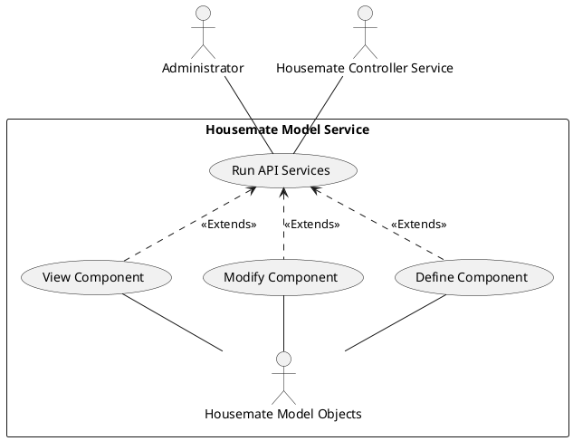
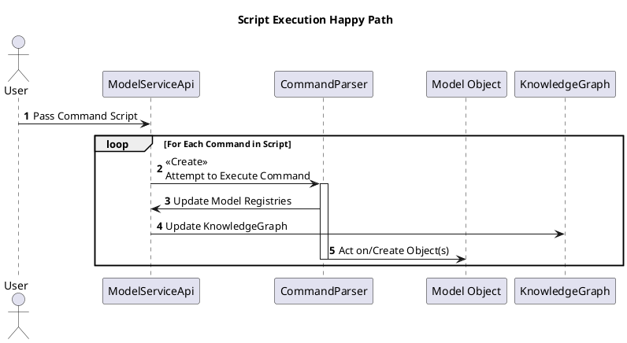
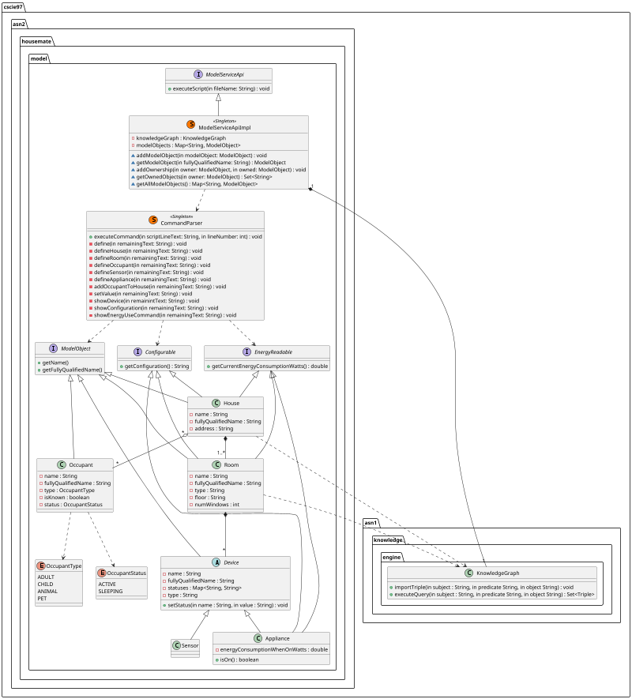

# Housemate Model Service Design Document
__Date:__ 09/22/2025
__Author:__ Erik Orlowski
__Reviewers:__ Gaston Tourn, Kyriaki Avgerinou

## Introduction
This document outlines the requirements and designs for the Housemates Model Service.

## Overview
The Housemate Model Service is used to model houses, rooms, occupants, sensors and appliances for Housemate enabled homes. The model service provides the ability to configure, update and view these objects. The model service also exposes a command line interface (CLI) that allows users to interact with the model service.

## Requirements

### Objects
__Requirement: House Model__
A House shall model an individual House. A House shall include the following pieces of information:
* A globally unique name
* An address
* Zero or more occupants
* One or more rooms
* Zero or more devices (appliances or sensors)
* The current energy consumption of the House in Watts

__Requirement: House Name Uniqueness__
Any attempt to create a House where a House with that name already exists shall have no effect.

__Requirement: Room Model__
A Room shall model an individual Room. Each Room will be associated with one and only one House. A Room shall contain the following pieces of information:
* The type of Room
* The floor of the House the Room is located in
* A unique name of the Room within the House
* The number of windows
* The current aggregate energy consumption of all the Appliances in the Room that are turned on, in Watts.
* The Devices in the Room

__Requirement: Room Name Uniqueness__
Any attempt to create a Room where a Room with that name in the House already exists shall have no effect.

__Requirement: Occupant Model__
An occupant shall model an adult, child or animal. An Occupant shall contain the following pieces of information:
* The type of Occupant (adult, child, animal)
* Whether the Occupant is known (e.g. family, friend) or unknown (e.g. guest, burglar)
* A globally unique name
* A status (active or sleeping)

__Requirement: Occupant Name Uniqueness__
Any attempt to create an Occupant where an Occupant with that name already exists shall have no effect.

__Requirement: Device Model__
A Device is a Sensor or Appliance that can be controlled and/or monitored by the Housemate system. A device shall include the following pieces of information:
* Unique identifier within a Room
* Zero or more named statuses each with an associated value
* Room
* Device type (e.g. humidity sensor, thermostat, television)

__Requirement: Device Name Uniqueness__
Any attempt to create a Device where a Device with that name in the Room already exists shall have no effect.

__Requirement: Appliance Control__
Appliances are a specific type of Device. In addition to the properties and attributes of all Devices, appliances shall have the ability to be controlled to perform one or more actions.

__Requirement: Appliance Energy Consumption__
Appliances shall track their current energy consumption in Watts.

__Requirement: Appliance Energy When On__
The energy consumption of an Appliance shall be 0 unless the "Power" status of the Appliance is "ON". Both of these strings shall be interpreted as being case insensitive.

### API
The Housemates Model service exposes an Application Programmer Interface (API) that allows objects to be configured, viewed and controlled.

__Requirement: API Call Auth_Tokens__
All API calls shall require an authentication token (auth_token) to be provided. This will be used in a future release.

__Requirement: Command Line Interface__
The Housemate Model Service shall expose a Command Line Interface (CLI) that will enable used to specify a file of specified commands to interact with the Housemate Model Service.

__Requirement: Define House Command__
A CLI command to define a house shall be defined with the following syntax:
```define house <house_name> address <address>```
When executed, this command shall create a new House with the given name and given address.

__Requirement: Define Room Command__
A CLI command to define a Room shall be defined with the following syntax:
```define room <room_name> floor <floor> type <room_type> house <house_name> windows <window_count>```
When executed, this command shall create a new Room with the given name, floor, room type, window count. The Room will be associated with the specified House.

__Requirement: Define Occupant Command__
A CLI command to define an Occupant shall be defined with the following syntax:
```define occupant <occupant_name> type <occupant_type>```
When executed, this command shall create a new occupant with the given name and type.

__Requirement: Add Occupant to House Command__
A CLI command to add an Occupant to a House shall be defined with the following syntax:
```add occupant <occupant_name> to_house <house_name>```
When executed, this command shall associate the specified Occupant with the specified House.

__Requirement: Define Sensor Command__
A CLI command to define a Sensor shall be defined with the following syntax:
```define sensor <name> type <sensor_type> room <house_name>:<room_name>```
When executed, this command shall create a new Sensor with the given name and type, and associate it with the specified House and Room.

__Requirement: Define Appliance Command__
A CLI command to define an Appliance shall be defined with the following syntax:
```define appliance <name> type <sensor_type> room <house_name>:<room_name> energy-use <energy-use>```
When executed, this command shall create a new Appliance with the given name and type. The appliance shall be associated with the specified House and Room. The energy use of the Appliance when turned on shall also be configured as specified.

__Requirement: Define Appliance No Energy Command__
A CLI command to define an Appliance without specifying the energy consumption shall be defined with the following syntax:
```define appliance <name> type <sensor_type> room <house_name>:<room_name>```
When executed, this command shall create a new Appliance with the given name and type. The appliance shall be associated with the specified House and Room. The energy use of the Appliance when turned on shall be zero.

__Requirement: Set Device Value Command__
A CLI command to set a Device value shall be defined with the following syntax:
```set sensor|appliance <house_name>:<room_name>:<name> status <status_name> value <value>```
When executed, this command shall set the specified Device status to the given value. Status names shall be case insensitive.

__Requirement: Set Device Status Command__
A CLI command to set a Device status shall be defined with the following syntax:
```set sensor|appliance <house_name>:<room_name>:<name> status <status_name>```
When executed, this command shall set the specified Device status to a value of "Actice". Status names shall be case insensitive.

__Requirement: Show Device Status Command__
A CLI command to set a Device status shall be defined with the following syntax:
```show sensor|appliance <house_name>:<room_name>:<name> status <status>```
When executed, this command shall display the value associated with the given status or return an error if that status does not exist. Status names shall be case insensitive.

__Requirement: Show Device Command__
A CLI command to show a Device's value and status shall be defined with the following syntax:
```show sensor|appliance <house_name>:<room_name>:<name>```
When executed, this command shall display the specified Device's status and value.

__Requirement: Show Configuration Command__
A CLI command to show the configuration of all Houses shall be defined with the following syntax:
```show configuration```
When executed, this command shall display a list of all Houses, Rooms and Appliances in the Housemate system.

__Requirement: Show House Configuration Command__
A CLI command to show the configuration of a House shall be defined with the following syntax:
```show configuration <house_name>```
When executed, this command shall display the House's name, address, Rooms and Appliances.

__Requirement: Show Room Configuration Command__
A CLI command to show the configuration of a Room shall be defined with the following syntax:
```show configuration <house_name>:<room_name>```
When executed, this command shall display the Room name, floor, number of windows and Appliances.

__Requirement: Show Appliance Configuration Command__
A CLI command to show the configuration of an Appliance shall be defined with the following syntax:
```show configuration <house_name>:<room_name>:<appliance>```
When executed, this command shall display the name, type, energy consumption when on and statuses of the Appliance.

__Requirement: Show Energy Useage of All Houses Command__
A CLI command to show the energy useage for all Houses shall be defined with the following syntax:
```show energy-use```
When executed, this command shall display the name of each House along with its current energy consumption in Watts.

__Requirement: Show Energy Useage of House Command__
A CLI command to show the energy useage of a specific House shall be defined with the following syntax:
```show energy-use <house_name>```
When executed, this command shall display the current energy consumption of the House in Watts.

__Requirement: Show Energy Useage of Room Command__
A CLI command to show the energy useage of a specific Room shall be defined with the following syntax:
```show energy-use <house_name>:<room_name>```
When executed, this command shall display the current energy consumption of the Room in Watts.

__Requirement: Show Energy Useage of Appliance Command__
A CLI command to show the energy useage of a specific Appliance shall be defined with the following syntax:
```show energy-use <house_name>:<room_name>:<appliance>```
When executed, this command shall display the current energy consumption of the Application in Watts.

__Requirement: Line Comments__
Any line where the first non-whitespace character is a "#" shall be considered a comment and not executed.

### Script Execution
__Requirement: Script Validation__
While executing a command script, the following elements of the script shall be validated:
* The syntax of each command
* The existence of each specified object

If any of these validation checks fail, the script shall stop at the current point of execution and display an error indicating where the script stopped running.

_Rationale:_ Users of this product will not interact directly with this API and other services are likely to interact with this API through single calls and not long scripts. Therefore the extra effort to ensure a failed script execution does not have any side effects is not neccessary.

__Requirement: Script Confirmation__
After successfully executing a command script, a message shall be displayed to the user indicating that the script ran successfully.

## Use Cases
The use case of the Housemate Model Service is for users to interact with the API to configure or view the state of components in the Housemate system.

The user will call on the Model Service to run a script. That script will then be validated and executed. When executed, the script will run specific commands which will modify or read information from the Housemate Model Objects.



## Implementation
At a high level, when a command script is passed in by a user, the processessing of this file starts with the ModelServiceApiImpl class. The ModelServiceApiImpl class is responsible for interacting with the file and passing the text of the file line by line to the CommandParser class.

The CommandParser class is the class responsible for the validation and execution of commands.

A high level view of the happy path process to execute a Command Script is shown in the sequence diagram below.


__1:__ The user passes a command script file to the service.
__2:__ The ModelServiceApi passes each command in the script, line by line to the CommandParser class.
__3:__ The CommandParser calls on the ModelServiceApi to update its Model registries.
__4:__ The ModelServiceApi updates the KnowledgeGraph with new relationships between Model Objects.
__5:__ Objects are created and interacted with to perform the Command.

## Class Diagram
The class diagram for the Housemate Model Service is shown below:



The top level class that users will interact with is the ModelServiceApi. This interface is implemented by the ModelServiceApiImpl class. This class reads the script file and delegates command execution to the CommandParser class. 

The CommandParser class is the main class responsible for validating and executing commands.

Commands are perform the business logic of a line in the script file. These Commands interact with the ModelServiceApiImpl class to maintain a registry of ModelObjects and the ModelSerivceApiImpl class interacts with the KnowledgeGraph to maintain relationships between ModelObjects.

Commands use a variety of ModelObject classes to represent components in the Housemate Model Service. These objects represent several properties and implement various interfaces which allow different Commands to interact with them.

## Class Dictionary

### ModelServiceApi
The ModelServiceApi is the public facing interface for external agents to interact with the Housemate Model Service. The interface is implemented by the ModelServiceApiImpl class.

__Methods:__
| Method Name | Signature | Description |
|---|---|---|
| executeScript | void executeScript(String fileName) | Processes the content of a command script file and delegate handling of each line of the script to the CommandParser class. |

### ModelServiceApiImpl
The ModelServiceApiImpl is the main concrete class responsible for executing a command script and maintaining a registry of ModelObjects.

This class is a Singleton instance and follows the [Singleton Design Pattern](https://www.geeksforgeeks.org/system-design/singleton-design-pattern/).

__Methods:__
| Method Name | Signature | Description |
|---|---|---|
| addModelObject | void addModelObject(ModelObject modelObject) | Adds a ModelObject to the modelObjects registry. |
| getModelObject | ModelObject getModelObject(String fullyQualifiedName) | Returns the ModelObject with the fullyQualifiedName. |
| addOwnership | void addOwnership(ModelObject owner, ModelObject owned) | Updates the KnowledgeGraph to add an ownership relation between the two ModelObjects. |
| getOwnedObjects | Set<String> getOwnedObjects(ModelObject owner) | Uses the KnowledgeGraph to find the fullyQualifiedName of all ModelObjects owned by the specified ModelObject. |
| getAllModelObjects | Map<String, ModelObject> getAllModelObjects() | Gets all of the ModelObjects created by the Housemate Model Service. |

__Associations:__
| Association Name | Type | Description |
|---|---|---|
| knowledgeGraph | KnowledgeGraph | Maintains the ownership relations of ModelObjects. |
| modelObjects | Map<String, ModelObject> | Maintains a Map of all ModelObjects created by the Housemate Model Service. |

### KnowledgeGraph
The KnowledgeGraph from assignment 1 is used to maintain the ModelObjects and their associations with each other. ModelObjects passed to the KnowledgeGraph are specified by their fully qualified name. The predicate used for ownership is "has_a".

__Methods:__
| Method Name | Signature | Description |
|---|---|---|
| importTriple | void importTriple(String subject, String predicate, String object) | Adds a new Triple to the KnowledgeGraph. |
| executeQuery | void executeQuery(String subject, String predicate, String object) | Adds a new Triple to the KnowledgeGraph. |

### CommandParser
The CommandParser encompasses the responsibility to parse, validate and execute an individual Command.

__Methods:__
| Method Name | Signature | Description |
|---|---|---|
| executeCommand | void executeCommand(String scriptLineText, int lineNumber) | Processes a command from a line of the script file and delegates execution of the command to the appropriate method. |
| define | void define(String remainingText) | Delegates the creation of a ModelObject to a specific method. |
| defineHouse | void defineHouse(String remainingText) | Creates a new House from the provided Command. |
| defineRoom | void defineHouse(String remainingText) | Creates a new Room from the provided Command. |
| defineOccupant | void defineOccupant(String remainingText) | Creates a new Occupant from the provided Command. |
| defineSensor | void defineSensor(String remainingText) | Creates a new Sensor from the provided Command. |
| defineAppliance | void defineAppliance(String remainingText) | Creates a new Appliance from the provided Command. |
| addOccupantToHouse | void addOccupantToHouse(String remainingText) | Executes a command that will associate an existing Occupant with an existing House. |
| setValue | setValue(String remainingText) | Executes a command that sets a value of a Device. |
| showDevice | showDevice(String remainingText) | Executes a command that shows information about a Device. |
| showConfiguration | showConfiguration(String remainingText) | Executes a command that displays the comfiguration of a ModelObject. |
| showEnergyUse | showEnergyUse(String remainingText) | Executes a command that shows the current energy useage of a ModelObject and its owned ModelObjects that are turned on. |

### ModelObject
The ModelObject interface represents a component in the Housemates system that Commands can interact with.

__Methods:__
| Method Name | Signature | Description |
|---|---|---|
| getName | String getName() | Gets the name of this ModelObject. |
| getFullyQualifiedName | String getFullyQualifiedName() | Gets the name of the ModelObject preceded by its type and its owning objects, separated by colons (e.g. "house_House1:room_Room2:sensor_Thermostat").

### Configurable
The Configurable interface is used for the ShowConfiguration Command to interact with certain ModelObjects to display their configuration.

__Methods:__
| Method Name | Signature | Description |
|---|---|---|
| getConfiguration | String getConfiguration() | Returns a String representing the configuration of the ModelObject as described in the requirement. |

### EnergyReadable
The EnergyReadable interface is used for the ShowEnergyUse Command to interact with certain ModelObjects and display their current energy useage.

__Methods:__
| Method Name | Signature | Description |
|---|---|---|
| getCurrentEnergyConsumptionWatts | double getCurrentEnergyConsumptionWatts() | Returns the current energy consumption in Watts of the object. |

### House
Represents a house in the Housemates system.

__Methods:__
Only methods declared in ModelObject, Configurable and EnergyReadable interfaces.

__Properties:__
| Property Name | Type | Description |
|---|---|---|
| name | String | The globally unique name of the House. |
| fullyQualifiedName | String | The fully qualified name of the House. |
| address | String | The address of the house. |

### Room
Represents a room in the Housemates system.

__Properties:__
| Property Name | Type | Description |
|---|---|---|
| name | String | The name of the Room, unique within the House. |
| fullyQualifiedName | String | The fully qualified name of the Room. |
| type | String | The type of room (e.g. bedroom, kitchen...) |
| floor | String | The floor of the Room. This is a String to have the ability to represent floors such as "Ground Floor", "Basement". |
| numWindows | int | The number of windows in the Room. |

### Occupant
Represents an Occupant in the Housemate system.

__Properties:__
| Property Name | Type | Description |
|---|---|---|
| name | String | The globally unique name of the Occupant. |
| fullyQualifiedName | String | The fully qualified name of the Occupant. |
| isKnown | boolean | Whether the occupant is known (family member, pet...) or unknown (intuder, guest...) |

__Associations:__
| Association Name | Type | Description |
|---|---|---|
| type | OccupantType | The type of the occupant (adult, child or animal). |
| status | OccupantStatus | The current status of the Occupant (active or sleeping) |

### OccupantType
The OccupantType is an enum which classifies Occupants as:

| Values |
|---|
| ADULT |
| CHILD |
| PET |
| ANIMAL |

### OccupantStatus
The OccupantStatus is an enum which classifies Occupants as:

| Values |
|---|
| ACTIVE |
| SLEEPING |

### Device
The Device class is an abstract class used to represent Sensors and Appliances in the Housemate system.

__Methods:__
| Method Name | Signature | Description |
|---|---|---|
| setStatus | void setStatus(String name, String value) | Sets a status of the Device to a certain value. |

__Properties:__
| Property Name | Type | Description |
|---|---|---|
| name | String | The name of the Device, unique within the Room. |
| fullyQualifiedName | String | The fully qualified name of the Device. |
| type | String | The type of Device (e.g. thermostat, TV...) |

### Sensor
The Sensor class is a concrete implementation of the Device class, used to represent a Sensor in the Housemate system. It does not have any additional methods or attributes from the Device class, but is being created as a separate class as it ties closes to business logic and may be needed in the future.

### Appliance
The Appliance class is a concrete implementation of the Device class that can be powered on and consume energy.

__Methods:__
| Method Name | Signature | Description |
|---|---|---|
| isOn | boolean isOn() | Returns whether the Appliance is powered on. This will return true when a status called "power" has the value of "on". |

__Properties:__
| Property Name | Type | Description |
|---|---|---|
| energyConsumptionWhenOnWatts  | double | The energy consumption of the Appliance when it is turned on, in Watts. |

## Exception Handling
There are a few exceptions that must be handled in processing a command script.

In all cases, these exceptions result in the script not executing and an error message being returned to the user.

First, any exceptions related to opening or reading from the command script file are handled by the ModelServiceApiDriver class.

Next, any issues with the formatting of a command such that the command type cannot be ascertained are handled by the ModelServiceApi class.

Any issues dealing with the syntax of a command or with finding an identifier are handled by the Command class.

In all cases, these exceptions cause the execution of the command and the script to stop. The effects from any previously executed commands are not undone.

## Testing
### Sample Script Test
The implementation of this design shall be tested with the sample script provided in the assignment.

### Energy Use Test
The energy useage calculations shall be verified to ensure:
* The power value being turned on and off has the correct effect
* Appliance power consumption correctly rolls up to Room power consumption
* Room power consumption correctly rolls up to House power consumption
* House power consumption correctly rolls up to overall power consumption

### Duplicate Name Test
For every class that has duplicate name requirements, an attempt will be made to make objects with duplicate names, to verify that a duplicate object is not created.

## Risks
The primary risk of this design is in classifying types of commands. The design as it stands requires a lot of custom String processing that might not scale well with a large number of commands, such as opening up the system to third party commands. In addition to this, the process of classifying a command will take place in O(n) time, with n representing the number of commands. If the number of command types were to grow significantly, this would create performance issues.