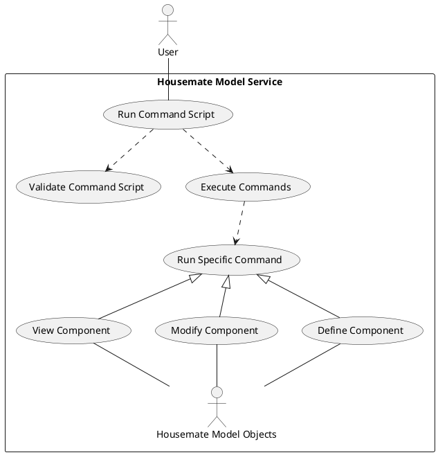
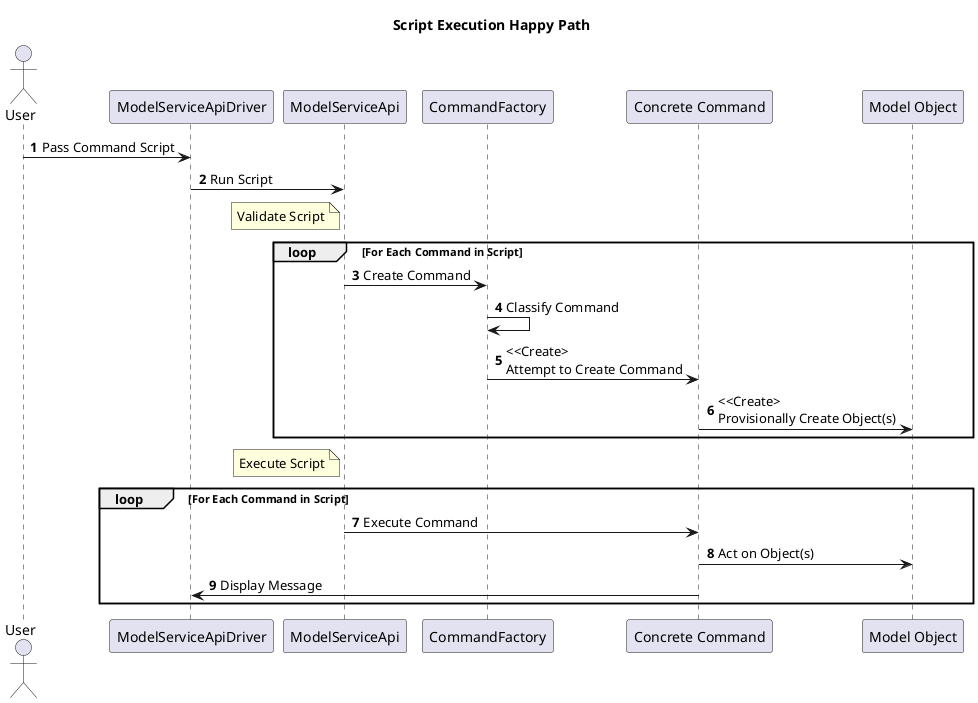
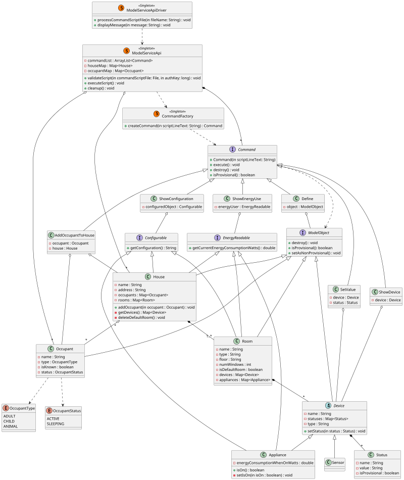

# Housemate Model Service Design Document
__Date:__ 09/22/2025
__Author:__ Erik Orlowski
__Reviewers:__ Gaston Tourn, Kyriaki Avgerinou

## Introduction
This document outlines the requirements and designs for the Housemates Model Service.

## Overview
The Housemate Model Service is used to model houses, rooms, occupants, sensors and appliances for Housemate enabled homes. The model service provides the ability to configure, update and view these objects. The model service also exposes a command line interface (CLI) that allows users to interact with the model service.

## Requirements

### Objects
__Requirement: House Model__
A House shall model an individual House. A House shall include the following pieces of information:
* A globally unique name
* An address
* Zero or more occupants
* One or more rooms
* Zero or more devices (appliances or sensors)
* The current energy consumption of the House in Watts

__Requirement: House Name Uniqueness__
Any attempt to create or modify a House such that two or more Houses would have duplicate names shall be rejected.

__Requirement: Room Model__
A Room shall model an individual Room. Each Room will be associated with one and only one House. A Room shall contain the following pieces of information:
* The type of Room
* The floor of the House the Room is located in
* A unique name of the Room within the House
* The number of windows
* The current aggregate energy consumption of all the Appliances in the Room that are turned on, in Watts.
* The Occupants known to be in the Room
* The Devices in the Room

__Requirement: Room Name Uniqueness__
Any attempt to create or modify a Room such that two or more Rooms within a House would have duplicate names shall be rejected.

__Requirement: Occupant Model__
An occupant shall model an adult, child or animal. An Occupant shall contain the following pieces of information:
* The type of Occupant (adult, child, animal)
* Whether the Occupant is known (e.g. family, friend) or unknown (e.g. guest, burglar)
* A globally unique name
* A status (active or sleeping)

__Requirement: Occupant Name Uniqueness__
Any attempt to create or modify an Occupant such that two or more Occupants would have duplicate names shall be rejected.
_Rationale:_ A single Occupant could be associated with multiple Houses, so to reliably identify a given occupant, a globally unique name is required.

__Requirement: Device Model__
A Device is a Sensor or Appliance that can be controlled and/or monitored by the Housemate system. A device shall include the following pieces of information:
* Unique identifier within a Room
* Zero or more named statuses each with an associated value
* Room
* Device type (e.g. humidity sensor, thermostat, television)

__Requirement: Device Name Uniqueness__
Any attempt to create or modify a Device such that two or more Devices within a Room would have duplicate names shall be rejected.
_Rationale:_ All specified CLI commands that interact with a specific Device specify the Room, so a Device name only needs to be unique within a specific Room.

__Requirement: Appliance Control__
Appliances are a specific type of Device. In addition to the properties and attributes of all Devices, appliances shall have the ability to be controlled to perform one or more actions.

__Requirement: Appliance Energy Consumption__
Appliances shall track their current energy consumption in Watts.

__Requirement: Appliance Energy When On__
The energy consumption of an Appliance shall be 0 unless the "Power" status of the Appliance is "ON". Both of these strings shall be interpreted as being case insensitive.

### API
The Housemates Model service exposes an Application Programmer Interface (API) that allows objects to be configured, viewed and controlled.

__Requirement: API Call Auth_Tokens__
All API calls shall require an authentication token (auth_token) to be provided. This will be used in a future release.

__Requirement: Command Line Interface__
The Housemate Model Service shall expose a Command Line Interface (CLI) that will enable used to specify a file of specified commands to interact with the Housemate Model Service.

__Requirement: Define House Command__
A CLI command to define a house shall be defined with the following syntax:
```define house <house_name> address <address>```
When executed, this command shall create a new House with the given name and given address. The House will be created with one default Room, which will be deleted when a Room is defined in the House.

__Requirement: Define Room Command__
A CLI command to define a Room shall be defined with the following syntax:
```define room <room_name> floor <floor> type <room_type> house <house_name> windows <window_count>```
When executed, this command shall create a new Room with the given name, floor, room type, window count. The Room will be associated with the specified House.

__Requirement: Define Occupant Command__
A CLI command to define an Occupant shall be defined with the following syntax:
```define occupant <occupant_name> type <occupant_type>```
When executed, this command shall create a new occupant with the given name and type.

__Requirement: Add Occupant to House Command__
A CLI command to add an Occupant to a House shall be defined with the following syntax:
```add occupant <occupant_name> to_house <house_name>```
When executed, this command shall associate the specified Occupant with the specified House.

__Requirement: Define Sensor Command__
A CLI command to define a Sensor shall be defined with the following syntax:
```define sensor <name> type <sensor_type> room <house_name>:<room_name>```
When executed, this command shall create a new Sensor with the given name and type, and associate it with the specified House and Room.

__Requirement: Define Appliance Command__
A CLI command to define an Appliance shall be defined with the following syntax:
```define appliance <name> type <sensor_type> room <house_name>:<room_name> energy-use <energy-use>```
When executed, this command shall create a new Appliance with the given name and type. The appliance shall be associated with the specified House and Room. The energy use of the Appliance when turned on shall also be configured as specified.

__Requirement: Set Device Value Command__
A CLI command to set a Device value shall be defined with the following syntax:
```set sensor|appliance <house_name>:<room_name>:<name> status <status_name> value <value>```
When executed, this command shall set the specified Device status to the given value. Status names shall be case insensitive.

__Requirement: Show Device Status Command__
A CLI command to set a Device status shall be defined with the following syntax:
```show sensor|appliance <house_name>:<room_name>:<name> status <status>```
When executed, this command shall display the value associated with the given status or return an error if that status does not exist. Status names shall be case insensitive.

__Requirement: Show Device Command__
A CLI command to show a Device's value and status shall be defined with the following syntax:
```show sensor|appliance <house_name>:<room_name>:<name>```
When executed, this command shall display the specified Device's status and value.

__Requirement: Show Configuration Command__
A CLI command to show the configuration of all Houses shall be defined with the following syntax:
```show configuration```
When executed, this command shall display a list of all Houses with their names, addresses, number of Rooms and a list of Occupant names.

__Requirement: Show House Configuration Command__
A CLI command to show the configuration of a House shall be defined with the following syntax:
```show configuration <house_name>```
When executed, this command shall display the House's name, address, the number of Rooms and a list of Occupant names.

__Requirement: Show Room Configuration Command__
A CLI command to show the configuration of a Room shall be defined with the following syntax:
```show configuration <house_name>:<room_name>```
When executed, this command shall display the House name, Room name, the Room type, the number of windows in the room and a list of the Devices in the room with each Device's name.

__Requirement: Show Appliance Configuration Command__
A CLI command to show the configuration of an Appliance shall be defined with the following syntax:
```show configuration <house_name>:<room_name>:<appliance>```
When executed, this command shall display the House name, Room name, Appliance name, Appliance type, Appliance status and the energy usage of the device when turned on.

__Requirement: Show Energy Useage of All Houses Command__
A CLI command to show the energy useage for all Houses shall be defined with the following syntax:
```show energy-use```
When executed, this command shall display the name of each House along with its current energy consumption in Watts.

__Requirement: Show Energy Useage of House Command__
A CLI command to show the energy useage of a specific House shall be defined with the following syntax:
```show energy-use <house_name>```
When executed, this command shall display the current energy consumption of the House in Watts.

__Requirement: Show Energy Useage of Room Command__
A CLI command to show the energy useage of a specific Room shall be defined with the following syntax:
```show energy-use <house_name>:<room_name>```
When executed, this command shall display the current energy consumption of the Room in Watts.

__Requirement: Show Energy Useage of Appliance Command__
A CLI command to show the energy useage of a specific Appliance shall be defined with the following syntax:
```show energy-use <house_name>:<room_name>:<appliance>```
When executed, this command shall display the current energy consumption of the Application in Watts.

__Requirement: Line Comments__
Any line where the first non-whitespace character is a "#" shall be considered a comment and not executed.

__Requirement: Disallowed Characters__
Any identifier or Device value that includes a colon ":" or whitespace shall be rejected.
_Rationale:_ These characters are included in the command syntax, so allowing these characters would unneccessarily complicate the processing of commands.

### Script Execution
__Requirement: Script Validation__
Before executing a command script, the following elements of the script shall be validated:
* The syntax of each command
* The uniqueness property of each name
* The existence of each specified object

If any of these validation checks fail, the script shall not execute and an informative error message shall be displayed to the user.

_Rationale:_ Users of this product are likely to be non-technical, so it would be frustrating for them to have a script partially run and need to create a new script to only run the parts that failed.

__Requirement: Script Confirmation__
After successfully executing a command script, a message shall be displayed to the user indicating that the script ran successfully.

## Use Cases
The use case of the Housemate Model Service is for users to interact with the API to configure or view the state of components in the Housemate system.

The user will call on the Model Service to run a script. That script will then be validated and executed. When executed, the script will run specific commands which will modify or read information from the Housemate Model Objects.



## Implementation
At a high level, when a command script is passed in by a user, the processessing of this file starts with the ModelServiceApiDriver class. The ModelServiceApiDriver class is responsible for interacting with the file and passing the text of the file to the ModelServiceApi class.

The ModelServiceApi class is the class responsible for the validation and execution of the command script. This first step is to validate the script.

In validation, the ModelServiceApi uses the CommandFactory to create each command. The CommandFactory is responsible for reading the first part of the command text and deciding what type of command it is. The CommandFactory class then creates a specific concrete Command.

The concrete Command class is then responsible for final validation of the command text. Part of this validation includes provisionally creating objects, including Housemate Model Objects and statuses.

The purpose of this provisional creation is to have objects in place so the script can be checked for errors such as identifiers that do not exist.

If validation is successful, the ModelServiceApi will call on each Command to execute.

A high level view of the happy path process to execute a Command Script is shown in the sequence diagram below.


__1:__ The user passes a command script file to the service.
__2:__ The ModelServiceApiDriver parses the text of the command script file and passes it to the ModelServiceApi.
__3:__ The ModelServiceApi calls on the CommandFactory, which serves as a single actor to create any type of command.
__4:__ The CommandFactory attempts to use the first part of the command and classify what type of command (e.g. definition, modification, viewing) to create.
__5:__ Depending on the classification, the CommandFactory creates a specific type of command. This class then uses the remainder of the command text to validate the rest of the command.
__6:__ If objects are created in the script, we must create them now so that we can validate later in the script that we are able to find all of our identifiers. If the script validation fails at a later point, these objects will be deleted.
__7:__ Run the specific logic for each command to execute it. This step also removes the provisional marking on created objects because the script has already been validated.
__8:__ The command uses or modifies the Model Objects as required.
__9:__ Any messages that must be displayed to the user are delegated to the ModelServiceApiDriver class.

## Class Diagram
The class diagram for the Housemate Model Service is shown below:



The top level class that users will interact with it the ModelServiceApiDriver. This class reads the script file and displays messages to users. The class delegates the validation and execution of the script file to the ModelServiceApi class.

The ModelServiceApi class is the main class responsible for validating and executing the script. It utilizes the CommandFactory class in validation to create the necessary Commands.

The CommandFactory is responsible for creating categorizing and creating Commands.

Commands are responsible for performing the business logic of a line in the script file. Concrete Command classes are created for different types of Commands.

Commands use a variety of ModelObject classes to represent components in the Housemate Model Service. These objects represent several properties and implement various interfaces which allow different Commands to interact with them.

## Class Dictionary

### ModelServiceApiDriver
The ModelServiceApiDriver is the class that users interact with directly. It is responsible for running reading from the script file and displaying messages to the user.

This class is a Singleton instance and follows the [Singleton Design Pattern](https://www.geeksforgeeks.org/system-design/singleton-design-pattern/).

__Methods:__
| Method Name | Signature | Description |
|---|---|---|
| processCommandScriptFile | void processCommandScriptFile(String fileName) | Process the content of a command script file and delegate handling the content of the file to the ModelServiceApi class. |
| displayMessage | void displayMessage(String message) | Print the given message to the screen. |

### ModelServiceApi
The ModelServiceApi is responsible for the validation and execution of a Command script. It uses the CommandFactory class to create Commands during validation, maintains a list of these Commands, and interacts with these Commands directly to execute them.

This class is a Singleton instance and follows the [Singleton Design Pattern](https://www.geeksforgeeks.org/system-design/singleton-design-pattern/).

__Methods:__
| Method Name | Signature | Description |
|---|---|---|
| validateScript | void validateScript(File commandScriptFile, long authKey) | Validate the command script file before executing. This validation includes provisionally creating the Commands. An authentication key is included for future use. |
| executeScript | void executeScript() | Calls on each Command created during the validation process to execute. |
| cleanup | void cleanup() | Called on a validation failure to remove provisionally created Commands and ModelObjects. |

__Associations:__
| Association Name | Type | Description |
|---|---|---|
| commandList | ArrayList<Command> | Maintains a list of all Commands in the current Command script. |
| houseMap | Map<House> | Maintains a Key-Value pair Map of all created Houses. |
| occupantMap | Map<Occupant> | Maintains a Key-Value pair Map of all created Occupants. |

### CommandFactory
The CommandFactory class is the single point of entry to create new Commands. This class is responsible for parsing the first part of a script line, classifying the type of Command, and creating an instance of that Command.

This class is a Singleton instance and follows the [Singleton Design Pattern](https://www.geeksforgeeks.org/system-design/singleton-design-pattern/).

__Methods:__
| Method Name | Signature | Description |
|---|---|---|
| createCommand | Command createCommand(String sciptLineText) | Creates and returns a new Command by classifying the text in a line of the script file. If the CommandType cannot be classified, an exception is thrown. |

### Command
The Command interface encompasses the functionality to create, execute and destroy Commands.

__Methods:__
| Method Name | Signature | Description |
|---|---|---|
| Command | Command(String scriptLineText) | Provisionally creates a new Command from a line of the script and creates the relevant ModelObjects. If an error occurs in creating the Command, throw an exception. |
| execute | void execute() | Performs the business logic to run the command and mark the Command and associates objects as no longer provisional. |
| destroy | void destroy() | Deletes an objects that were provisionally created when the Command was being validates. |

### SetValue
The SetValue class is an implementation of the Command interface used to handle Commands involving setting the value of a Device.

__Associations:__
| Association Name | Type | Description |
|---|---|---|
| device | Device | The Device that will have a value set. |
| status | Status | Information about the status and the value to set the status to. |

### ShowEnergyUse
The ShowEnergyUse class is an implementation of the Command interface that displays the current energy use of an object in Watts.

__Associations:__
| Association Name | Type | Description |
|---|---|---|
| energyUser | EnergyReadable | The object to get the current energy useage from. |

### ShowConfiguration
The ShowConfiguration class is an implementation of the Command interface that displays the configuration of an object.

__Associations:__
| Association Name | Type | Description |
|---|---|---|
| configuredObject | Configurable | The object to get the configuration from. |

### Define
The Define class is an implementation of the Command interface that creates a new ModelObject.

__Associations:__
| Association Name | Type | Description |
|---|---|---|
| object | ModelObject | The object to be created. |

### ShowDevice
The ShowDevice class is an implementation of the Command interface that shows information about a device.

__Association:__
| Association Name | Type | Description |
|---|---|---|
| device | Device | The Device to show information from. |

### ModelObject
The ModelObject interface represents a component in the Housemates system that Commands can interact with.

__Methods:__
| Method Name | Signature | Description |
|---|---|---|
| destroy | destroy() | Destroys a provisionally created object and anything associated with it upon a validation failure. |

### Configurable
The Configurable interface is used for the ShowConfiguration Command to interact with certain ModelObjects to display their configuration.

__Methods:__
| Method Name | Signature | Description |
|---|---|---|
| getConfiguration | String getConfiguration() | Returns a String representing the configuration of the ModelObject as described in the requirement. |

### EnergyReadable
The EnergyReadable interface is used for the ShowEnergyUse Command to interact with certain ModelObjects and display their current energy useage.

__Methods:__
| Method Name | Signature | Description |
|---|---|---|
| getCurrentEnergyConsumptionWatts | double getCurrentEnergyConsumptionWatts() | Returns the current energy consumption in Watts of the object. |

### House
Represents a house in the Housemates system.

__Methods:__
| Method Name | Signature | Description |
|---|---|---|
| addOccupant | void addOccupant(Occupant occupant) | Creates a new Occupant and associates it with the House. |
| getDevices | Map<Device> getDevices() | Returns a Map of all the Devices associated through Rooms with the House. |
| deleteDefaultRoom | void deleteDefaultRoom() | Deletes the default room associated with a House when a non-default Room has been created. |

__Properties:__
| Property Name | Type | Description |
|---|---|---|
| name | String | The globally unique name of the House. |
| address | String | The address of the house. |

__Associations:__
| Association Name | Type | Description |
|---|---|---|
| occupants | Map<Occupant> | A Map of Occupants associated with the House. |
| rooms | Map<Room> | A Map of Rooms associated with the House. |

### Room
Represents a room in the Housemates system.

__Properties:__
| Property Name | Type | Description |
|---|---|---|
| name | String | The name of the Room, unique within the House. |
| type | String | The type of room (e.g. bedroom, kitchen...) |
| floor | String | The floor of the Room. This is a String to have the ability to represent floors such as "Ground Floor", "Basement". |
| numWindows | int | The number of windows in the Room. |
| isDefaultRoom | boolean | Is this Room the default Room created when a new House is defined? |

__Associations:__
| Association Name | Type | Description |
|---|---|---|
| devices | Map<Device> | A Map of the Devices in the Room. |
| appliances | Map<Appliance> | A Map of the Appliances in the Room, used to efficiently get the current energy consumption of the Room. |

### Occupant
Represents an Occupant in the Housemate system.

__Properties:__
| Property Name | Type | Description |
|---|---|---|
| name | String | The globally unique name of the Occupant. |
| isKnown | boolean | Whether the occupant is known (family member, pet...) or unknown (intuder, guest...) |

__Associations:__
| Association Name | Type | Description |
|---|---|---|
| type | OccupantType | The type of the occupant (adult, child or animal). |
| status | OccupantStatus | The current status of the Occupant (active or sleeping) |

### OccupantType
The OccupantType is an enum which classifies Occupants as:

| Values |
|---|
| ADULT |
| CHILD |
| ANIMAL |

### OccupantStatus
The OccupantStatus is an enum which classifies Occupants as:

| Values |
|---|
| ACTIVE |
| SLEEPING |

### Device
The Device class is an abstract class used to represent Sensors and Appliances in the Housemate system.

__Methods:__
| Method Name | Signature | Description |
|---|---|---|
| setStatus | void setStatus(Status status) | Sets a status of the Device to a certain value. |

__Properties:__
| Property Name | Type | Description |
|---|---|---|
| name | String | The name of the Device, unique within the Room. |
| type | String | The type of Device (e.g. thermostat, TV...) |

__Associations:__
| Association Name | Type | Description |
|---|---|---|
| statuses | Map<Status> | The statuses associated with the Device. |

### Sensor
The Sensor class is a concrete implementation of the Device class, used to represent a Sensor in the Housemate system. It does not have any additional methods or attributes from the Device class, but is being created as a separate class as it ties closes to business logic and may be needed in the future.

### Appliance
The Appliance class is a concrete implementation of the Device class that can be powered on and consume energy.

__Methods:__
| Method Name | Signature | Description |
|---|---|---|
| isOn | boolean isOn() | Returns whether the Appliance is powered on. |
| setIsOn | boolean setIsOn() | Sets the Appliance to be on or off based on the Appliance Status as described in the requirements. |

### Status
The Status class encapsulates a status and a value the status is set to for a Device.

__Properties:__
| Property Name | Type | Description |
|---|---|---|
| name | String | The name of the Status, unique within the Device. |
| value | String | The current value of the Status. |

## Exception Handling
There are a few exceptions that must be handled in processing a command script.

In all cases, these exceptions result in the script not executing and an error message being returned to the user.

First, any exceptions related to opening or reading from the command script file are handled by the ModelServiceApiDriver class.

Next, any issues with the formatting of a command such that the command type cannot be ascertained are handled by the CommandFactory class.

Any issues dealing with the syntax of a classified command, or with finding an identifier are handled by the concrete Command class.

## Testing
### Sample Script Test
The implementation of this design shall be tested with the sample script provided in the assignment.

### Duplicate Name Test
For every class that has duplicate name requirements, an attempt will be made to make objects with duplicate names, to verify that this is disallowed.

### Invalid Syntax Test
This test shall pass script files with undefined commands, disallowed characters in names and an incorrect number of whitespace separated words and verify that these validation failures are correctly handled.

### Script Partially Ran Test
This test shall run a script to create and modify objects, with a command at the end of the script that will fail. It shall be verified that the script leaves no side effects to the Housemate Model.

## Risks
The primary risk of this design is in classifying types of commands. The design as it stands requires many class definitions that might not scale well with a large number of commands, such as opening up the system to third party commands. In addition to this, the process of classifying a command will take place in O(n) time, with n representing the number of commands. If the number of command types were to grow significantly, this would create performance issues.