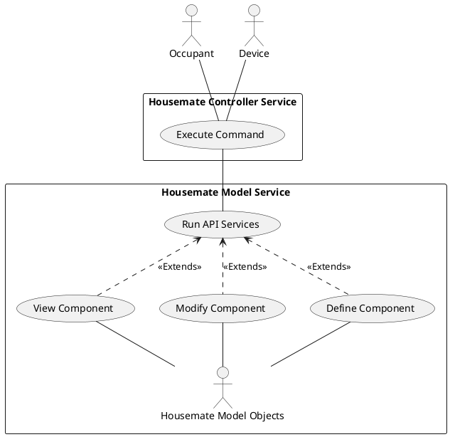
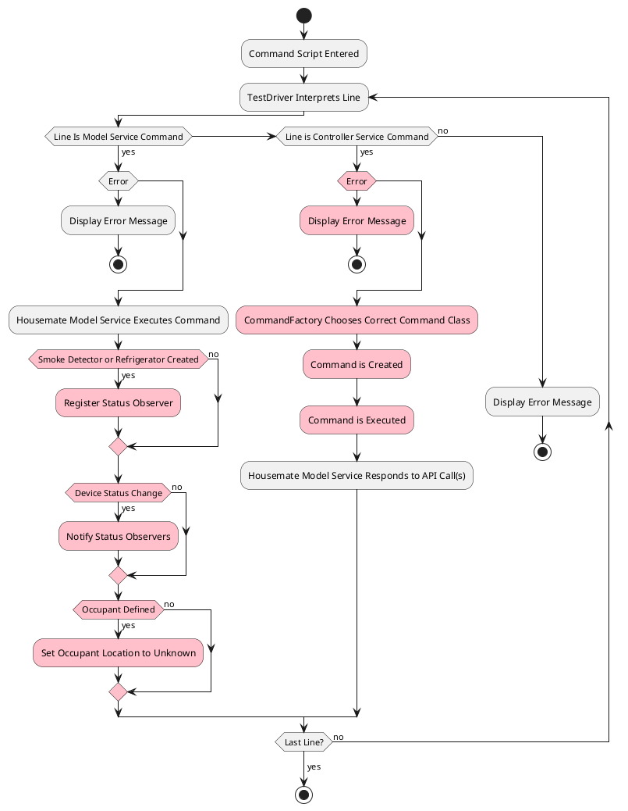

# Housemate Controller Service Design Document
__Date:__ 10/14/2025
__Author:__ Erik Orlowski
__Reviewers:__ Abderrahmane Fadli, Ian Mariner

## Introduction
The document captures the requirements, design and test plan for the Housemate Controller Service.

## Overview
The Housemate Controller Service receives input on the state of objects from the Housemate Model Service. Based on a defined set of rules, the Housemate Controller Service uses the state of objects in the Housemate Model Service to perform certain actions, again, utilizing the Housemate Model Service. The Housemate Controller Service also tracks the location of Occupants using a KnowledgeMap and uses this information to perform actions on the Housemate Model Service.

## Requirements
__Requirement: Rule Execution Logging__
All rule executions and resulting actions shalled by logged.

### Rules
This section defines the rules for specific behaviors of the Housemate Controller Service. In each case, when the given stimulus occurs, the states action shall be taken.

When text is given in parentheses in the stimulus column, this is the exact text that will be passed to the CLI for stimuli that don't directly map to the Housemate Model Service.

__Requirement: Exception Handling__
When one of the rules below cannot be executed, either because it is specified with incorrect syntax or because a referenced object cannot be found, script execution shall be stopped and the invalid command shall not be executed.

__Requirement: Ava Device Rules__
The following rules shall be enforced when stimuli of a voice command in the specified form is encountered on a Device with the type of "Ava":

| Stimulus | Action |
|-|-|
| open door (ava <full_qualified_ava_name> open door) | Sets the "open" status of all Devices of type "door" to in the same Room as the Ava Device to "opened". |
| close door (ava <full_qualified_ava_name> close door) | Sets the "open" status of all Devices of type "door" in the same Room as the Ava Device to "closed". |
| lights off (ava <full_qualified_ava_name> lights off) | Sets the "power" status of all Devices of type "light" in the same Room as the Ava Device to "ON". |
| lights on (ava <full_qualified_ava_name> lights on) | Sets the "power" status of all Devices of type "light" in the same Room as the Ava Device to "ON". |
| <appliance_type> <status_name> <value> (ava <room_fully_qualified_name> type <appliance_type> status <status_name> value <value>) | Sets the given status of all Devices of the specified type in the same Room as the Ava Device to the specified value. |
| where is <occupant_name> (ava where is <occupant_name>) | Return a response in the form of "<occupant_name> is_located_in <room_name>". |

__Requirement: Camera Rules__
The following rules shall be enforced when the described action is detected by a Device of type "Camera":

| Stimulus | Action |
|-|-|
| Occupant Detected (occupant <occupant_name> in_room <room_fully_qualified_name>) | Sets the "power" status of all Devices of type "light" in the Room to "ON". Sets the "setpoint" status of all Devices of type "thermostat" in the Room to 2 degrees warmer if this is the only Occupant in the Room. Update the location of the Occupant with the current Room. |
| Occupant Leaving (occupant <occupant_name> leaving_room <room_fully_qualified_name>) | Sets the "power" status of all Devices of type "light" in the Room to "OFF". Sets the "setpoint" status of all Devices of type "thermostat" in the Room to 2 degrees cooler if there are no more Occupants remaining in the Room. Update the location of the Occupant. |
| Occupant Inactive (occupant <occupant_name> inactive) | Tracks that the Occupant is sleeping. |
| Occupant Active (occupant <occupant_name> active) | Tracks that the Occupant is awake. |

__Requirement: Smoke Detector Rule__
The following rule shall be enforced when the described action is detected by a Device of type "SmokeDetector":

| Stimulus | Action |
|-|-|
| The "fire" status is set to a value of "active". | Sets the "power" status of all Devices of type "light" in the Room to "ON". Send text to speech to all Devices of type "Ava" in the House: “Fire in the <room_name>, please leave the house immediately”. The Housemate ControllerService initiates a 911 call. |

__Requirement: Refrigerator Rule__
The following rule shall be enforced when the described action is detected by a Device of type "Refrigerator":

| Stimulus | Action |
|-|-|
| The value of the "beer_count" status changes. | If the new beer count is less than 3, the Occupant is prompted if they would like to order more beers. If the Occupant responds "yes", the Housemate Controller Service sends an email requesting more beer. |

## Use Cases
The Housemate Controller Service works with the Housemate Model Service and the KnowledgeGraph to events that occur in the Housemate system. The Housemate Model Service is responsible for creating, configuring and managing Housemate Model Objects. Housemate Controller Service is responsible for interpreting events and performing actions based on those events.

This diagram depicts how an Occupant or Device has its actions or inputs interpreted by the Housemate Controller Service to execute a command. The Housemate Controller Service then calls on the Housemate Model Service to update Model Objects based on the result of the command.

## Implementation
A high level view of the use of the Housemate Model Service and Housemate Controller Service is shown below.

Activities colored in pink are the responsibility of the Housemate Controller Service.

When a command is run by the Housemate Model Service, the output of that command is then sent to the Housemate Controller Service to process it.

If a Smoke Detector or Refrigerator are created, then they must register to observe status changes in order to respond to fires or changes in the beer counts respectively.

If a Device status changes, then all registered observers are notified with details of the new status and these observers can decide if a Command needs to be executed in response to the new status.

If an Occupant is defined, the Housemate Controller Service's KnowledgeGraph needs to be updated with the new Occupant and an unknown location.

When a command is run directly by the Housemate Controller Service, first, the command is validated. If the line is validated, the type of Command class is classified. Then, the Command is Executed.

Many Command executions require calling the Housemate Model Service API to make necessary updates to Model Objects.