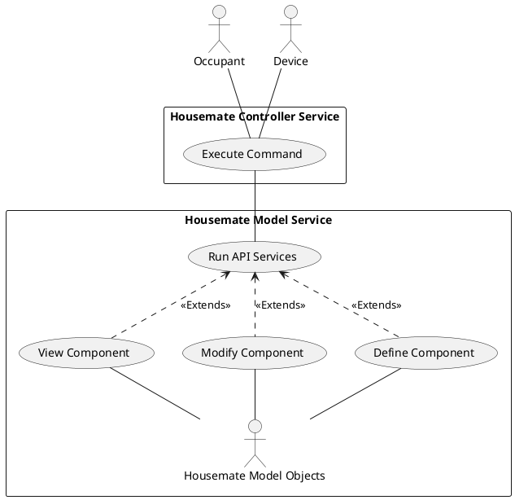
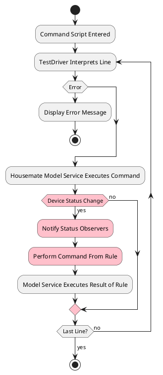
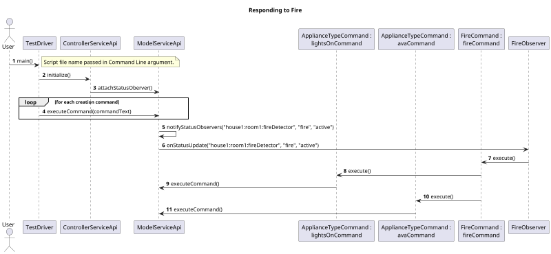

# Housemate Controller Service Design Document
__Date:__ 10/14/2025
__Author:__ Erik Orlowski
__Reviewers:__ Abderrahmane Fadli, Ian Mariner

## Introduction
The document captures the requirements, design and test plan for the Housemate Controller Service.

## Overview
The Housemate Controller Service receives input on the state of objects from the Housemate Model Service. Based on a defined set of rules, the Housemate Controller Service uses the state of objects in the Housemate Model Service to perform certain actions, again, utilizing the Housemate Model Service. The Housemate Controller Service also tracks the location of Occupants using a KnowledgeMap and uses this information to perform actions on the Housemate Model Service.

This document includes the requirements for the Housemate Controller Service which describe the rules that are implemented by the service. The document includes use cases for the service, as well as implementation details including an activity diagram, class diagram, class dictionary and sequence diagram. Finally, the document includes information on exception handling, testing and risks.

## Requirements
__Requirement: Rule Execution Logging__
All rule executions and resulting actions shall be output to the user.

### Rules
This section defines the rules for specific behaviors of the Housemate Controller Service. In each case, when the given stimulus occurs, the states action shall be taken.

When text is given in parentheses in the stimulus column.

__Requirement: Exception Handling__
When one of the rules below cannot be executed, either because it is specified with incorrect syntax or because a referenced object cannot be found, script execution shall continue and the specific command shall not execute.

__Requirement: Ava Device Rules__
The following rules shall be enforced when stimuli of a voice command in the specified form is encountered on a Device with the type of "Ava":

| Stimulus | Action |
|-|-|
| Ava type device receives a 'voice_in' status with a value of "open door" | Sets the "open" status of all Devices of type "door" to in the same Room as the Ava Device to "opened". |
| Ava type device receives a 'voice_in' status with a value of "close door" | Sets the "open" status of all Devices of type "door" in the same Room as the Ava Device to "closed". |
| Ava type device receives a 'voice_in' status with a value of "lights off" | Sets the "power" status of all Devices of type "light" in the same Room as the Ava Device to "ON". |
| Ava type device receives a 'voice_in' status with a value of "lights on" | Sets the "power" status of all Devices of type "light" in the same Room as the Ava Device to "ON". |
| Ava type device receives a 'voice_in' status with a value in the form of "<appliance_type> <status_name> <value> | Sets the given status of all Devices of the specified type in the same Room as the Ava Device to the specified value. |
| Ava type device receives a 'voice_in' status with a value in the form of "where is <occupant_name> | Return a response in the form of "<occupant_name> is_located_in <room_name>". |

__Requirement: Camera Rules__
The following rules shall be enforced when the described action is detected by a Device of type "Camera":

| Stimulus | Action |
|-|-|
| Device of type camera receives a status of "occupant_detected" with a value of the occupant name. | Sets the "power" status of all Devices of type "light" in the Room to "ON". Sets the "setpoint" status of all Devices of type "thermostat" in the Room to 2 degrees warmer if this is the only Occupant in the Room. Update the location of the Occupant with the current Room. |
| Device of type camera receives a status of "occupant_leaving" with a value of the occupant name. | Sets the "power" status of all Devices of type "light" in the Room to "OFF". Sets the "setpoint" status of all Devices of type "thermostat" in the Room to 2 degrees cooler if there are no more Occupants remaining in the Room. Update the location of the Occupant. |
| Device of type camera receives a status of "occupant_sleeping" with a value of the occupant name. | Tracks that the Occupant is sleeping. |
| Device of type camera receives a status of "occupant_waking" with a value of the occupant name. | Tracks that the Occupant is awake. |

__Requirement: Smoke Detector Rule__
The following rule shall be enforced when the described action is detected by a Device of type "SmokeDetector":

| Stimulus | Action |
|-|-|
| The "fire" status is set to a value of "active". | Sets the "power" status of all Devices of type "light" in the Room to "ON". Send text to speech to all Devices of type "Ava" in the House: “Fire in the <room_name>, please leave the house immediately”. The Housemate ControllerService initiates a 911 call. |

__Requirement: Refrigerator Rule__
The following rule shall be enforced when the described action is detected by a Device of type "Refrigerator":

| Stimulus | Action |
|-|-|
| The value of the "beer_count" status changes. | If the new beer count is less than 3, the Occupant is prompted if they would like to order more beers. If the Occupant responds "yes", the Housemate Controller Service sends an email requesting more beer. |

## Use Cases
The Housemate Controller Service works with the Housemate Model Service and the KnowledgeGraph to events that occur in the Housemate system. The Housemate Model Service is responsible for creating, configuring and managing Housemate Model Objects. Housemate Controller Service is responsible for interpreting events and performing actions based on those events.

This diagram depicts how an Occupant or Device has its actions or inputs interpreted by the Housemate Controller Service to execute a command. The Housemate Controller Service then calls on the Housemate Model Service to update Model Objects based on the result of the command.

## Implementation
A high level view of the use of the Housemate Model Service and Housemate Controller Service is shown below.

Activities colored in pink are the responsibility of the Housemate Controller Service.

When a command is run by the Housemate Model Service, any devices status changes are sent to the Housemate Controller Service to be processed. The Housemate Controller Service then reacts to this change and takes any appropriate action through a Command.

When a Command is executed, the Controller Service will handle the business logic of the Command and delegate the execution of any changes to model objects as a result of the Command to the Model Service.

## Class Diagram
The class diagram for the Housemate Controller Service is shown below.

```plantuml
@startuml
scale max 800 width
set separator :
top to bottom direction

package cscie97.asn2.housemate.controller {
    interface ControllerServiceApi {
    }

    class ControllerServiceApi << (S,#FF7700) Singleton >> {
        + initialize() : void
    }

    class OccupantTracker << (S,#FF7700) Singleton >> {
        - occupantKnowledgeGraph : KnowledgeGraph
        + addOccupantToRoom(in occupantName: String, in fullyQualifiedRoomName: String) : void
        + removeOccupantFromRoom(in occupantName: String, in fullyQualifiedRoomName: String) : void
        + makeOccupantActive(in occupantName: String) : void
        + makeOccupantInactive(in occupantName: String) : void
        + getOccupantsInRoom(in fullyQualifiedRoomName: String) : Set<String>
        + getOccupantsInHouse(in houseName: String) : Set<String>
        + getOccupantLocation(in occupantName: String) : String
    }

    interface StatusObserver {
        + onStatusUpdate(in device: String, in status: String, in newValue: String, in deviceType: String) : void
    }

    class FireObserver {
    }

    class BeerCountObserver {
    }

    class OvenDoneObserver {

    }

    class AvaObserver {

    }

    class CameraObserver {

    }

    interface Command {
        + execute() : String
    }

    class ApplianceTypeCommand {
        - fullyQualifiedContainerName : String
        - applianceType : String
        - statusName : String
        - newValue : String
        + ApplianceTypeCommand(in fullyQualifiedContainerName: String,\nin applianceType: String, in statusName: String, in newValue: String)
    }

    class OccupantRoomCommand {
        - occupantName : String
        - fullyQualifiedRoomName : String
        - isEntering : bool
        + OccupantRoomCommand(in occupantName: String, in fullyQualifiedRoomName: String, in isEntering: boolean)
    }

    class OccupantStatusCommand {
        - occupantName : String
        - isActive : bool
        + OccupantStatusCommand(in occupantName: String, in isActive: boolean)
    }

    class BeerNotificationCommand {
        - fullyQualifiedRefrigeratorName : String
        - beerCount : int
        + BeerNotificationCommand(in fullyQualifiedRefrigeratorName: String, in beerCount: int)
    }

    class FireCommand {
        - fullyQualifiedSmokeDetectorName : String
        + FireCommand(in fullyQualifiedSmokeDetectorName: String)
    }

    class OvenDoneCommand {
        - fullyQualifiedOvenName : String
        + OvenDoneCommand(in fullyQualifiedOvenName: String)
    }

    ControllerServiceApi "1" o-- "*" StatusObserver
    StatusObserver <-- FireObserver
    StatusObserver <--- BeerCountObserver
    StatusObserver <-- OvenDoneObserver
    StatusObserver <-- AvaObserver
    StatusObserver <-- CameraObserver
    Command <-- ApplianceTypeCommand
    Command <--- OccupantRoomCommand
    Command <--- OccupantStatusCommand
    Command <--- BeerNotificationCommand
    Command <-- FireCommand
    Command <- OvenDoneCommand
    OccupantRoomCommand ....> OccupantTracker
    OccupantStatusCommand ..> OccupantTracker
    FireObserver ..> FireCommand
    BeerCountObserver ..> BeerNotificationCommand
    OvenDoneObserver ..> OvenDoneCommand
    AvaObserver ..> ApplianceTypeCommand
    CameraObserver ..> OccupantStatusCommand
    CameraObserver ..> OccupantRoomCommand
}

package cscie97.asn2.housemate.model {
    interface ModelServiceApi {
        - statusObservers : ArrayList<StatusObserver>
        + executeCommand(in commandText: String) : String
        + attachStatusObserver(in observer : StatusObserver) : void
        + notifyStatusObservers(in device: String, in status: String, in newValue: String, in deviceType: String) : void
    }
}

package cscie97.asn1.knowledge.engine{
    class KnowledgeGraph {
        + importTriple(in subject : String, in predicate String, in object String) : void
        + executeQuery(in subject : String, in predicate String, in object String) : Set<Triple>
        + removeTriplesBySubjectAndPredicate(in subject : String, in predicate : String) : void
    }

    class Triple {
        - subject : Node
        - predicate : Predicate
        - object : Node
    }

    class Node {
        - identifier : String
    }

    class Predicate {
        -identifier : String
    }

    KnowledgeGraph ..> Triple
    Triple ..> Node
    Triple ..> Predicate
}

Command ..down.....> ModelServiceApi
OccupantTracker ..> KnowledgeGraph
ModelServiceApi "1" o-- "*" StatusObserver



@enduml
```

The ControllerServiceApi is the top level class of the Controller Service. The ControllerServiceApi is called to register StatusObserver objects which will be notified by the Housemate Model Service to implement the functionality of the Controller Service.

When StatusObservers are notified, they will call on Commands to execute specific business logic based on the stimulus. The Commands can then call on the Model Service to make changes to specific objects in the Housemate Model Service.

Commands dealing with Occupants interact with the OccupantTracker singleton class. This class is a wrapper around the KnowledgeGraph, providing an easy way for Commands to gain information about Occupant state.

## Class Dictionary
### ControllerServiceApi
The ControllerServiceApi is the top level class of the Housemate Controller Service with the responsibility for registering the StatusObservers that will in turn, respond to changes in the Housemate Model Service and act appropriately.

__Methods:__
| Method Name | Signature | Description |
|---|---|---|
| initialize | void initialize() | Registers all needed StatusObservers with the Model Service. |

### StatusObserver
The StatusObserver interface is used to receive updates from the Housemate Model Service when a Device has changed its status. Concrete implementations of this interface look for specific status changes and perform Commands based on these changes.

__Methods:__
| Method Name | Signature | Description |
|---|---|---|
| onStatusUpdate | void onStatusUpdate(String device, String status, String newValue, String deviceType) | Receives a status update event from the HousemateModelService. A concrete implementation of this interface can use the arguments of this method to perform meaningful actions. |

### FireObserver
The FireObserver is a concrete implementation of the StatusObserver interface which looks for smoke detectors indicating a fire.

__Methods:__
| Method Name | Signature | Description |
|---|---|---|
| onStatusUpdate | void onStatusUpdate(String device, String status, String newValue, String deviceType) | If the status update is a smoke detector indicating a fire, calls the FireCommand execute method to respond to the fire. |

### BeerCountObserver
The BeerCountObserver is a concrete implementation of the StatusObserver interface which looks for refrigerators indicating a beer count of less than 3.

__Methods:__
| Method Name | Signature | Description |
|---|---|---|
| onStatusUpdate | void onStatusUpdate(String device, String status, String newValue, String deviceType) | If the status update is a refrigerator indicating a beer count of less than 3, prompts the user if they would like to order more beer and places the order if necessary. |

### OvenDoneObserver
The OvenDoneObserver is a concrete implementation of the StatusObserver interface which looks for ovens indicating a time to cook of 0.

__Methods:__
| Method Name | Signature | Description |
|---|---|---|
| onStatusUpdate | void onStatusUpdate(String device, String status, String newValue, String deviceType) | If the status update is an oven indicating a time to cook of 0, turn the oven off and have all Ava devices in the room indicate that food is ready. |

### AvaObserver
The AvaObserver is a concrete implementation of the StatusObserver interface which looks for specific voice commands to an Ava device.

__Methods:__
| Method Name | Signature | Description |
|---|---|---|
| onStatusUpdate | void onStatusUpdate(String device, String status, String newValue, String deviceType) | If the status update is for a recognized Ava Command, the relevant command(s) are executed. |

### CameraObserver
The CameraObserver is a concrete implementation of the StatusObserver interface which looks Occupant related stimuli from the camera.

__Methods:__
| Method Name | Signature | Description |
|---|---|---|
| onStatusUpdate | void onStatusUpdate(String device, String status, String newValue, String deviceType) | If the status update is for a recognized Occupant transition, calls the appropriate Commands to perform business logic on the transition. |

### Command
The Command interface represents some action that can be taken soon or long after when it is created. Concrete implementations of this interface will use the execute method to perform relevant behaviors for the Housemate Controller Service.

__Methods:__
| Method Name | Signature | Description |
|---|---|---|
| execute | String execute() | Performs the relevant actions for a specific type of Command. The output of the Command execution is returned. |

### ApplicationTypeCommand
This is a generic Command that sets the statuses all devices of a given type in a given room or house to a given value.

__Methods:__
| Method Name | Signature | Description |
|---|---|---|
| ApplicationTypeCommand | ApplicationTypeCommand(String fullyQualifiedContainerName,
String applianceType, String statusName, String newValue) | Creates a new ApplicationTypeCommand with the provided information. |

__Properties:__
| Property Name | Type | Description |
|---|---|---|
| fullyQualifiedContainerName | String | The fully qualified name of the Room or House. |
| applianceType | String | The type of Appliance to set statuses for. |
| statusName | String | The name of the status to set. |
| newValue | String | The value to set the status to. |

### FireCommand
This Command performs all the actions necessary to respond to a fire as described in the requirements.

__Methods:__
| Method Name | Signature | Description |
|---|---|---|
| FireCommand | FireCommand(String fullyQualifiedSmokeDetectorName) | Creates a new FireCommand with the provided information. |

__Properties:__
| Property Name | Type | Description |
|---|---|---|
| fullyQualifiedSmokeDetectorName | String | The fully qualified name of the smoke detector indicating the fire. This can be used to find the house and room of the fire. |

### OvenDoneCommand
This Command indicates when an oven is done cooking.

__Methods:__
| Method Name | Signature | Description |
|---|---|---|
| OvenDoneCommand | OvenDoneCommand(String fullyQualifiedOvenName) | Creates a new OvenDoneCommand with the provided information. |

__Properties:__
| Property Name | Type | Description |
|---|---|---|
| fullyQualifiedOvenName | String | The fully qualified name of the oven that is finished cooking. |

### BeerNotificationCommand
This Command indicates when a refrigerator is low on beer.

__Methods:__
| Method Name | Signature | Description |
|---|---|---|
| BeerNotificationCommand | BeerNotificationCommand(String fullyQualifiedRefrigeratorName, int beerCount) | Creates a new BeerNotificationCommand with the provided information. |

__Properties:__
| Property Name | Type | Description |
|---|---|---|
| fullyQualifiedRefrigeratorName | String | The fully qualified name of the refrigerator that is low on beer. |
| beerCount | int | The current amount of beer in the refrigerator. |

### OccupantRoomCommand
This Command handles an Occupant entering or leaving a Room.

__Methods:__
| Method Name | Signature | Description |
|---|---|---|
| OccupantRoomCommand | OccupantRoomCommand(String occupantName, String fullyQualifiedRoomName, bool isEntering) | Creates a new OccupantRoomCommand with the provided information. |

__Properties:__
| Property Name | Type | Description |
|---|---|---|
| occupantName | String | The name of the Occupant entering or leaving the Room. |
| fullyQualifiedRoomName | String | The fully qualified name of the Room the Occupant is entering or leaving. |
| isEntering | bool | Whether the Occupant is entering or leaving the Room. |

### OccupantStatusCommand
This Command handles an Occupant entering or leaving a Room.

__Methods:__
| Method Name | Signature | Description |
|---|---|---|
| OccupantStatusCommand | OccupantStatusCommand(String occupantName, bool isActive) | Creates a new OccupantStatusCommand with the provided information. |

__Properties:__
| Property Name | Type | Description |
|---|---|---|
| occupantName | String | The name of the Occupant to update the status of. |
| isActive | bool | Whether the Occupant is awake or sleeping. |

### OccupantTracker
The OccupantTracker is a wrapper around the KnowledgeGraph used to allow Commands to easily gain information about the status of Occupants in the Housemate system.

__Methods:__
| Method Name | Signature | Description |
|---|---|---|
| addOccupantToRoom | addOccupantToRoom(String occupantName, String fullyQualifiedRoomName) | Adds the Occupant with a given name to the specified Room. |
| removeOccupantFromRoom | addOccupantToRoom(String occupantName, String fullyQualifiedRoomName) | Removes the Occupant with a given name from the specified Room. If the Occupant was not present, do nothing. |
| makeOccupantActive | makeOccupantActive(String occupantName) | Marks the specified Occupant as active. |
| makeOccupantInactive | makeOccupantInactive(String occupantName) | Marks the specified Occupant as inactive. |
| getOccupantsInRoom | Set<String> getOccupantsInRoom(String fullyQualifiedRoomName) | Returns the Occupants known to be in a given Room. |
| getOccupantsInHouse | Set<String> getOccupantsInHouse(String houseName) | Returns the Occupants known to be in a given House. |
| getOccupantLocation | String getOccupantLocation(String occupantName) | Returns the fully qualified Room name the Occupant is known to be in or "unknown" if the Occupant location is not known. |

## Implementation Details
Further details about the implementation of the Housemate Controller Service can be seen in the sequence diagram below.

This sequence diagram represents the Controller Service responding to a detected fire.

Responding to a fire relies on using the observer pattern to alert the Controller Service when a fire has occurred. Once a fire occurs, the business logic for handling the fire is the responsibility of the FireCommand class. The FireCommand class then delegates specific actions other Commands in the Controller Service, which in turn delegate to the ModelServiceApi to execute make changes to individual objects.

## Exception Handling
There are two types of exceptions that could occur in the Housemate Controller Service.

One type of exception would be if a command was formatted improperly or otherwise could not be parsed.

This type of exception is handled by an __InvalidCommandException__. The properties of this exception are the command text and a message indicating the problem with the command text.

Another type of exception occurs when an object in the Housemate Model Service is referenced that cannot be found. This type of exception is handled by an __ObjectNotFoundException__. The only property of this exception is the specified name of the object that could not be found.

## Test Strategy
The following items shall be included in the testing of the Housemate Controller Service:
* A fire including rooms for which window evacuation is and isn't necessary.
* Beer count changes including beer counts where notifying the user is and isn't necessary.
* Oven timeout changes.
* An Occupant entering a Room.
* An Occupant leaving a Room.

## Risks
The current implementation of the observer pattern could send many updates to the controller service on sensor updates which are not needed. This could potentially increase processor load and make the system less responsive. Because there is nothing in this system that is time critical in intervals of less than seconds, this is likely an acceptable risk.