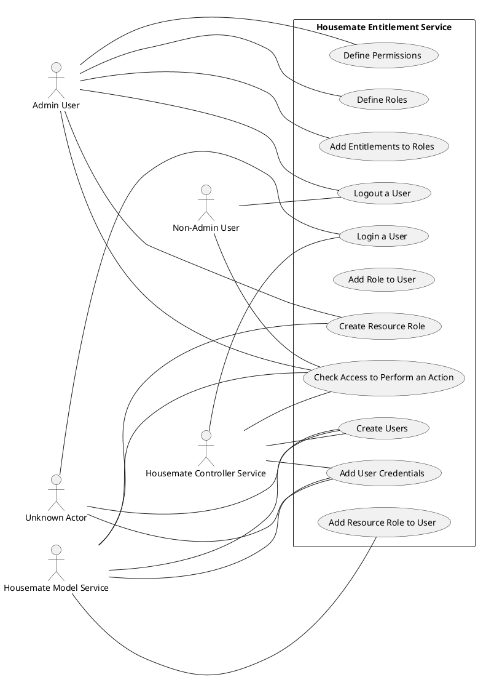
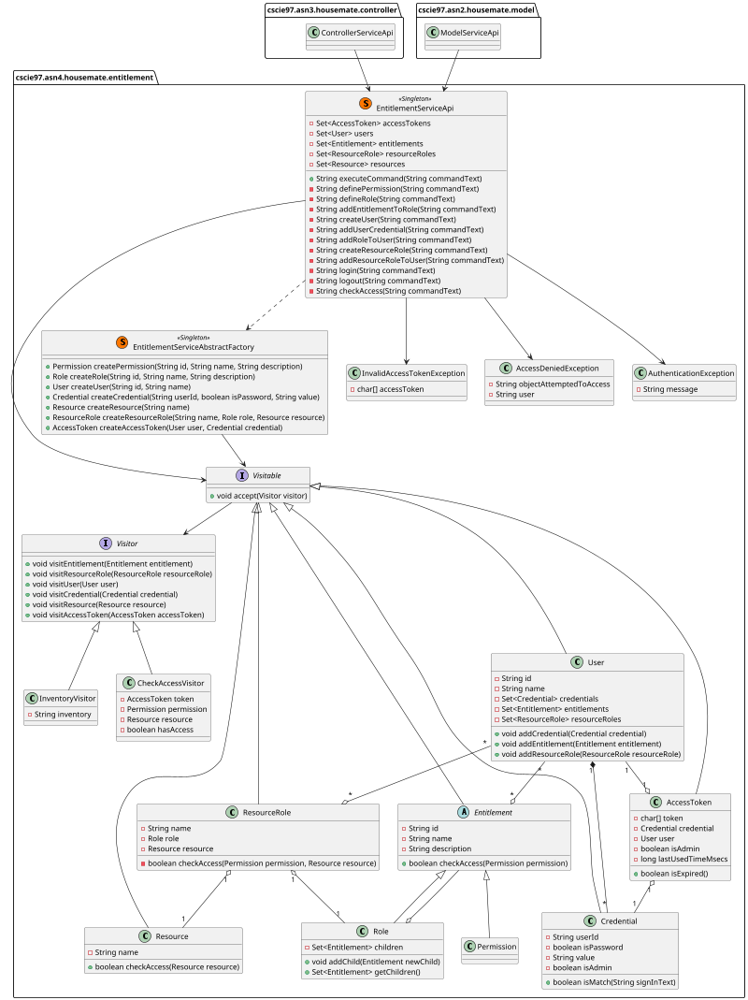

# Housemate Entitlement Service Design Document

__Date:__ 11/1/2025
__Author:__ Erik Orlowski
__Reviewers:__ Audreen Soh, Kyriaki Avgerinou

## Introduction
This document defines the design and requirements for the Housemate Entitlement Service. This service is used to control access to the Housemate Model Service.

## Overview
The Housemate system automates devices within the home to respond to user inputs and other appliances. Because of the level of access granted to elements of a user's home, it is imperative that only authorized user have access to objects in the Housemate system. The responsibility for this access control falls primarily on the Housemate Entitlement Service.

The Housemate Entitlement Service operates by defining Roles, which are compositions of Permissions and other Roles. The Housemate Entitlement Service also defines Resources, which map to objects in the Housemate Model Service. Resources require a user to have a specific Role or Resource Role to interact with them through the Housemate Model Service. Finally, the Housemate Entitlement Service defines users that can be assigned Roles and Resource Roles allowing them to interact with objects in the Housemate Model Service.

## Requirements
### Access Checks
The most fundamental feature of the Housemate Entitlement Service is to check if a user making a request to the Housemate Model Service has the appropriate access. This is implemented by the Housemate Model Service sending a request to the Housemate Entitlement Service in the form of

```check_access <auth_token>, <permission>, <resource>```

When a check_access request is received, the Housemate Entitlement Service first attempts to find the provided auth_token.

| __Requirement: Access Check With Invalid auth_token Is Rejected__ |
|--|
| When a check_access request is received and the provided auth_token is not found, the Housemate Entitlement Service shall throw an InvalidAccessTokenException. |

After the auth_token is found, the next step is to determine whether the auth_token has the required Permission provided by the Housemate Model Service.

| __Requirement: Permission Check Success for Admin User__ |
|--|
| When a check_access request is received and the auth_token is resolved to an Admin User, then the Housemate Entitlement Service shall return a successful response if the user has the Permission contained in the request. |

| __Requirement: Permission Check Failure for Admin User__ |
|--|
| When a check_access request is received and the auth_token is resolved to an Admin User, then the Housemate Entitelement Service shall throw an AccessDeniedException if the conditions in __Requirement: Permission Check Success for Admin User__ are not met. |

| __Requirement: Permission Check Success for Non-Admin User__ |
|--|
| When a check_access request is received and the auth_token is resolved to an Non-Admin User, then the Housemate Entitlement Service shall return a successful response if [the user has a Resource Role that specifies the provided Resource OR the Resource provided in the request is contained directly or indirectly in the resource specified by the Resource Role] AND [a Resource Role matching the provided Resource contained the Permission given in the request]. |

| __Requirement: Permission Check Failure for Non-Admin User__ |
|--|
| When a check_access request is received and the auth_token is resolved to an Non-Admin User, then the Housemate Entitlement Service shall throw an AccessDeniedException if the conditions in __Requirement: Permission Check Success for Non-Admin User__ are not met. |

### Access Management
Several constructs are used to represent the access that Users have in the Housemate system. These include Permissions, Roles and Resource Roles.

#### Permissions
Permissions are the most fundamental Entitlement. A Permission is requested by the Housemate Model Service to perform actions. 

A Permission consists of an ID, a name and a description.

Permissions are created with the following command:

```define_permission, <permission_id>, <permission_name>, <permission_description>```

| __Requirement: Define Permission Success__ |
|--|
| When a define_permission command is entered, if the command is correctly formatted, a Permission will be created with the requested ID, name and description. |

#### Roles
A Role is a composition of Permissions and sub-Roles. Roles are used to create logical groupings of Permissions that are easier to interact with than individual Permissions.

A Role consists of an ID, a name and a description.

A new Role is created with the following command:

```define_role, <role_id>, <role_name>, <role_description>```

| __Requirement: Define Role Success__ |
|--|
| When a define_role command is entered, if the command is correctly formatted, a Role will be created with the requested ID, name and description. |

Entitlements (Roles or Permissions) can be added to a Role with the following command:

```add_entitlement_to_role, <role_id>, <entitlement_id>```

| __Requirement: Add Entitlement to Role - Entitlement Not Found__ |
|--|
| When the add_entitlement_to_role command is run and the role_id or entitlement_id cannot be found, the command shall be rejected and the user will be informed of the error. |

| __Requirement: A Entitlement to Role Success__ |
|--|
| When an add_entitlement command is run, if the command is formatted correctly, the role_id is found and the entitlement_id is found, the Entitlement with entitlement_id shall be added to the Role with role_id.

#### Resource Roles
Resource Roles are used to indicate that a User can perform actions associated with a specific Role on a Resource or objects contained in that Resource.

A Resource Role consists of a name, a Role and a Resource.

Resource Roles are created with the following command:

```create_resource_role <resource_role_name>, <role_id>, <resource_id>```

| __Requirement: Resource Role Item Not Found__ |
|--|
| When a create_resource_role command is run, if a Role with the provided role_id cannot be found in the Housemate Entitlement Service or a Resource with the provided resource_id cannot be found in the Housemate Model Service, the command shall be rejected and the user will be informed of the error. |

| __Requirement: Resource Role Creation Successful__ |
|--|
| When a create_resource_role command is run, if a Role and Resource are found with the specified parameters, a new Resource Role shall be created with the provided resource_role_name, role_id and resource_id. |

| __Requirement: Resource Role Creation on Existing Resource Role__ |
|--|
| When a create_resource_role command is run and the resource_role_name already exists, the command shall be executed successfully with the Resource Role being associated with the new role_id and resource_id. |

### User Management
Users interact with the Housemate System through commands and through interacting the Housemate devices. The Housemate Entitlement Service has Admin users with access to configure the Housemate Entitlement Service and interact with any home and Non-Admin users who only have access to interact with Homes they are associated with.

Users are created by running the following command. At the time of creation, it is unknown whether the User should be an Admin or Non-Admin User.

```create_user <user_id>, <user_name>```

| __Requirement: User Creation__ |
|--|
| When the create_user command is run and it is properly formatted, a new User shall be created with the specified ID and name. |

Users also have credentials. A User's credentials are configured through the following command:

```add_user_credential <user_id>, <voice_print|password>, <value>```

| __Requirement: Add User Credential - User Not Found__ |
|--|
| If the add_user_credential command is run and the user_id provided does not match a User in the Housemate Entitlement Service, the command shall be rejected and a message shall be displayed. |

| __Requirement: Add User Credential - Unknown Credential Type__ |
|--|
| If the add_user_credential command is run and the second argument is neither "voice_print" nor "password", the command shall be rejected and a message shall be displayed. |

| __Requirement: Add User Credential - Admin User__ |
|--|
| If the add_user_credential command is run and the second argument is "password", the User's password shall be saved and the User shall be registered as an Admin. |

| __Requirement: Add User Credential - Admin User__ |
|--|
| If the add_user_credential command is run and the second argument is "voice_print", the User's voiceprint shall be saved and the User shall be registered as a Non-Admin. |

In order for Users to perform actions, they must be associated with Roles and Resource Roles. Users are given a Role with the following command:

```add_role_to_user <user_id>, <role>```

| __Requirement: Add Role To Invalid User__ |
|--|
| If the add_role_to_user command is executed and the user_id cannot be found, the command shall be rejected and an error message shall be displayed. |

| __Requirement: Add Invalid Role to User__ |
|--|
| If the add_role_to_user command is executed and the role cannot be found, the command shall be rejected and an error message shall be displayed. |

| __Requirement: Add Role to User Success__ |
|--|
| If the add_role_to_user command is run with a valid user_id and role, the User shall be given the specified Role. |

Users are given Resource Roles through the following command:

```add_resource_role_to_user <user_id>, <resource_role>```

| __Requirement: Add Resource Role To Invalid User__ |
|--|
| If the add_resource_role_to_user command is executed and the user_id cannot be found, the command shall be rejected and an error message shall be displayed. |

| __Requirement: Add Invalid Resource Role to User__ |
|--|
| If the add_resource_role_to_user command is executed and the resource_role cannot be found, the command shall be rejected and an error message shall be displayed. |

| __Requirement: Add Resource Role to User Success__ |
|--|
| If the add_resource_role_to_user command is run with a valid user_id and resource_role, the User shall be given the specified Resource Role. |

### Authentication
When Users are authenticated, an AccessToken is created for the User.

Admin Users are authenticated through the following command:

```login user <user_id>, password <password>```

| __Requirement: Admin User Successful Authentication__ |
|--|
| When the login command is executed with proper Admin formatting, if the user_id and password match a User, then the User shall be authenticated. |

Non-Admin Users are authenticated through the following command:

```login voiceprint <voiceprint>```

| __Requirement: Non-Admin User Successful Authentication__ |
|--|
| When the login command is executed with proper Non-Admin formatting, if the voiceprint matches a User, then the User shall be authenticated. |

| __Requirement: Invalid Login Rejection__ |
|--|
| If the login command is executed and [it is not formatted properly for an Admin or Non-Admin login] OR [the credential information provided does not match a User] then an AuthenticationException shall be thrown and the authentication attempt shall be rejected. |

| __Request: AccessToken After Login__ |
|--|
| If the login command is called successfully by the Housemate Model Service or the Housemate Controller Service, the newly created AccessToken shall be returned. |

#### Access Token Handling
When a User is authenticated, an AccessToken is created. This AccessToken is attached to the User and stays active until it is logged out or until it is timed out.

| __Requirement: Access Token Creation__ |
|--|
| When a User is successfully authenticated, a new AccessToken shall be created and attached to that User. |

An AccessToken is logged out through the following command:

```logout <auth_token>```

| __Requirement: Access Token Logout__ |
|--|
| When the logout command is executed successfully, any subsequent attempts to use the provided access key shall result in an InvalidAccessTokenException being thrown. |

| __Requirement: Access Token Logout Not Found__ |
|--|
| When the logout command is executed, if the auth_token provided is not found, an InvalidAccessTokenException shall be thrown. |

When AccessTokens are created, they are given an expiration time. This expiration time is renewed each time the AccessToken is used. If an attempt is made to use the AccessToken after its expiration time has expires, an exception is thrown.

| __Requirement: Access Token Timeout__ |
|--|
| When an attempt is made to use an AccessToken more than 1 hour after when the AccessToken was created or that last time it was used (whichever is later), an InvalidAccessTokenException shall be thrown. |

#### Authentication Required for Administrator Commands
In order to use certain commands, an Admin User must be logged in.

| __Requirement: Admin User for Configuration Commands__ |
|--|
| With the exception of the create_user, add_user_credential, login, logout and check_access commands, all commands described in this document shall throw an AccessDeniedException if an Admin User is not currently logged in with a valid AccessToken. |

### Inventory
An inventory of the Housemate Entitlement Service can be requested with the following command:

```inventory_entitlement_service```

| __Requirement: Inventory Command__ |
|--|
| When the inventory_entitlement_service command is received, a listing of all the objects created in the Housemate Entitlement Service shall be returned. |

### Invalid Commands
A number of error cases for commands are laid out in this document. In addition, a catch-all requirement is added to deal with any otherwise improper commands.

| __Requirement: Improper Housemate Entitlement Service Commands__ |
|--|
| If a command is processed by the Housemate Entitlement Service and this command is not properly formatted according to the commands outlined in this document, the command shall be rejected and an appropriate error message shall be shown. |

### External Interactions
In order to function properly in the Housemate System as a whole, the Housemate Entitelement Service interacts with the Housemate Model Service and the Housemate Controller Service.

#### check_access Interactions with Housemate Model Service
When the Housemate Model Service receives a request to view or change any Housemate Model Objects, it sends a check_access request to the Housemate Entitlement Service. The permission_id is be view_<device_type> for read only requests and control_<device_type> for requests that modify the device.

#### Occupants Interaction with Housemate Model Service
When a new Occupant is created in the Housemate Model Service, the Housemate Model Service sends a create_user request to the Housemate Entitlement Service, followed by an add_user_credential request for a default voiceprint associated with the newly created User.

When an Occupant is associated with a House, a create_resource_role request is made with the resource_role_name of <House Name>_(Adult|Child|Pet)_Resource_Role, a role of (Adult|Child|Pet)_Role and a resource of <House Name>. This is followed by an add_resource_role_to_user request to add the newly created Resource Role to the User.

#### Voice Command Device Interaction with Housemate Controller Service
When the 'voiceprint' status on an Ava device is modified, the Housemate Controller Service sends a login request to the Housemate Entitlement Service with the voiceprint associated with the status value.

When a voice command is received, the AccessToken associated with the current voiceprint status value of the Ava device is used in a check_access request to the Housemate Entitlement Service.

#### Housemate Controller Service Initial Login
At startup, the Housemate Controller Service uses Housemate Entitlement Service commands to create an Admin User and authenticate that User. The AccessToken associated with this User is used for all requests made by the Housemate Controller Service to the Housemate Model Service.

## Use Cases
The actors interacting with the Housemate Entitlement Service include unknown actors attempting to create users and login, Admin Users, Non-Admin Users, the Housemate Model Service and the Housemate Controller Service.

The use cases of the Housemate Entitlement Service include creating and configuring users, logging in and out, creating and allocating entitlements and checking access to perform certain actions. The use cases are laid out in greater detail below.



## Implementation
The main class in the Housemate Entitlement Service is the EntitlementServiceApi. This singleton class is the interface used by the command processor, the Housemate Model Service and the Housemate Controller Service.

The EntitlementServiceApi then uses the EntitlementServiceAbstractFactory, which implements the abstract factory design pattern to create the various objects that are used by the Housemate Entitlement Service.

When the EntitlementServiceApi receives a request to check access or inventory the objects in the Housemate Entitlement Service, this is handled using the visitor design pattern. A Visitor interface is created with methods to visit all of the relevant Entitlement Service classes. One concrete Visitor class is created to handle inventory requests and another concrete Visitor class is created to handle check access requests.

The final design pattern in use is the Composite design pattern to manage the relationship between Roles and Permissions.

The classes that make up the Housemate Entitlement Service are explained in greated detail in the class diagram below.

## Class Diagram


The classes used in the Housemate Entitlement Service and their relationships are shown in the diagram above. Further detail will be included in the Class Dictionary.

Notably, the Visitable interface covers all of the "domain" classes for the Housemate Entitlement Service, so many of the relationships with the higher level classes of the service are shown with this interface.

Also of note are the relationships between the User and athentication related classes. The AccessToken class is the first point of interaction in checking access. This class has a reference to its associated User and Credential. The Credential is needed to determine if the AccessToken has Admin rights. The reference to the User is then used to determine the Entitlements and ResourceRoles available.

## Class Dictionary
### EntitlementServiceApi
The EntitlementServiceApi is the top level class of the Housemate Entitlement Service. This is the class that external services and the command line interface interact with. This is implemented as a Singleton class.

#### Methods
| Method Name | Method Signature | Description |
|--|--|--|
| executeCommand | String executeCommand(String commandText) | Executes a command either from the command line or an external service and returns the output of the command or null if the command should not be processed by the Housemate Entitlement Service (i.e. it does not match one of the Entitlement Service commands). |
| definePermission | String definePermission(String commandText) | Creates a Permission object as requested and returns a String stating that the object was created or an error message. |
| defineRole | String defineRole(String commandText) | Creates a Role object as requested and returns a String stating that the object was created or an error message. |
| addEntitlementToRole | String addEntitlementToRole(String commandText) | Adds an Entitlement to a Role. Returns a confirmation String if the Entitlement was added or an error message otherwise. |
| createUser | String createUser(String commandText) | Creates a new User as requested and returns a String confirming the new User or an error message. |
| addUserCredential | String addUserCredential(String commandText) | Adds a new Credential to an existing User and returns a String confirming this action or an error message. |
| addRoleToUser | String addRoleToUser(String commandText) | Associates a User with a Role and returns a String confirming this action or an error message. |
| createResourceRole | String createResourceRole(String commandText) | Creates a new ResourceRole as requested and returns a String confirming this action or an error message. |
| addResourceRoleToUser | String addResourceRoleToUser(String commandText) | Associates an existing ResourceRole with an existing User and returns a String confirming this action or an error message. |
| login | String login(String commandText) | Logs the User in with the Credentials specified. Returns the AccessToken on success and an error message on failure. |
| logout | String logout(String commandText) | Logs the User with the given AccessToken out of the Housemate Entitlement Service. Returns a String indicating the successful logout or an error message. |
| checkAccess | String checkAccess(String commandText) | Checks if the provided AccessToken has access to the provided Permission with the provided Resource. Returns a String starting with "Access Granted" or "Access Denied". |

#### Associations
| Association Name | Type | Description |
|--|--|--|
| accessTokens | Set\<AccessToken> | A Set of all the AccessTokens that might currently be active in the Housemate Entitlement Service. |
| users | Set\<User> | A Set of all the Users that have been created in the Housemate Entitlement Service. |
| entitlements | Set\<Entitlement> | A Set of all the Entitlements in the Housemate Entitlement Service. |
| resourceRoles | Set\<ResourceRole> | A set of all the ResourceRoles in the Housemate Entitlement Service. |
| resources | Set\<Resource> | A Set of all the Resources in the Housemate Entitlement Service. |

### EntitlementServiceAbstractFactory
The EntitlementServiceAbstractFactory is the main interface in the Housemate Entitlement Service to create new instances of the classes making up the service. It is implemented as a Singleton class.

| Method Name | Method Signature | Description |
|--|--|--|
| createPermission | Permission createPermission(String id, String name, String description) | Creates a new Permission object with the specified parameters. |
| createRole | Role createRole(String id, String name, String description) | Creates a new Role object with the specified parameters. |
| createUser | User createUser(String id, String name) | Creates a new User with the specified parameters. |
| createCredential | Credential createCredential(String userId, boolean isPassword, String value) | Creates a new Admin or Non-Admin Credential with the specified parameters. |
| createResource | Resource createResource(String name) | Creates a new Resource with the specified name, corresponding to the fully qualified name of a Housemate Model Service object. |
| createResourceRole | ResourceRole createResourceRole(String name, Role role, Resource resource) | Creates a new ResourceRole with the parameters specified. |
| createAccessToken | AccessToken createAccessToken(User user, Credential credential) | Creates a new AccessToken for the specified User and Credential. |

### Visitable
The Visitable interface is used for Visitors to interact with Entitlement Service objects. This is used to facilitate taking an inventory of Entitlement Service objects and checking for access.

#### Methods
| Method Name | Method Signature | Description |
|--|--|--|
| accept | void accept(Visitor visitor) | Receives requests from the Visitor implementations. |

### Visitor
The Visitor interface is the interface implemented by the InventoryBuilder and CheckAccessVisitor to traverse the objects in the Housemate Entitlement Service.

#### Methods
| Method Name | Method Signature | Description |
|--|--|--|
| visitEntitlement | void visitEntitlement(Entitlement entitlement) | Performs the relevant action for the Entitlement abstract class. |
| visitResourceRole | void visitResourceRole(ResourceRole resourceRole) | Performs the relevant action for the ResourceRole class. |
| visitUser | void visitUser(User user) | Performs the relevant action for the User class. |
| visitCredential | void visitCredential(Credential credential) | Performs the relevant action for the Credential class. |
| visitResource | void visitResource(Resource resource) | Performs the relevant action for the Resource class. |
| visitAccessToken | void visitAccessToken(AccessToken accessToken) | Performs the relevant action for the AccessToken class. |

### InventoryVisitor
The InventoryVisitor class is used to build an inventory of the objects in the Housemate Entitlement Service.

#### Properties
| Property Name | Type | Description |
|--|--|--|
| inventory | String | A running record of the inventory of objects in the Housemate Entitlement Service. |

### CheckAccessVisitor
The CheckAccessVisitor class is used to check access for a particular Permission and Resource.

#### Properties
| Property Name | Type | Description |
|--|--|--|
| hasAccess | boolean | Whether it has been determined that the AccessToken has the access requested. |

#### Associations
| Association Name | Type | Description |
|--|--|--|
| token | AccessToken | The AccessToken being used to request access. |
| permission | Permission | The Permission being requested. |
| resource | Resource | The Resource that the request is trying to act on. |

### Resource
The Resource class is used to represent an object in the Housemate Model Service that a request might be made to act on.

#### Methods
| Method Name | Method Signature | Description |
|--|--|--|
| checkAccess | boolean checkAccess(Resource resource) | Returns whether this Resource is contained in and therefore has access to the Resource parameter being passed in. |

#### Properties
| Property Name | Type | Description |
|--|--|--|
| name | String | The fully qualified name of the Resource as represented in the Housemate system command line interface. |

### Entitlement
The Entitlement abstract class is used to represent both Roles and Permissions in the Housemate Entitlement Service.

#### Methods
| Method Name | Method Signature | Description |
|--|--|--|
| checkAccess | boolean checkAccess(Permission permission)| Returns whether the entitlement matches or contains the given Permission. |

#### Properties
| Property Name | Type | Description |
|--|--|--|
| id | String | The unique ID of the Entitlement. |
| name | String | The name of the Entitlement. |
| description | String | A description of the Entitlement. |

### Permission
The Permission class represents the most basic level of access in the Housemate Entitlement Service. It extends the Entitlement abstract class and has no additional properties or methods. The Permission class serves as a "leaf" in the composite pattern relating Roles and Permissions.

### Role
The Role class is used to represent a logic grouping of Permissions and sub-Roles that might be associated with zero or more Users. A Role serves the purpose of a "directory" in the composite pattern relating Roles and Permissions.

#### Methods
| Method Name | Method Signature | Description |
|--|--|--|
| addChild | void addChild(Entitlement newChild) | Adds an Entitlement to the access granted by this Role. |
| getChildren | Set<Entitlement> getChildren() | Returns a Set of the direct children of the Role. |

### User
The User class represents a User of the Housemate system and stores their Credentials and access. AccessTokens are not stored by the User, but instead, Users are referenced through AccessTokens.

#### Methods
| Method Name | Methid Signature | Description |
|--|--|--|
| addCredential | void addCredential(Credential credential) | Associates the credential with the User. |
| addEntitlement | void addEntitlement(Entitlement entitlement) | Associates the Entitlement with the User. |
| addResourceRole | void addResourceRole(ResourceRole resourceRole) | Associates the ResourceRole with the User. |

#### Properties
| Property Name | Type | Description |
|--|--|--|
| id | String | The unique ID of the user. |
| name | String | The name of the User. |

#### Associations
| Association Name | Type | Description |
|--|--|--|
| credentials | Set<Credential> | A Set of the Credentials associated with this User. |
| entitlements | Set<Entitlement> | A Set of the Entitlements associated with this User. |
| resourceRoles | Set<ResourceRole> | A Set of the ResourceRoles associated with this User. |

### Credential
The Credential class represents a method for a User to login to the Housemate Entitlement Service. This can eiter be a User ID and password or a voiceprint.

#### Methods
| Method Name | Method Signature | Description |
|--|--|--|
| isMatch | boolean isMatch(String signInText) | Checks if the signInText provided from a login request matches this Credential. |

### Properties
| Property Name | Type | Description |
|--|--|--|
| userId | String | The userId associated with this credential or null for a voiceprint. |
| isPassword | boolean | Stores whether this Credential represents a username/password combo or a voiceprint. |
| value | String | The hashed value of the password or voiceprint. |
| isAdmin | boolean | Stores whether this Credential grants Admin access. For now, this is the same as isPassword, but a separate property is being included to prevent issues with future potential changes. |

### AccessToken
The AccessToken class represents an authenticated session with the Housemate Entitlement Service. An AccessToken is created when a User logs in and deleted when a User logs out or an attempt is made to use an expired AccessToken.

#### Methods
| Method Name | Method Signature | Description |
|--|--|--|
| isExpired | boolean isExpired() | Returns whether the AccessToken has timed out. |

#### Properties
| Property Name | Type | Description |
|--|--|--|
| token | char[] | The token used to store this AccessToken. |
| isAdmin | boolean | Whether this AccessToken represents an Admin users. |
| lastUsedTimeMsecs | long | A system timestamp in milliseconds of the last time this AccessToken logged in or was used. This is used to monitor for timeouts. |

#### Associations
| Association Name | Type | Description |
|--|--|--|
| credential | Credential | The Credential used to create this AccessToken. |
| user | User | The User associated with this AccessToken. |

### InvalidAccessTokenException
An InvalidAccessTokenException is thrown whever the Housemate Entitlement Service attempts to use an expired of logged out AccessKey.

#### Properties
| Property Name | Type | Description |
|--|--|--|
| accessToken | chaf[] | The accessToken that was used for the failed request. |

### AccessDeniedException
The AccessDeniedException is thrown when an attenpt to antthing without acess.

#### Properties
| Property Name | Type | Description |
|--|--|--|
| objectAttemptedToAccess | String | The object in the Housemate Model Service the User was attempting to access. |
| user | String | The User name attempting the access request. |

### AuthenticationException
An AuthenticationException is thrown when a login attempt fails.

#### Properties
| Property Name | Type | Description |
|--|--|--|
| message | String | A message explaining the authentication failure. |

## Implementation Details
Below is a detailed view of the interactions between the Housemate Entitlement Service, Housemate Controller Service and Housemate Model Service for typical useage of the Housemate system.

```plantuml
@startuml
scale max 800 width

actor Admin as "Admin User"
actor User as "Non-Admin User"
participant CommandInterface
participant Model as "ModelServiceApi"
participant Controller as "ControllerServiceApi"
participant Entitlement as "EntitlementServiceApi"
participant Factory as "EntitlementServiceAbstractFactory"
participant AdminUser as "User : adminUser"
participant AdminCredential as "Credential : adminCredential"
participant AdminAccessToken as "AccessToken : adminAccessToken"
participant Role as "Role : adultRole"
participant Resource as "Resource : house1"
participant ResourceRole as "ResourceRole : adultHouse1"
participant Permission as "Permission : controlLights"

Admin -> CommandInterface : create_user admin, Admin
CommandInterface -> Entitlement : executeCommand("create_user admin, Admin")
Entitlement -> Factory : createUser("admin", "Admin")
Factory -> AdminUser : new User("admin", "Admin")
Admin -> CommandInterface : add_user_credential, admin, password, secret
CommandInterface -> Entitlement : executeCommand("add_user_credential, admin, password, secret")
Entitlement -> Factory : createCredential("admin", true, "secret")
Factory -> AdminCredential : new Credential("admin", true, "secret")
Factory -> AdminUser : addCredential(adminCredential)
Admin -> CommandInterface : login admin, password secret
CommandInterface -> Entitlement : executeCommand("login admin, password secret")
Entitlement -> AdminAccessToken : new AccessToken(adminCredential, adminUser)
Admin -> CommandInterface : define_permission, control_lights, control_lights, "Turn on and off lights"
CommandInterface -> Entitlement : executeCommand("define_permission, control_lights, control_lights, \"Turn on and off lights\"")
Entitlement -> Factory : createPermission("control_lights", "control_lights", "Turn on and off lights")
Factory -> Permission : new Permission("control_lights", "control_lights", "Turn on and off lights")
Admin -> CommandInterface : define_role, adult_user, adult_user, "An adult Housemate User"
CommandInterface -> Entitlement : executeCommand("define_role, adult_user, adult_user, \"An adult Housemate User\"")
Entitlement -> Factory : createRole("adult_user", "adult_user", "An adult Housemate User")
Factory -> Role : new Role("adult_user", "adult_user", "An adult Housemate User")
Admin -> CommandInterface : define occupant John type Adult
CommandInterface -> Model : executeCommand("define occupant John type Adult")
Model -> Entitlement : executeCommand("create_user John John")
note right
    User created in a similar manner to above.
end note
Model -> Entitlement : executeCommand ("add_user_credential, John, voiceprint, --John--")
note right
    Credential created in a similar manner to above.
end note
Entitlement --> Model
Admin -> CommandInterface : add occupant John to house House1
CommandInterface -> Model : executeCommand("add occupant John to house House1")
Model -> Entitlement : executeCommand("create_resource_role house1Adult, adult_user, House1")
Entitlement -> Factory : createResource("House1")
Factory -> Resource : new Resource("House1")
Entitlement -> Factory : createResourceRole("House1Adult", adultRole, house1)
Factory -> ResourceRole : new ResourceRole("House1Adult", adultRole, house1)
User -> CommandInterface : set appliance House1:Kitchen:Ava status voiceprint value --John--
CommandInterface -> Model : executeCommand("set appliance House1:Kitchen:Ava status voiceprint value --John--")
Model -> Entitlement : executeCommand("login voiceprint --John--")
note right
    Login performed in the same manner as above.
end note
Entitlement --> Model
User -> CommandInterface : set appliance House1:Kitchen:Ava status voice_command value Lights_On
CommandInterface -> Model : executeCommand("set appliance House1:Kitchen:Ava status voice_command value Lights_On")
Model -> Controller
note right
    Handle voice command
end note
Controller -> Model : executeCommand("set appliance House1:Kitchen:Lights status power value on", johnAccessToken)
Model -> Entitlement : executeCommand("check_access johnAccessToken, control_lights, House1:Kitchen:Lights")

@enduml
```



This diagram depicts the process of provisioning Users, Entitlements and Resources. It also shows the processing of creating User credentials and authenticating. Finally, it shows a typical process for a user executing a command and how the access check takes place.

## Exception Handling
Exceptions are primarily handled by the three Exception classes. The InvalidAccessTokenException class handles cases where an AccessToken is expired or logged out. The AccessDeniedException handles cases where an access request is rejected because the AccessToken provided does not have the correct access. Finally, the AuthenticationException handles errors during user authentication.

In all cases, execution of the command script shall continue past any Exceptions and a helpful error message shall be returned.

## Testing
The testing for the Housemate Entitlement Service shall include the following:

* Creating an Admin and Non-Admin User
* Creating Credentials for each of these Users
* Logging in with each of these Users
* An Admin User creating a Permission, a Role and a Sub-Role
* A Non-Admin User being created by the Housemate Model Service
* A Non-Admin User being given a Resource Role by being associated with a House
* A request needing authentication being made directly to the Housemate Model Service and being accepted
* A request needing authentication being made directly to the Housemate Model Service and being rejected
* A request needing authentication being made through the Housemate Controller Service and being accepted
* A request needing authentication being made through the Housemate Controller Service and being rejected
* An attempt to use an expired AccessToken (this can be achieved by temporarily changing the timeout time and introducing a sleep command into the command processor)

## Risks
The Housemate System has a high amount of access to user homes. Because of that, it is an ethical responsibility of the Housemate Company to ensure that the safety of Housemate users is protected by ensuring the security of Housemate systems. The Housemate Entitlement Service provides the protection for users to ensure that this service remains safe and secure.

One vulnerability is in the command line interface. Given the commands specified in the assignment requirements, an individual, authorized or otherwise, with access to the command line interface would have easy ability to create Admin and Non-Admin users. They would also have easy ability to create Roles and Permissions and assign themselves to these Entitlements. This would grant them a very high level of access to Houses across the Housemate system.

Because of that, thorough threat modeling must be performed to ensure that unauthorized agents do not receive access to the Housemate system.

An additional risk is that passwords are being passed as plain text to the command line. This could additionally pose a security risk to users, risking the security of their passwords.