# Next Generation Air Traffic Controller - Software Design
__Date:__ 12/3/2025
__Author:__ Erik Orlowski
__Reviewers:__ Jefferson Dang, Kyriaki Avgerinou

## Introduction
The document captures the requirements, design and test plan for the Next Generation Air Traffic Control (NGATC) system. The NGATC is composed of several modules, this document will discuss the architectural design of how these modules work together, as well as each of these modules individually.

## Overview
The NGATC is a scalable, high availability and safety critical system that will manage air traffic throughout the United States. The system supports the ability to:
* Track aircraft position in US airspace
* Use flight plan data and current aircraft data to predict aircraft flight paths
* Use flight path predictions to predict and prevent any aircraft collisions
* Monitor and reject flight plans with invalid routes (e.g. through restricted airspace or into obstacles)
* Display information about flights to Air Traffic Controllers
* Support communication between the NGATC and pilots
* Allow administrators to configure the NGATC system as needed
* Monitor and log events throughout the system

Each of the modules in the NGATC will communicate with each other through the REST API protocol. The NGATC will be created as a Kubernetes cluster, enabling redundancy of the modules making up the system as well as allowing the system to be easily scaled and reconfigured.

The system will be tested at a functional level (verifying and validating the system as a whole), a module level (verifying individual modules) and at a unit level (unit testing of individual methods).

This document includes a discussion of the NGATC system as a whole, as well as each of the modules that make it up. This document also discusses the functional and non-functional requirements of the system and modules, as well as a high level test plan.

## System Level Requirements
The following section discusses the system level requirements of the NGATC. More granular requirements are discusses in the module level requirements below.

### Functional Requirements

#### Aircraft Tracking and Surveillance
| Requirement: Real-Time Aircraft Data Ingestion |
|--|
| The NGATC shall ingest real-time position data from surveillance sources including radar, ADS-B, satellite and potential future sources through a well-defined API. |

| Requirement: Real-Time Aircraft Position Update |
|--|
| The NGATC shall update the real-time position of all tracked aircraft at a rate of at least once per second. |

| Requirement: Unified Aircraft Track |
|--|
| The NGATC shall synthesize surveillance inputs for a single aircraft into a single, unified aircraft track. |

| Requirement: Aircraft Data Display |
|--|
| The NGATC shall display the position, pitch, altitude, speed and heading of each tracked aircraft to controllers. |

#### Flight Data Management
| Requirement: Flight Plan Ingestion |
|--|
| The NGATC shall ingest aircraft flight plans through a well defined API. |

| Requirement: Flight Plan Association |
|--|
| The NGATC shall associate aircraft flight plans with aircraft tracks. |

| Requirement: Flight Plan Amendments |
|--|
| The NGATC shall support the ability for pilots and controllers to make amendments to flight plans. |

| Requirement: Pilot Flight Plan Amendment Acceptance |
|--|
| When the NGATC receives a proposed flight plan amendment from a pilot, the NGATC shall have the ability to accept or reject this proposal. |

| Requirement: Aircraft Trajectory Prediction |
|--|
| The NGATC shall predict aircraft trajectories based on the aircraft's speed, altitude and route. |

| Requirement: Flight Plan Deviation Notifications |
|--|
| The NGATC shall notify controllers of deviations between an aircraft's flight plan and its actual behavior beyond acceptable limits. |

#### Communication Services
| Requirement: Secure Pilot Messaging Interface |
|--|
| The NGATC shall provide a secure messaging interface between controllers and pilots. |

| Requirement: Communication Log Audits and Playback |
|--|
| The NGATC shall persistently store communication logs to enable audits and playback. |

| Requirement: Controller to Controller Messaging |
|--|
| The NGATC shall support the ability for any two controllers to message each other. |

| Requirement: Controller Status Indicators |
|--|
| The NGATC will make available to controllers, supervisors and administrators, status indicators showing which controller is responsible for which sector of airspace. |

| Requirement: High Priority Ports |
|--|
| Each module of the NGATC shall provide high priority communication ports to be only to be used to ensure real-time communication in emergency situations. |

#### Conflict Detection and Safety Alerts
| Requirement: Loss of Separation Detection |
|--|
| The NGATC shall detect any loss of separation conflict with other aircraft or with static hazards. |

| Requirement: Loss of Separation Alert to Aircraft |
|--|
| Upon detection of loss of separation, the NGATC shall provide an alert to the involved aircraft including [the position, altitude, heading, and vertical and horizontal speeds] of both aircraft, and avoidance guidance (both aircrafts' avoidance guidance are sent to both aircraft) within 100 ms. |
| Rationale: In loss of separation incidents, it is unacceptable to rely solely on the reaction time of a human operator. Therefore, it is preferable to trust the initial task of alerting the involved aircraft to automated systems. |

| Requirement: Loss of Separation Alert to Controller |
|--|
| When a loss of separation event occurs, the NGATC shall notify the relevant controller(s) with the same information and guidance provided to the involved aircraft. |

| Requirement: Restricted Airspace Alerts |
|--|
| The NGATC shall alert controllers when an aircraft violates restricted airspace. |

#### Weather and External Data Integration
| Requirement: Real-Time Weather Ingestion |
|--|
| The NGATC shall ingest real-time weather and turbulence data. |

| Requirement: Weather Impacts on Trajectories |
|--|
| The NGATC shall compensate for the impact of weather on flight trajectories. |

| Requirement: UI Weather Overlays |
|--|
| The NGATC shall include a weather overlay on controller displays. |

#### Sector Management
| Requirement: Dynamic Sector Boundaries |
|--|
| The NGATC shall support administrators merging and splitting sectors based on workload. |

| Requirement: Aircraft Sector Reassignment |
|--|
| The NGATC shall automatically reassign aircraft when sector boundaries change. |

| Requirement: Sector Workload Threshold Alerts |
|--|
| When a sector exceeds workload thresholds, the NGATC shall alert administrators and supervisors. |

#### Airspace Automation and AI Assistance
| Requirement: AI Assisted Conflict Prediction |
|--|
| The NGATC shall provide AI assisted conflict prediction for at least 3-5 minutes into the future. |

| Requirement: AI Assisted Conflict Alert |
|--|
| When a potential future conflict is identified by the AI assisted conflict prediction, an alert will be given to the controller. |

| Requirement: AI Generated Route Optimization Suggestions |
|--|
| The NGATC shall provide AI generated route optimization suggestions that controllers can either accept or reject. |

| Requirement: AI Detected Abnormal Aircraft Behavior |
|--|
| The NGATC shall provide alerts to the controller for AI detected abnormal aircraft behavior, such as altitude deviations. |

#### Controller User Interface
| Requirement: Real-Time Aircraft Map |
|--|
| The NGATC shall display aircraft on a real-time map with configurable zoom levels. |

| Requirement: Color Coded Alerts |
|--|
| The NGATC shall display color coded visual alerts to controllers. Red alerts indicate an immediate safety concern, yellow alerts indicate a potential future safety concern and white alerts are informational. |

| Requirement: Aircraft Details Window |
|--|
| The NGATC shall provide controllers an aircraft details window, display the aircraft's altitude, route, communication status and ETA. |

| Requirement: Drag and Drop Sector Reassignment |
|--|
| The NGATC shall support the ability for controllers to drag and drop aircraft to reassign their sector. |

#### System Monitoring and Logging
| Requirement: Event Logging |
|--|
| The NGATC shall log all system events, alerts and messaging for auditing. |

| Requirement: Module Health Monitoring |
|--|
| The NGATC shall provide health monitoring for each module, visible to administrators, supervisors and controllers. |

| Requirement: Service Unavailable Alert |
|--|
| The NGATC shall provide an alert to administrators, supervisors and controllers when any module becomes unavailable. |

#### Administrative Functions
| Requirement: System Configurability |
|--|
| The NGATC shall allow for the configuration of what inputs to accept as surveillance inputs, the severity of alerts and aircraft separation thresholds. |

| Requirement: Role Based Access |
|--|
| The NGATC shall support role based actions based on the controller, supervisor and administrator roles. |

| Requirement: Simulation Mode |
|--|
| The NGATC shall support a simulation mode for training. |

### Non-Functional Requirements

#### Performance
| Requirement: Surveillance Latency |
|--|
| The NGATC shall process surveillance updates with a latency of less than 500 ms. |

| Requirement: Aircraft Volume |
|--|
| The NGATC shall support at least 5000 simultaneous aircraft tracks. |

| Requirement: Controller UI Refresh Rate |
|--|
| The NGATC controller user interface shall update aircraft positions at least once per second. |

#### Availability and Reliability
| Requirement: 5 Nines of Availability |
|--|
| The NGATC shall be available 99.999% of the time. |

| Requirement: Redundance Services |
|--|
| The NGATC shall provide redundancy with automatic within 250 ms for all modules whose absence could adversely affect aircraft safety. |
| Comment: This system does not necessarily require a "bumpless" switchover, so long as all data used by modules is not more than 2 seconds old (measured from when the NGATC ingested the data) and the module uses the most current available data within 1 second of the switchover event. |

| Requirement: Track Data Preservation |
|--|
| When the NGATC switches to another instance of a module due to a failure, this switchover shall preserve all track data. |

#### Scalability
| Requirement: Horizontal Scalability |
|--|
| The NGATC deployment shall scale horizontally to support increases in aircraft volume. |

| Requirement: Module Scaling |
|--|
| NGATC modules shall have the ability to scale independently based on loading. |

| Requirement: Data Pipeline Support |
|--|
| NGATC data pipelines shall support ingest rates of up to 100,000 messages per second. |

#### Security
| Requirement: Communication Encryption |
|--|
| All communication between modules shall use TLS encryption. |

| Requirement: Role-Based Authentication |
|--|
| The NGATC shall enforce role based authentication. |

| Requirement: Security Logging |
|--|
| The NGATC shall log all security-relevant events, including logins, changes and overrides. |

| Requirement: Flight Data Modification |
|--|
| The NGATC shall protect against the unauthorized modification of flight data. |

#### Maintainability
| Requirement: Microservice Use |
|--|
| NGATC modules shall be implemented as microservices using well-defined APIs. |

| Requirement: Module Failure Isolation |
|--|
| The NGATC shall isolate failures to individual modules to prevent cascading effects. |

| Requirement: Naming and Documentation |
|--|
| Code and service interactions shall follow clear naming conventions and documentation standards. |

#### Usability
| Requirement: Controller Alert Reaction Time |
|--|
| Controllers shall be able to identify conflicts within 2 seconds of an alert being generated. |

| Requirement: Color Coded Alerts |
|--|
| The NGATC UI shall distinguish between alert severity levels using different colors and shapes. |

| Requirement: Night and Day Mode |
|--|
| The NGATC UI shall support both night and day display modes. |

#### Interoperability
| Requirement: Surveillance Data Input Format |
|--|
| The NGATC shall use JSON as the supported input format for surveillance data. |

| Requirement: External REST API |
|--|
| The NGATC shall provide a REST API for integrating with external systems. |

| Requirement: New Data Sources |
|--|
| The NGATC shall support the "plug and play" addition of new data sources. |

#### Testability
| Requirement: Module Testability |
|--|
| Each module shall be independently testable using mock data. |

| Requirement: Simulation Testing |
|--|
| The NGATC shall provide simulation tools that can be used to test conflict detection logic at a system level. |

| Requirement: Automated Test Coverage |
|--|
| At least 80% automated test coverage of the NGATC core logic shall be achieved. |

## Use Cases
The following diagram summarizes the use cases of the NGATC.

```plantuml
@startuml
title Next Generation Air Traffic Control Use Cases
scale max 800 width

actor Pilot
actor "Flight Controller" as ctrl
actor Supervisor
actor Administrator
actor "Surveillance Data" as data

usecase "Submit Flight Plan" as plan
usecase "Use New Flight Plan" as usenew
usecase "Accept/Reject Flight Plan" as accept
usecase "Give New Route" as reroute
usecase "Give Emergency Guidance" as guide
usecase "Report Aircraft Positions" as report
usecase "Configure System" as cfg
usecase "Reassign Sectors" as sector
usecase "Monitor System Health" as monitor

Pilot --> plan
Pilot --> usenew
ctrl --> accept
ctrl --> reroute
ctrl --> guide
Administrator --> cfg
Administrator --> sector
data --> report
Supervisor --> monitor
Administrator --> monitor
ctrl --> monitor
@enduml
```
The Pilot reports their flight plan to the flight controller and has regular contact with them. Part of the contact will be to receive and utilize new flight plans from the controller.

The controller works with the pilot and with the information from the NGATC to safety guide aircraft through their flight plans. Controllers have the responsibility of accepting or rejecting flight plans, rerouting aircraft as necessary and supporting the implementation of emergency guidance generated by the NGATC.

Supervisors monitor the system health and sector volume.

Administrators configure the system, divide the airspace into sectors and monitor the health of the system.

Finally, surveillance data is used to report the position of aircraft.

## Module Summary
The modules that make up the NGATC are shown in the component diagram below and are explained in more detail following the diagram.

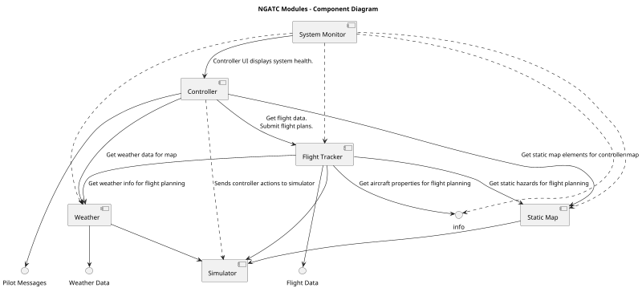

### System Monitor
The System Monitor is responsible for monitoring the health of all modules in the NGATC system. The system monitor consumes the health of each module in the NGATC and produces an interface for modules (the Controller module, although there is nothing to preclude other modules from consuming this interface) to gain information about the NGATC system health.

### Controller
The Controller module is the primary interface that flight controllers will directly interact with. This module exposes a GUI to flight controllers that shows aircraft light data, weather, map information and aircraft type information. The Controller module consumes this information from the Flight Tracker, Static Map and Weather modules. This module allows bidirectional communication between pilots and controllers, as well as between multiple controllers. It also provides alert information to controllers, as well as AI generated suggestions.

The Controller module also allows administrators and supervisors to configure airspace sectors.

Finally, the controller module allows pilots to have encrypted communication with flight controllers.

### Flight Tracker
The Flight Tracker module is a safety critical module responsible for consuming all data related to aircraft flights and providing this information to the Controller module. In addition to consuming data, the Flight Tracker module has the responsibility to detect aircraft conflicts and any other unsafe conditions, and to respond appropriately. The module also uses an AI agent to make adjustments to flight plans, using safety critical code to detect for any hazards.

As the safety critical module of the NGATC, the Flight Tracker module shall be developed in compliance with [Systematic Capability 3](https://www.exida.com/blog/Back-to-Basics-14-Systematic-Capability) as defined in [IEC 61508-3](https://www.exida.com/Blog/back-to-basics-06-iec-61508).

### Weather
The Weather module is responsible for ingesting weather reports and providing this information to the Flight Tracker.

### Static Map
The Static Map module is responsible for managing the airspace map, including static hazards (e.g. mountains and tall buildings), restricted airspace and landmarks (e.g. airports). This information is consumed by the Flight Tracker and Controller modules.

### Simulator
The Simulator module is responsible for providing mock data to the modules of the NGATC, as well as consuming information from the NGATC to inform this mock data. Furthermore, the Simulator module will report to the modules that are consuming it whether the system is in production or simulated mode. An administrator can interact with the Simulator module through a command line interface to enable and disable simulation mode.

## Module Communications
Modules communicate with each other and with external services through REST APIs. Communication between modules is encrypted using TLS encryption.

## Activity Diagram
The process of provisioning a new flight is demonstrated in the activity diagram below.

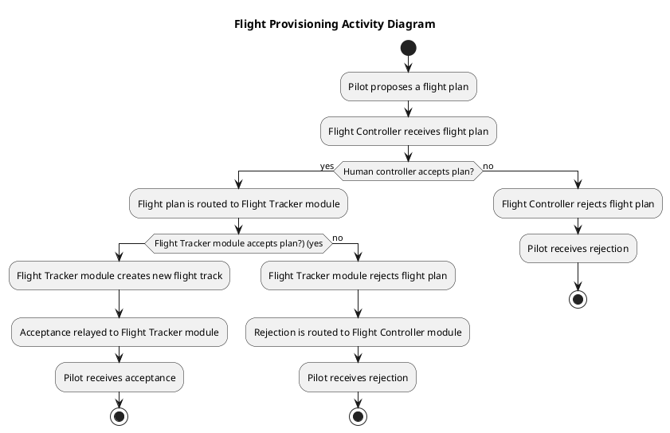

This diagram illustrates the a flight plan must be accepted by both a human flight controller as well as the analysis performed in the Flight Tracker module. If the flight plan is accepted, then the plan is entered into the NGATC system for the flight to begin. If the flight plan is rejected, then the pilot will need to submit a new plan.

## High Level Flight Sequence
The diagram below shows a high level overview of the communication between modules during the course of an example flight.

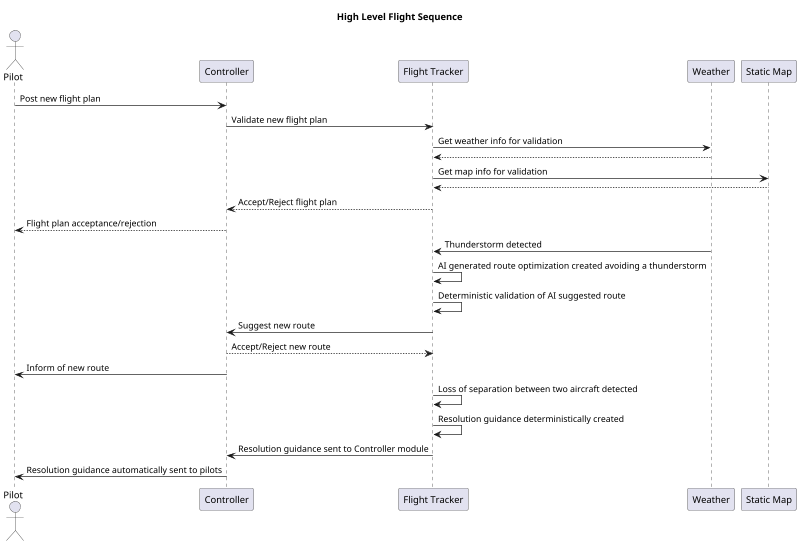

This diagram depicts how the pilots interact with flight controllers through the Flight Control module. It also depicts how the Flight Tracker module validates a flight plan, using data from other, lower level modules. The interactions in the flight plan validation process are meant to be illustrative, with more specific details available in the Flight Tracker module level design. Finally, the diagram depicts the process of receiving, validating and communicating an AI suggested route optimization, in this case, to avoid a thunderstorm. Of note is that once the suggestion is created, it is validated in a deterministic manner (i.e. not through the use of AI) to ensure the new flight plan is safe.

The thunderstorm route adjustment contrasts with the resolution guidance created to handle a loss of separation event. In this case, the resolution guidance is deterministically created, without the use of AI. This guidance is then automatically sent to the pilots. This removes any human reaction time from the flight controller in the implementation of the resolution guidance.

## System Deployment
The NGATC is deployed through Kubernetes, with each module being deployed along with its database. Multiple instances of each module are deployed to allow for redundant switchover and automatic load balancing handled automatically by Kubernetes. To ensure resilience against any physical events, instances of each module are commissioned at disparate geographic locations.

## Access Control
Access control for the NGATC will utilize the Entitlement Service developed by Housemate Inc. The four roles defined for the NGATC are controllers, supervisors, administrators, pilots and internal modules. For all actions in the NGATC that are not "read-only", some level of authenticated access is required, with specifics discussed in the requirements and design details.

## Persistence Strategy
For each module, all information needed to restore to the current running point in the event of failure is stored persistently in a database, accessed using Hibernate. For classes that must be persisted, the module level designs outline what property in the class maps to the primary key that relates the object to the persistent database.

## Use of AI
AI agents are used to accomplish three tasks in the NGATC, all interfacing with the Flight Tracker module:
* To predict future aircraft conflicts (although detecting active loss of separation events is accomplished through deterministic, safety critical code)
* To generate route optimization suggestions (validated by deterministic code)
* To detect and report abnormal aircraft behavior

In no cases will an AI agent have the authority to direct edit a any data in the NGATC without being deterministically validated. Whenever possible, any actions proposed by an AI agent are also validated by a human.

## High Level Testing Strategy
The NGATC is tested at three levels, unit testing, module testing and system testing.

### Unit Testing
Unit testing is performed as needed on modules of the NGATC. For safety critical code, the following guidelines are established:
* [CCN](https://www.geeksforgeeks.org/dsa/cyclomatic-complexity/) <= 3: Unit test not required
* [CCN](https://www.geeksforgeeks.org/dsa/cyclomatic-complexity/) <= 9: Unit test required with reasonable branch coverage
* [CCN](https://www.geeksforgeeks.org/dsa/cyclomatic-complexity/) >= 10: Unit test required with 100% branch coverage required

For non-safety critical code, the following guidelines are established:
* [CCN](https://www.geeksforgeeks.org/dsa/cyclomatic-complexity/) <= 3: Unit test not recommended
* [CCN](https://www.geeksforgeeks.org/dsa/cyclomatic-complexity/) <= 9: Unit test recommended with reasonable branch coverage
* [CCN](https://www.geeksforgeeks.org/dsa/cyclomatic-complexity/) >= 10: Unit test required with reasonable branch coverage

### Module Testing
Module testing validates an individual module's behavior. It is performed by ingesting communication directly into the module, interacting with the module's GUI as appropriate, and observing the communicates output from the module. Details on module testing are discussed in the module design sections.

### System Testing
System testing is used to validate the NGATC's behavior as a "closed box". In system tests, the data for the NGATC to act upon are simulated through the Simulation module and user interactions with system GUIs are simulated using [Functionize](https://www.functionize.com/?_gl=1*12iaepr*_up*MQ..*_ga*MTMyMzYyNjUzMi4xNzY1MzEwMDI0*_ga_77JHMZYNHZ*czE3NjUzMTAwMjMkbzEkZzAkdDE3NjUzMTAwMjMkajYwJGwwJGgyMDExNDMyMDUy).

#### Happy Path Test
* Mock weather, map and aircraft type data are input through the simulator
* Multiple flight plans are submitted that should be accepted
* It is validated that these flight plans are accepted
* The NGATC waits until an AI route optimization is suggested
* It is validated that this suggestion is correctly accepted or rejected
* Is is validated that any updates to a flight plan are communicated properly
* The simulator injects surveillance data that should move an aircraft between sectors
* It is validated that the aircraft correctly changed sectors
* The Flight Control module GUI changes a sector boundary
* It is validated the all aircraft are correctly re-assigned and the controller GUIs update as needed

#### Loss of Separation Test
This test validates that the system responds properly to aircraft loss of separation events with other aircraft and static hazards.
* Mock weather, map and aircraft type data are input through the simulator
* Multiple flight plans are submitted that should be accepted
* It is validated that these flight plans are accepted
* The simulator injects flight surveillance data that should indicate a loss of separation between two aircraft
* It is validated that the system responds correctly to this loss of separation
* The simulator injects flight surveillance data that should indicate a loss of separation between an aircraft and a static hazard
* It is validated that the system responds correctly to this loss of separation

#### Invalid Flight Plan Test
* Mock weather, map and aircraft type data are input through the simulator
* Multiple flight plans are submitted that should be rejected
* It is validated that these flight plans are rejected and not added to the NGATC system.

## Risk Summary
The most critical risk for the NGATC is safety and availability. This risk comes in two forms: the risk that the system will cause a pilot to take an unsafe action and the risk that the system will fail to detect of act upon an existing unsafe condition. This risk is mitigated by the Flight Tracker module being treated as a safety critical module, with several design choices in the module reflecting the principal of diverse redundancy, and with the SC3 level of rigor the module is developed to. A significant challenge in developing the safety infrastructure of the NGATC is unlike in machine safety where "the safest machine is one that isn't running", there is no candidate for a "safe state" for the system. This means that the system must keep operating at all times and provide its best possible guidance to pilots.

Furthermore, this risk is mitigated by deploying redundant instances of the modules and corresponding databases making up the system, that automatically fail-over in the event of any failures.

Another class of risk in the NGATC is security. An unauthorized user making changes to this system could have catastrophic consequences. To mitigate this risk, the system is designed with access control using the Housemate Entitlement Service.

## System Monitor Module
The System Monitor module is responsible for monitoring and reporting on the statuses and events of modules in the NGATC system. The module is implemented with a MySQL database and uses the Spring Boot framework for the REST API implementation.

### Module Requirement Summary

#### Module Functional Requirements

* Controller Status Indicators: The System Monitor module shall expose an interface for other modules to report their status.
* Module Health Monitoring: The System Monitor module shall make available to other modules the status of all modules for which it has status information.
* Service Unavailable Alert: When the System Monitor module has not received a status update from a module in 2 seconds, it shall report the module as offline.
* High Priority Ports: In the system deployment, the System Monitor module's service shall have high priority ports for other modules to communicate high priority status updates.
* Event Logging: The System Monitor module shall expose an interface for other modules to report system events.
* Event Logging: The System Monitor module shall persistently store all system events provided to the module.
* Event Logging: The System Monitor module shall expose an interface for other modules to access recorded system events. This service shall require an administrator access token.

#### Module Non-Functional Requirements
* The System Monitor module shall respond to all incoming requests within 50 ms.
* The System Monitor module shall reflect all status updates from other modules within 50 ms.
* The System Monitor module shall be deployed in a redundant configuration, such that if an instance of the module fails, a switchover to a working instance of the module is complete within 250 ms.
* The System Monitor module shall have the ability to scale horizontally to accommodate additional module instances.
* The System Monitor module shall be implemented in such a way to allow new module types to be added to the NGATC system.
* The System Monitor module shall use a REST API to communicate with other modules in the NGATC.

### System Monitor Classes
The System Monitor is implemented with the following classes as shown below.

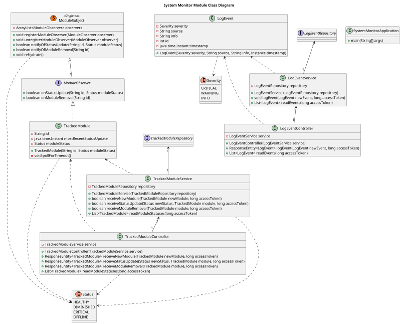

#### Class Dictionary
##### SystemMonitorApplication
The SystemMonitorApplication class is the main class used by the Spring Boot framework to run the REST API and database implementation. No business logic occurs in this class.

###### Methods
| Method Name | Method Signature | Description |
|--|--|--|
| main | main(String[] args) | Starts the SpringbootapiApplication, which runs the REST API and database implementation. |

##### LogEvent
The LogEvent class is used to store information for a specific system event in the NGATC.

###### Methods
| Method Name | Method Signature | Description |
|--|--|--|
| LogEvent | LogEvent(Severity severity, String source, String info, Instance timestamp) | Constructs a new LogEvent object. |

###### Properties
| Property Name | Type | Description |
|--|--|--|
| severity | Severity | The severity of the event. |
| source | String | A String with information about the module creating the event. |
| info | String | A String containing full information about the event. |
| timestamp | java.time.Instant | The time when the event occurred. |
| id | int | A unique ID of the LogEvent to use as the primary key in the database. |

##### LogEventRepository
This interface is used by the Spring Boot framework to store instances of the LogEvent class in the database.

##### LogEventService
The LogEventService is used to handle the business logic of REST API requests involving the LogEvent object.

###### Methods
| Method Name | Method Signature | Description |
|--|--|--|
| LogEventService | LogEventService (LogEventRepository repository) | Creates and logs a new LogEventService instance. |
| logEvent | void logEvent(LogEvent newEvent, long accessToken) | Logs a new LogEvent. |
| readEvents | List<LogEvent> readEvents(long accessToken) | Returns a list of events in the NGATC if the provided access token has the administrator role. |

###### Associations
| Association Name | Type | Description |
|--|--|--|
| repository | LogEventRepository | A reference to a LogEventRepository instance used for this service. |

##### LogEventController
The LogEventController class is used to generate HTTP responses to REST API requests involving the LogEvent class.

###### Methods
| Method Name | Method Signature | Description |
|--|--|--|
| LogEventController | LogEventController(LogEventService service) | Creates and logs a new LogEventController instance. |
| logEvent | ResponseEntity<LogEvent> logEvent(LogEvent newEvent, long accessToken) | Logs a new LogEvent. |
| readEvents | List<LogEvent> readEvents(long accessToken) | Returns a list of events in the NGATC. |

###### Associations
| Association Name | Type | Description |
|--|--|--|
| service | LogEventService  | A reference to a LogEventService instance used for this controller. |

##### ModuleSubject
The ModuleSubject class fills the role of the "subject" in the observer design pattern. This is implemented as a singleton instance, with a list of its registered observers.

###### Methods
| Method Name | Method Signature | Description |
|--|--|--|
| registerModuleObserver | void registerModuleObserver(ModuleObserver observer) | Registers a ModuleObserver to receive updates. |
| unregisterModuleObserver | void unregisterModuleObserver(ModuleObserver observer) | Removes the ModuleObserver from the list of ModuleObservers receiving updates. |
| notifyOfStatusUpdate | boolean notifyOfStatusUpdate(String id, Status moduleStatus) | Notifies all registered observers of a module giving a status update. Returns whether a module was found matching the ID. |
| notifyOfModuleRemoval | boolean notifyOfModuleRemoval(String id) | Notifies all registered observers that a module has been removed and its status should no longer be tracked. Returns whether a module was found matching the ID. |
| rehydrate | void rehydrate() | On power up, refreshes the list of tracked observers with the module database. |

###### Associations
| Association Name | Type | Description|
|--|--|--|
| observers | ArrayList<ModuleObserver> | An ArrayList of all registers ModuleObservers. |

##### ModuleObserver
The ModuleObserver interface fills the role of the observer in the observer framework. It should be noted that this interface is not currently needed, as there is only one concrete observer. However, the interface is included to provide for potential future expansion.

###### Methods
| Method Name | Method Signature | Description |
|--|--|--|
| onStatusUpdate | boolean onStatusUpdate(String id, Status moduleStatus) | Processes a status update. The concrete implementation of this method will decide whether the ID is relevant and process the update if so. If the concrete implementation of this interface is tracking a timeout for status updates, the timeout time should be updated in this method. Returns whether this observer matches the provided ID. |
| onModuleRemoval | boolean onModuleRemoval(String id) | Processes a module removal. The concrete implementation of this method will decide whether the ID is relevant and remove the module from tracking if so. Returns whether this observer matches the provided ID. |

##### TrackedModule
The TrackedModule class is the concrete observer for the observer design pattern. This represents a module in the NGATC system whose status is being tracked. It inherits from the ModuleObserver interface.

###### Methods
| Method Name | Method Signature | Description |
|--|--|--|
| TrackedModule | TrackedModule(String id, Status moduleStatus) | Constructs a new TrackedModule instance and creates a thread to call the pollForTimeout method every 250 ms to monitor for a timeout of the module. |
| pollForTimeout | void pollForTimeout() | Checks if it has been more than 2 seconds since the last time a status update has been received from the module. If it has, the module status is set to OFFLINE. |

###### Properties
| Property Name | Type | Description |
|--|--|--|
| id | String | A String identifying the module. This is used as the primary key to store the TrackedModule in the database. |
| mostRecentStatusUpdate | java.time.Instant | The most recent time this module's status was updated. |
| moduleStatus | Status | The current status of the module. |

##### TrackedModuleRepository
This interface is used by the Spring Boot framework to store instances of the TrackedModule class in the database.

##### TrackedModuleService
The TrackedModuleService is used to handle the business logic of REST API requests involving the TrackedModule object.

###### Methods
| Method Name | Method Signature | Description |
|--|--|--|
| TrackedModuleService | TrackedModuleService (TrackedModuleRepository repository) | Creates and logs a new TrackedModuleService instance. |
| receiveNewModule | bool receiveNewModule(TrackedModule newModule, long accessToken) | Adds a new module to track the status of. Returns whether this module could be added. |
| receiveStatusUpdate | bool receiveStatusUpdate(Status newStatus, TrackedModule module, long accessToken) | Processes a module status update. Returns whether that module was found. |
| receiveModuleRemoval | bool receiveModuleRemoval(TrackedModule module, long accessToken) | Removes a module from tracking. Returns whether the module was found. |
| readModuleStatuses | List<TrackedModule> readModuleStatuses(long accessToken) | Returns a list of all tracked modules and their statuses. |

###### Associations
| Association Name | Type | Description |
|--|--|--|
| repository | TrackedModuleRepository | A reference to a TrackedModuleRepository instance used for this service. |

##### TrackedModuleController
The TrackedModuleController class is used to generate HTTP responses to REST API requests involving the TrackedModule class.

###### Methods
| Method Name | Method Signature | Description |
|--|--|--|
| TrackedModuleController | TrackedModuleController(TrackedModuleService service) | Creates and logs a new TrackedModuleController instance. |
| receiveNewModule | ResponseEntity<TrackedModule> receiveNewModule(TrackedModule newModule, long accessToken) | Adds a new module to track the status of. Returns an HTTP 501 status if the module could not be added (e.g. duplicate ID). |
| receiveStatusUpdate | ResponseEntity<TrackedModule> receiveStatusUpdate(Status newStatus, TrackedModule module, long accessToken) | Processes a module status update. Returns an HTTP 501 status if the module could not be found. |
| receiveModuleRemoval | ResponseEntity<TrackedModule> receiveModuleRemoval(TrackedModule module, long accessToken) | Removes a module from tracking. Returns an HTTP 501 status if the module could not be found. |
| readModuleStatuses | List<TrackedModule> readModuleStatuses(long accessToken) | Returns a list of all tracked modules and their statuses. |

###### Associations
| Association Name | Type | Description |
|--|--|--|
| service | TrackedModuleService  | A reference to a TrackedModuleService instance used for this controller. |

### Service API
The Service Monitor module implements the following API services:

* Log Event: Log a new system event.
    * Inputs:
        * Event Severity (2=CRITICAL, 1=WARNING, 0=INFO)
        * Event Source (A String containing information about the module originating the event)
        * Event Info (A String with full information about the event)
        * Event Timestamp (Number of milliseconds past the Unix epoch)
        * Access Token
    * Output: HTTP Status
* Read Events: Return all logged system events.
    * Inputs: Access Token
    * Outputs: A list of logged events in the form:
        * Event Severity (2=CRITICAL, 1=WARNING, 0=INFO)
        * Event Source (A String containing information about the module originating the event)
        * Event Info (A String with full information about the event)
        * Event Timestamp (Number of milliseconds past the Unix epoch)
* New Module: Add a new module for status tracking.
    * Inputs:
        * Module ID (String with the module name)
        * Status (3=HEALTHY, 2=DIMINISHED, 1=CRITICAL, 0=OFFLINE)
        * Access Token
    * Output: HTTP Status
* Status Update: Update a tracked module's status.
    * Inputs:
        * Module ID (String with the module name)
        * Status (3=HEALTHY, 2=DIMINISHED, 1=CRITICAL, 0=OFFLINE)
        * Access Token
    * Output: HTTP Status
* Remove Module: Remove the module from tracking.
    * Inputs:
        * Module ID (String with the module name)
        * Access Token
    * Output: HTTP Status
* Read Module Statuses: Returns the status of all tracked modules.
    * Inputs: Access Token
    * Output: A list of tracked modules in the form:
        * Module ID (String with the module name)
        * Status (3=HEALTHY, 2=DIMINISHED, 1=CRITICAL, 0=OFFLINE)

### Event Logging Sequence Diagram
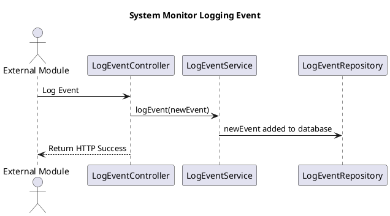

This diagram illustrates the interactions taking place with a new log event being received. The interactions involving the service, controller and repository classes are handled by the Spring Boot framework.

### Module Status Update Sequence Diagram
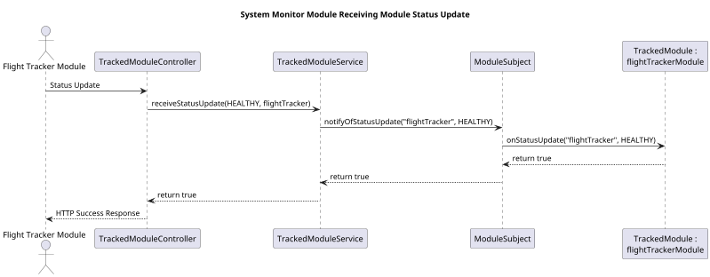

This diagram illustrates the process of updating the status of a module and returning whether a matching module could be found to update the status of.

### Entitlement Service Integration
The Read Events API service requires the administrator role to be performed. All other services require the Internal Module role.

### Object Persistence
Object persistence is handled using the Spring Boot framework, using a MySQL database. The persisted classes are the TrackedModule and LogEvent classes. The observers list in the ModuleSubject class is rehydrated on power up using custom logic with the module database.

### Testing Strategy
The following module level tests are specified for the System Monitor module:
#### Module Status Test
* Register new modules to the System Monitor module
* Read the module statuses and verify they match their initial statuses
* Send status updates
* Read the module statuses and verify they match their new statuses
* Remove a module
* Read the module statuses and verify the module is removed
* Let a module timeout
* Read the module statuses and verify the module is offline
* Restart the System Monitor module
* Read the module statuses and verify the statuses report their proper values
* Attempt to set a module status with an invalid access token
* Verify the API service is rejected

#### Logging Test
* Log several events
* Verify that the events can be read
* Attempt to read the events with an invalid access token
* Verify the API service is rejected

### Risks
For this module, the primary risk is security. For this reason, it is imperative that API request to this module have access protections. For module statuses, a malicious actor could potentially perform a denial of service attack by spoofing statuses claiming that modules were offline. A malicious actor could also spoof statuses claiming that the modules were healthy, masking actual issues with the modules. For event logging, a malicious actor accessing the NGATC event logs could potentially learn valuable information about the system that could be used for an attack.

## Controller Module
The Controller module is the primary interface for human users of the NGATC system. The module provides information on flights, weather and maps to flight controllers. The module provides information on sector loading to administrators, allowing them to change sector boundaries. The module also interfaces with pilots to exchange messages.

### Module Requirement Summary
#### Module Functional Requirements
* Real-Time Aircraft Position Update: The Controller module shall update the position of aircraft on flight controller maps at least once per second.
* Aircraft Data Display: The NGATC shall display the position, pitch, altitude, speed and heading of each tracked aircraft to controllers.
* Flight Plan Ingestion: The Controller module shall expose a well defined API for pilots to submit their flight plans.
* Flight Plan Association: The Controller module shall send proposed flight plans to the Flight Tracker module so that the Flight Tracker module can begin associating aircraft surveillance data with the flight plan.
* Flight Plan Amendments: The Controller module shall allow flight controllers to propose modified flight plans through the Controller GUI.
* Pilot Flight Plan Amendment Acceptance: When the Controller module receives a flight plan, flight controllers shall have the ability to accept or reject the proposed plan.
* Flight Plan Deviation Notifications: The Controller module shall display an indication to the flight controller when the Flight Tracker module detects deviations between an aircraft's flight plan and its actual behavior beyond acceptable limits.
* Secure Pilot Messaging Interface: The Controller module shall provide for secure messaging between controllers and pilots.
* Communication Log Audits and Playback: The Controller module shall persistently store a log of all communication between flight controllers and pilots.
* Controller to Controller Messaging: The Controller module shall provide the ability to transmit messages between controllers across sectors.
* Controller Status Indicators: The Controller module UI shall display what controllers are responsible for each sector of airspace.
* High Priority Ports: The Controller module shall be deployed with a high priority port to be used for emergency communication.
* Loss of Separation Alert to Aircraft: When the Controller module receives a loss of separation alert from the Flight Tracker module, the alert and corresponding guidance shall automatically be sent to the relevant pilot(s).
* Loss of Separation Alert to Controller: When a loss of separation event occurs, the NGATC shall notify the relevant controller(s) with the same information and guidance provided to the involved aircraft.
* Restricted Airspace Alerts: The Controller module UI shall alert controllers when an aircraft violates restricted airspace.
* UI Weather Overlays: The Controller module shall include a weather overlay on controller displays.
* Dynamic Sector Boundaries: The Controller module shall allow administrators to merge and split sectors based on workload.
* Aircraft Sector Reassignment: The Controller module shall automatically reassign aircraft when sector boundaries change.
* Sector Workload Threshold Alerts: When a sector exceeds workload thresholds, the Controller module shall alert administrators and supervisors.
* AI Assisted Conflict Alert: When a potential future conflict is identified by the AI assisted conflict prediction, an alert will be given to the controller.
* AI Generated Route Optimization Suggestions: When the Flight Tracker module creates an AI generated route optimization suggestion, this suggestion shall be displayed to the flight controller to accept or reject.
* AI Detected Abnormal Aircraft Behavior: The Controller module shall provide alerts to the controller for AI detected abnormal aircraft behavior, such as altitude deviations.
* Real-Time Aircraft Map: The Controller module shall display aircraft on a real-time map with configurable zoom levels.
* Color Coded Alerts: The Controller module shall display color coded visual alerts to controllers. Red alerts indicate an immediate safety concern, yellow alerts indicate a potential future safety concern and white alerts are informational.
* Aircraft Details Window: The Controller module shall provide controllers an aircraft details window, display the aircraft's altitude, route, communication status and ETA.
* Drag and Drop Sector Reassignment: The Controller module shall support the ability for controllers to drag and drop aircraft to reassign their sector.
* Event Logging: The Controller module shall send all flight controller actions to the System Monitor module for logging.
* Module Health Monitoring: The Controller module shall provide health monitoring for each module, visible to administrators.
* Service Unavailable Alert: The NGATC shall provide an alert to administrators, supervisors and controllers when any module becomes unavailable.
* System Configurability: The Controller module shall allow administrators the ability to configure what inputs to accept as surveillance inputs, the severity of alerts and aircraft separation thresholds.

#### Module Non-Functional Requirements
* Surveillance Latency: The Controller module UI shall update aircraft on its UI within 200 ms of receiving location updates from the Flight Tracker module.
* Aircraft Volume: The Controller module shall support at least 5000 simultaneous aircraft tracks.
* Controller UI Refresh Rate: The controller user interface shall update aircraft positions at least once per second.
* Role-Based Authentication: The Controller module shall require authentication for all uses of the Controller module.
* Controller Alert Reaction Time: Controllers shall be able to identify conflicts within 2 seconds of an alert being generated.
* Color Coded Alerts: The Controller UI shall distinguish between alert severity levels using different colors and shapes.
* Night and Day Mode: The Controller UI shall support both night and day display modes.

### Controller Module Classes
The classes that make up the Controller module are shown in the class diagram and described in greater detail in the class dictionary below.

```plantuml
@startuml
title Controller Module Class Diagram
scale max 800 width

class Flight {
    - long id
    - String callSign
    - java.time.Instant departureTime
    - java.time.Instant eta
    - String flightStatus
    - int passengerCount
    - double fuelAmountPounds
    - double availableFlightTimeSeconds
    - double remainingFlightTimeSeconds
    - FlightPlan flightPlan
    - FlightPlan proposedUpdateToFlightPlan
    - FlightDynamics requestedFlightDynamics
    - FlightDynamics actualFlightDynamics
    - Aircraft aircraft
    - ArrayList<FlightLogEntry> flightLogEntries
    - Manifest manifest
    - boolean isFlightAccepted
    + void acceptFlightPlanUpdate()
    + void acceptFlight()
    + void addFlightLogEntry(FlightLogEntry entry)
    + void proposeNewFlightPlan(FlightPlan proposedFlightPlan)
    + void updateFlight(FlightDynamics newDynamics)
}

Flight "1" --> "1" FlightPlan

Flight  "1" --> "2" FlightDynamics

Flight  "1" --> "1" Aircraft

Flight "1" *-- "*" FlightLogEntry

Flight  "1" --> "1" Manifest

class FlightPlan {
    - long id
    - java.time.Instant departureTime
    - java.time.Instant eta
    - ArrayList<Waypoint> waypoints
}

FlightPlan "1" *-- "*" Waypoint

class FlightDynamics {
    - double attitude
    - double heading
    - double speedKnots
    - Location location
    - Trajectory trajectory
    - Waypoint targetWaypoint
}

FlightDynamics  "1" --> "1" Location
FlightDynamics  "1" --> "1" Trajectory
FlightDynamics "1" --> "1" Waypoint

class Location {
    - double latitude
    - double longitude
    - double altitudeFeet
}

class Benchmark {
    - java.time.Instant time
    - Location location
}

Benchmark "1" --> "1" Location

class Trajectory {
    - LinkedList<Benchmark> benchmarks
}

Trajectory "1" *-- "*" Benchmark

class Aircraft {
    - long id
    - String callSign
    - String readiness
    - AircraftModel model
    - FlightLog flightLog
}

Aircraft "1" --> "1" AircraftModel
Aircraft "1" --> "1" FlightLog

class AircraftModel {
    - long id
    - String manufacturer
    - String type
    - double ceilingFeet
    - double stallSpeedKnots
    - double cruisingSpeedKnots
    - double maxSpeedKnots
    - int passengerCapacity
    - double fuelCapacityPounds
    - double rangeMiles
}

class FlightLog {
    - long id
    - java.time.Instant startDate
    - LinkedList<FlightLogEntry> flightLogEntries
}

FlightLog "1" *-- "*" FlightLogEntry

class FlightLogEntry {
    - long id
    - String flightRecord
}

class Manifest {
    - ArrayList<CrewMember> crewMembers
    - ArrayList<Passenger> passengers
}

Manifest "1" *-- "*" CrewMember
Manifest "1" *-- "*" Passenger

class Passenger {
    - long id
    - String name
    - java.time.Instant dateOfBirth
}

class CrewMember {
    - long id
    - String name
    - java.time.Instant dateOfBirth
    - String role
}

class Waypoint {
    - long id
    - String name
    - Location location
}

Waypoint "1" <-- Location

class Landmark {
    - double elevationFeet
}

Waypoint <|-- Landmark

class Airport {
    - String code
}

Landmark <|-- Airport

class FlightWarning {
    - long id
    - java.time.Instant time
    - Severity severity
    - ArrayList<Flight> flightsInDanger
}

class MidAirCollisionWarning {
    - double timeBeforeCollisionSeconds
    - double distanceToCollisionMiles
    - String counterMeasureInstructions
}

FlightWarning <|-- MidAirCollisionWarning
FlightWarning "1" o-- "*" Flight
FlightWarning "1" --> "1" Severity


class ObstructionWarning {
    - double timeBeforeCollisionSeconds
    - double distanceToCollisionMiles
    - String counterMeasureInstructions
}

FlightWarning <|-- ObstructionWarning

class DeviationWarning {
    - String message
}

FlightWarning <|-- DeviationWarning

class Area {
    - long id
    - String type
    - double radiusMiles
    - String name
    - String description
    - ArrayList<Location> boundaries
}

Area "1" *-- "*" Location

class Terrain {
    - double elevationFeet
}

Area <|-- Terrain

class Building {
    - double elevationFeet
}

Area <|-- Building

class Airspace {
    - double upperLimitFeet
    - double lowerLimitFeet
}

Area <|-- Airspace

class RestrictedAirspace {

}

Airspace <|-- RestrictedAirspace

class SevereWeather {
    - java.time.Instant expirationTime
    - String warningDescription
}

Airspace <|-- SevereWeather

class ControlSector {
    - ArrayList<String> controllerMessages
    - int numberOfCurrentFlights
}

Airspace <|-- ControlSector

enum Severity {
    CRITICAL
    WARNING
    INFO
}

class SectorManager << (S,#FF7700) Singleton >> {
    - ConcurrentHashMap<long, ControlSector> sectors
    - ConcurrentHashMap<long, ConcurrentHashMap<long, Flight>> flightMap
    - ConcurrentHashMap<long, ConcurrentHashMap<long, Area>> areas
    - ConcurrentHashMap<long, ConcurrentHashMap<long, Waypoint>> waypoints
    + void addFlight(Flight flight)
    + void removeFlight(Flight flight)
    + void addArea(Area area)
    + void removeArea(Area area)
    + void addWaypoint(Waypoint waypoint)
    + void removeWaypoint(Waypoint waypoint)
    + void handleUpdatedSectors(List<ControlSector> updatedSector)
    + void mergeSectors(ControlSector consumingSector, List<ControlSector> sectorsGoingAway)
    + ControlSector getSectorById(long id)
    + ConcurrentHashMap<long, Flight> getSectorFlights(ControlSector sector)
    + ConcurrentHashMap<long, Area> getSectorArea(ControlSector sector)
    + ConcurrentHashMap<long, Waypoint> getSectorWaypoints(ControlSector sector)
    + Flight getFlightById(long id)
    + ArrayList<FlightWarning> getSectorWarnings(ControlSector sector)
    + void changeFlightToSector(Flight flight, ControlSector newSector)
}

SectorManager "1" *-- "*" ControlSector
SectorManager "1" *-- "*" Flight
SectorManager ..> FlightWarning

class ControllerUi {
    - long accessToken
    - String userName
    - MainWindow windowStrategy
    + void renderWindow()
    + void receiveSystemStatus(ArrayList<TrackedModule> moduleStatuses)
}

ControllerUi ..> TrackedModule

interface MainWindow {
    + void renderWindow()
}

ControllerUi "1" --> "1" MainWindow

class ControllerWindow {
    - ControlSector sector
    - void renderMap()
    - void renderWarnings()
    - void renderMessages()
    - void showFlightDetails(Flight flight)
}

MainWindow <|.. ControllerWindow
ControllerWindow --> ControlSector
ControllerWindow ..> SectorManager

class AdminWindow {
    - void renderSectorSummaryPanel()
    - void renderAdminPanel()
}

AdminWindow ..> SectorManager

MainWindow <|.. AdminWindow

class DefaultWindow {
    - void renderLoginPanel()
}

MainWindow <|.. DefaultWindow

class TrackedModule {
    - String id
    - Status moduleStatus
}

class ApiController << (S,#FF7700) Singleton >> {
    + void receiveNewFlightProposal(Flight newFlight)
    + void forwardNewFlightProposal(Flight newFlight)
    + void receiveFlightTrackerNewFlightDecision(Flight newFlight, boolean isAccepted)
    + void sendFlightDecision(Flight newFlight, boolean isAccepted)
    + void receiveFlightPlanUpdate(Flight flight, boolean isMandatory)
    + void sendFlightPlanUpdate(Flight flight, boolean isUrgent)
    + void respondToFlightPlanUpdate(Flight flight, FlightPlan proposedPlan, boolean isAccepted)
    + void receiveFlightWarning(FlightWarning warning)
    + void sendMessageToPilot(Flight flight, String message)
    + void receiveMessageFromPilot(Flight flight, String message)
    + void sendMessageToSector(ControlSector sector, String message)
    + void receiveFlights()
    + void updateWaypoint(Waypoint waypoint)
    + void removeWaypoint(Waypoint waypoint)
    + void updateArea(Area area)
    + void removeArea(Area area)
    + void reportLogEvent(LogEvent event)
    + void receiveModuleStatuses(ArrayList<TrackedModule>)
    + void reportStatus()
}

SectorManager <.. ApiController
ApiController ..> Flight
ApiController ..> FlightPlan
ApiController ..> FlightWarning
ApiController ..> ControlSector
ApiController ..> Waypoint
ApiController ..> Area
ApiController ..> LogEvent

class LogEvent {
    - Severity severity
    - String source
    - String info
    - int id
    - java.time.Instant timestamp
    + LogEvent(Severity severity, String source, String info, Instance timestamp)
}

LogEvent --> Severity

@enduml
```

#### Class Dictionary
##### Flight
The Flight class is the top level class that encapsulates all information relating to an individual flight.

###### Methods
| Method Name | Method Signature | Description |
|--|--|--|
| acceptFlightPlanUpdate | void acceptFlightPlanUpdate() | Accepts a proposed edit to the Flight's FlightPlan and replaces the flightPlan with the proposedUpdateToFlightPlan and communicates the updated plan to the pilot. |
| acceptFlight | void acceptFlight() | Signals that a new flight has been accepted into the NGATC and communicates the acceptance to the pilot. |
| addFlightLogEntry | void addFlightLogEntry(FlightLogEntry entry) | Adds an entry in the flight's log. |
| proposeNewFlightPlan | void proposeNewFlightPlan(FlightPlan proposedFlightPlan) | Adds a new flight plan proposal to the flight. |
| updateFlight | void updateFlight(FlightDynamics newDynamics) | Updates a Flight with updated FlightDynamics. |

###### Properties
| Property Name | Type | Description |
|--|--|--|
| id | long | A globally unique ID used as the primary key in the database. |
| departureTime | java.time.Instant | The time the flight has departed or is planning to depart. |
| eta | java.time.Instant | The time the flight is expecting to land. |
| flightStatus | String | The current status (e.g. "Not Departed", "In Progress", "Landed") of the flight. |
| passengerCount | int | The number of passengers the flight is carrying. |
| fuelAmountPounds | double | The current amount of fuel in pounds. |
| availableFlightTimeSeconds | double | The amount of time the aircraft can fly given the current fuel, altitude and speed. |
| remainingFlightTimeSeconds | double | The amount of time remaining in the current flight plan. |
| isFlightAccepted | boolean | Whether the flight has been accepted by air traffic control. |

###### Associations
| Association Name | Type | Description |
|--|--|--|
| flightPlan | FlightPlan | The currently active flight plan. |
| proposedUpdateToFlightPlan | FlightPlan | A proposed updated flight plan to be evaluated. |
| requestedFlightDynamics | FlightDynamics | The flight dynamics the aircraft is requested to observe. |
| actualFlightDynamics | FlightDynamics | The actual flight dynamics of the aircraft. |
| aircraft | Aircraft | Information about the aircraft flying the flight. |
| flightLogEntries | ArrayList<FlightLogEntry> | The log entries from the flight. |
| manifest | Manifest | The flight manifest. |

##### FlightPlan
The route, departure time and ETA of a flight.

###### Properties
| Property Name | Type | Description |
|--|--|--|
| id | long | A unique identifier of the flight plan, used as the primary key in the database. |
| departureTime | java.time.Instant | The time the flight is planned to depart. |
| eta | java.time.Instant | The time the flight is planned to land. |

###### Associations
| Association Name | Type | Description |
|--|--|--|
| waypoints | ArrayList<Waypoint> | A list of waypoints the flight is planned to follow. |

##### FlightDynamics
Information giving the current attitude, heading and speed of the aircraft.

###### Properties
| Property Name | Type | Description |
|--|--|--|
| attitude | double | The attitude of the aircraft in degrees. 0 degrees is horizontal and positive degrees are climbing. |
| heading | double | The heading relative to magnetic north, with 0 degrees corresponding to north. |
| speedKnots | double | The speed of the aircraft in knots. |

###### Associations
| Association Name | Type | Description |
|--|--|--|
| location | Location | The current location of the aircraft. |
| trajectory | Trajectory | The current trajectory of the aircraft. |
| targetWaypoint | Waypoint | The waypoint the aircraft is flying toward. |

##### Location
A GPS coordinate with an altitude.

###### Properties
| Property Name | Type | Description |
|--|--|--|
| latitude | double | The GPS latitude with north as positive. |
| longitude | double | The GPS longitude with east as positive. |
| altitudeFeet | double | The altitude in feet above sea level. |

##### Benchmark
A Location augmented with a time, used to create Trajectories.

###### Properties
| Property Name | Type | Description |
|--|--|--|
| time | java.time.Instant | The time the location will be reached. |

###### Associations
| Association Name | Type | Description |
|--|--|--|
| location | Location | The location that will be reached. |

##### Trajectory
A list of time/location benchmarks describing a flight's trajectory.

###### Associations
| Association Name | Type | Description |
|--|--|--|
| benchmarks | LinkedList<Benchmark> | A list of benchmarks for the trajectory. |

##### Aircraft
The Aircraft class represents information about a particular aircraft making a flight.

###### Properties
| Property Name | Type | Description |
|--|--|--|
| id | long | A globally unique ID for the aircraft, used as the primary key in the database. |
| readiness | String | A String representing the readiness of the aircraft. |

###### Associations
| Association Name | Type | Description |
|--|--|--|
| model | AircraftModel | The model of the aircraft (e.g. Boeing 737-700) |
| flightLog | FlightLog | A log of flights made by the aircraft. |

##### AircraftModel
The AircraftModel class represents a specific model of Aircraft (e.g. Boeing 737-700).

###### Properties
| Property Name | Type | Description |
|--|--|--|
| id | long | A globally unique ID of the aircraft model |
| manufacturer | String | The manufacturer of the aircraft model (e.g. AirBus) |
| type | String | The type of aircraft (e.g. Dual Engine, Single Aisle) |
| ceilingFeet | double | The height altitude above sea level the aircraft model can fly at. |
| stallSpeedKnots | double | The minimum speed the aircraft can fly without stalling. |
| cruisingSpeedKnots | double | The optimal speed for the aircraft to cruise at. |
| maxSpeedKnots | double | The maximum speed the aircraft is capable of flying at. |
| passengerCapacity | int | The maximum number of passengers the aircraft can carry. |
| fuelCapacityPounds | double | The fuel capacity of the aircraft. |
| rangeMiles | double | The maximum number of miles the aircraft can fly. |

##### FlightLog
A list of flight log entries.

###### Properties
| Property Name | Type | Description |
|--|--|--|
| id | long | A globally unique ID of the flight log, used as the primary key in the database. |
| startDate | java.time.Instant | The time the flight log was created. |

###### Associations
| Association Name | Type | Description |
|--|--|--|
| flightLogEntries | LinkedList<FlightLogEntry> | A list of entries into the flight log. |

##### FlightLogEntry
An individual entry into the flight log.

###### Properties
| Property Name | Type | Description |
|--|--|--|
| id | long | A globally unique ID of the entry, used as the primary key in the database. |
| flightRecord | String | The message to record. |

##### Waypoint
Describes a location augmented with a name.

###### Properties
| Property Name | Type | Description |
|--|--|--|
| id | long | A globally unique ID of the waypoint, used as the primary key in the database. |
| name | String | The name of the waypoint. |

###### Associations
| Association Name | Type | Description |
|--|--|--|
| location | Location | The location of the waypoint. |

##### FlightWarning
A class used to describe types of warnings that could occur during a flight.

###### Properties
| Property Name | Type | Description |
|--|--|--|
| id | long | A globally unique ID, used as the primary key in the database. |
| time | java.time.Instant | The time the warning occurred. |

###### Associations
| Association Name | Type | Description |
|--|--|--|
| severity | Severity | The severity of the warning. |
| flightsInDanger | ArrayList<Flight> | A list of the flights in danger with regards to the warning. |

##### MidAirCollisionWarning
A type of FlightWarning of an aircraft colliding with another aircraft in midair.

###### Properties
| Property Name | Type | Description |
|--|--|--|
| timeBeforeCollisionSeconds | double | The number of seconds before collision. |
| distanceToCollisionMiles | double | The number of miles until the projected collision. |
| counterMeasureInstructions | String | The instructions provided to pilots to avoid the collision. |

##### ObstructionWarning
A type of FlightWarning of an aircraft colliding with a static hazard.

###### Properties
| Property Name | Type | Description |
|--|--|--|
| timeBeforeCollisionSeconds | double | The number of seconds before collision. |
| distanceToCollisionMiles | double | The number of miles until the projected collision. |
| counterMeasureInstructions | String | The instructions provided to pilots to avoid the collision. |

##### DeviationWarning
A type of FlightWarning indicating that a flight has made a significant deviation from its flight plan.

###### Properties
| Property Name | Type | Description |
|--|--|--|
| message | String | A message explaining the deviation. |

##### Area
Represents an area in the NGATC system.

###### Properties
| Property Name | Type | Description |
|--|--|--|
| id | long | A globally unique ID, used as the primary key in the database. |
| type | String | A String indicating the type of area. |
| radiusMiles | double | The radius of the area in miles. |
| name | String | The name of the area. |
| description | String | A description of the area. |

###### Associations
| Association Name | Type | Description |
|--|--|--|
| boundaries | ArrayList<Location> | An ordered list of the boundaries of the area. |

##### Airspace
A type of area describing a volume of airspace.

###### Properties
| Property Name | Type | Description |
|--|--|--|
| upperLimitFeet | double | The upper limit of airspace altitude. |
| lowerLimitFeet | double | The lower limit of the airspace altitude. |

##### RestrictedAirspace
A type of Airspace that is restricted for civil aviation.

##### SevereWeather
A type of Airspace experiencing hazardous weather conditions for flight.

###### Properties
| Property Name | Type | Description |
|--|--|--|
| expirationTime | java.time.Instant | The time the weather will expire. |
| warningDescription | String | A description of the severe weather. |

##### ControlSector
A type of airspace describing a region of responsibility for a flight controller.

###### Properties
| Property Name | Type | Description |
|--|--|--|
| controllerMessages | ArrayList<String> | A list of messages sent between controllers. |
| numberOfCurrentFlights | int | The current number of flights active in the sector. |

##### SectorManager
The SectorManager class is responsible for categorizing objects into ControlSectors and reporting on those objects to other sectors. Concurrent hash maps are used to both ensure thread safety and to enable O(1) access to control sectors, O(1) access to objects within a sector and O(m) access to objects globally, where m is the number of sectors.

###### Methods
| Method Name | Method Signature | Description |
|--|--|--|
| addFlight | void addFlight(Flight flight) | Adds a flight to the system and categorizes it into the correct sector based on its takeoff location. |
| removeFlight | void removeFlight(Flight flight) | Removes a flight from the system after it has completed. |
| addArea | void addArea(Area area) | Adds an area to the system and categorizes it into the correct sector(s) |
| removeArea | void removeArea(Area area) | Removes an area from the system. |
| addWaypoint | void addWaypoint(Waypoint waypoint) | Adds a waypoint to the system and categorizes it into the correct sector |
| removeWaypoint | void removeWaypoint(Waypoint waypoint) | Removes a waypoint from the system |
| handleUpdatedSectors | void handleUpdatedSectors(List<ControlSector> updatedSector) | When sector boundaries change, updates the objects owned by the updated sectors. |
| mergeSectors | void mergeSectors(ControlSector consumingSector, List<ControlSector> sectorsGoingAway) | Merges two sectors and reassigns objects as appropriate. |
| getSectorById | ControlSector getSectorById(long id) | Returns a reference to a sector by its ID. |
| getSectorFlights | ConcurrentHashMap<long, Flight> getSectorFlights(ControlSector sector) | Gets the flights associated with the sector. |
| getSectorAreas | ConcurrentHashMap<long, Area> getSectorAreas(ControlSector sector) | Gets the areas associated with the sector. |
| getSectorWaypoints | ConcurrentHashMap<long, Waypoint> getSectorWaypoints(ControlSector sector) | Gets the waypoints associated with the sector. |
| getFlightById | Flight getFlightById(long id) | Gets a reference to a flight by its ID. |
| getSectorWarnings | ArrayList<FlightWarning> getSectorWarnings(ControlSector sector) | Gets the warnings associated with a sector. |
| changeFlightToSector | void changeFlightToSector(Flight flight, ControlSector newSector) | Changes a flight to a new sector. |

###### Associations
| Association Name | Type | Description |
|--|--|--|
| sectors | ConcurrentHashMap<long, ControlSector> | A map of sectors in the NGATC. |
| flightMap | ConcurrentHashMap<long, ConcurrentHashMap<long, Flight>> | A map of flights in the NGATC, organized by sector. |
| areas | ConcurrentHashMap<long, ConcurrentHashMap<long, Area>> | A map of areas in the NGATC, organized by sector (with duplicate entries for areas that span multiple sectors). |
| waypoints | ConcurrentHashMap<long, ConcurrentHashMap<long, Waypoint>> | A map of waypoints in the NGATC, organized by sector. |

##### ControllerUi
Represents the top level GUI used to interact with the Controller module. The class provides GUI elements common across all roles, such as system status, and uses the strategy design pattern to display information specific to a user's role. It also provides login, logout and create user functionality.

###### Methods
| Method Name | Method Signature | Description |
|--|--|--|
| render | void renderWindow() | Updates the UI with the main window indicated by the windowStrategy. This also starts a thread every second to update the system status render the main window, and update night/day mode. |
| receiveSystemStatus | void receiveSystemStatus(ArrayList<TrackedModule> moduleStatuses) | Receives a system status update. |

###### Properties
| Property Name | Type | Description |
|--|--|--|
| accessToken | long | The access token being used to access the UI. This is used to control the MainWindow being shown to the user. |
| userName | String | The username currently signed in. |

###### Associations
| Association Name | Type | Description |
|--|--|--|
| windowStrategy | MainWindow | The MainWindow being displayed to the user as part of the Strategy design pattern. |
| moduleStatuses | ArrayList<TrackedModule> | The statuses of modules in the NGATC. |

##### MainWindow (interface)
This is the interface for all windows displayed within the controller UI. It is implemented by a variety of windows, using the strategy design pattern.

###### Methods
| Method Name | Method Signature | Description |
|--|--|--|
| renderWindow | void renderWindow() | Renders this window, taking into account the time of day to decide between night and day mode. |

##### ControllerWindow
This is the window used by flight controllers to interact with the NGATC.

###### Methods
| Method Name | Method Signature | Description |
|--|--|--|
| renderMap | void renderMap() | Renders the controller map of the sector. |
| renderWarnings | void renderWarnings() | Renders the warnings relevant to the sector. |
| renderMessages | void renderMessages() | Renders the messages from pilots and other controllers relevant to the sector. |
| showFlightDetails | void showFlightDetails(Flight flight) | Shows the details of a particular flight. |

###### Associations
| Association Name | Type | Description |
|--|--|--|
| sector | ControlSector | A reference to the sector being controlled. |

##### AdminWindow
A window used by supervisors and administrators to manage the NGATC.

###### Methods
| Method Name | Method Signature | Description |
|--|--|--|
| renderSectorSummaryPanel | void renderSectorSummaryPanel() | Displays a summary of sectors and allows users to manage these sectors. |
| renderAdminPanel | void renderAdminPanel() | Displays a panel enabling a variety of configuration actions for the NGATC. |

##### DefaultWindow
Displays a window when no user is logged in, prompting users to login.

###### Methods
| Method Name | Method Signature | Description |
|--|--|--|
| renderLoginPanel | void renderLoginPanel() | Displays a login prompt to the user. |

##### ApiController
The ApiController class is a singleton class used to send and receive messages through the module's REST API.

###### Methods
| Method Name | Method Signature | Description |
|--|--|--|
| receiveNewFlightProposal | void receiveNewFlightProposal(Flight newFlight) | Receives a proposed flight and adds the flight in the SectorManager. |
| forwardNewFlightProposal | void forwardNewFlightProposal(Flight newFlight) | Sends a new flight proposal to the Flight Tracker module for final acceptance. |
| receiveFlightTrackerNewFlightDecision | void receiveFlightTrackerNewFlightDecision(Flight newFlight, boolean isAccepted) | Receives an accept/reject decision from the Flight Tracker module and uses that decision to send a decision to the pilot using sendFlightDecision and update the status of the flight in the Controller module. |
| sendFlightDecision | void sendFlightDecision(Flight newFlight, boolean isAccepted) | Sends the acceptance or rejection of a new flight to the pilots. |
| receiveFlightPlanUpdate | void receiveFlightPlanUpdate(Flight flight, boolean isMandatory) | Receives a flight plan update from the FlightTracker module or pilot and updates the Flight with the proposed plan in the Controller module, for a controller to accept or reject. If the update is marked as mandatory (e.g. emergency conflict resolution), the update is accepted automatically. |
| sendFlightPlanUpdate | void sendFlightPlanUpdate(Flight flight, boolean isUrgent) | Sends an updated flight plan to the pilots and Flight Tracker module. |
| respondToFlightPlanUpdate | void respondToFlightPlanUpdate(Flight flight, FlightPlan proposedPlan, boolean isAccepted) | Responds to the Flight Tracker module with weather a FlightPlan update was accepted. |
| receiveFlightWarning | void receiveFlightWarning(FlightWarning warning) | Receives a warning from the Flight Tracker module. |
| sendMessageToPilot | void sendMessageToPilot(Flight flight, String message) | Sends a message to a pilot. |
| receiveMessageFromPilot | void receiveMessageFromPilot(Flight flight, String message) | Receives a message from a pilot and adds the message to the appropriate sector. |
| sendMessageToSector | void sendMessageToSector(ControlSector sector, String message) | Sends a message to another sector encoded with the source sector. |
| receiveFlights | void receiveFlights() | Receives all the currently active flights from the Flight Tracker module, updates their FlightDynamics and ensures they are in the correct sector. |
| updateWaypoint | void updateWaypoint(Waypoint waypoint) | Receives an updated waypoint from the Static Map module. |
| removeWaypoint | void removeWaypoint(Waypoint waypoint) | Receives the removal of a waypoint from the Static Map module. |
| updateArea | void updateArea(Area area) | Receives an updated area from the Static Map module. |
| removeArea | void removeArea(Area area) | Receives the removal of an area from the Static Map module. |
| reportLogEvent | void reportLogEvent(LogEvent event) | Reports an event to the System Monitor module. |
| receiveModuleStatuses | void receiveModuleStatuses(ArrayList<TrackedModule>) | Receives the status of all NGATC modules. |
| reportStatus | void reportStatus() | Report's the module's status to the System Monitor module every second. |

### Service API
The Controller module implements the following API services:

* New Flight Proposal
    * Inputs:
        * Flight: The Flight in JSON encoding
        * Access Token: Requires a Pilot role
    * Output: HTTP Status, the accept/reject decision will be communicated asynchronously
* Flight Tracker New Flight Decision:
    * Inputs:
        * Flight: The Flight in JSON encoding
        * Is Accepted: A boolean representing whether the new flight was accepted
        * Access Token: Requires an internal module role
    * Output: HTTP status
* Update Flight Plan:
    * Inputs:
        * Flight: The Flight in JSON Encoding
        * Is Mandatory: Whether updating the Flight Plan is mandatory (e.g. emergency conflict resolution)
        * Access Token: Requires an internal module role
    * Output: HTTP status
* Flight Warning:
    * Inputs:
        * Warning: A FlightWarning in JSON encoding
        * Access Token: Requires an internal module role
    * Output: HTTP status
* Receive Pilot Message:
    * Inputs:
        * Flight: The Flight in JSON encoding
        * Message: The message to be sent
        * Access Token: Requires a Pilot role
    * Output: HTTP status
* Update Flights:
    * Inputs:
        * Flights: All currently active flights in JSON encoding
        * Access Token: Requires an internal module role
    * Output: HTTP status
* Update Waypoint:
    * Inputs:
        * Waypoint: The updated Waypoint in JSON encoding
        * Access Token: Requires an internal module role
    * Output: HTTP status
* Remove Waypoint:
    * Inputs:
        * Waypoint: The removed Waypoint in JSON encoding
        * Access Token: Requires an internal module role
    * Output: HTTP status
* Update Area:
    * Inputs:
        * Area: The updated Area in JSON encoding
        * Access Token: Requires an internal module role
    * Output: HTTP status
* Remove Area:
    * Inputs:
        * Area: The removed Area in JSON encoding
        * Access Token: Requires an internal module role
    * Output: HTTP status
* Update Module Statuses:
    * Inputs:
        * Statuses: A list of TrackedModules in JSON encoding
        * Access Token: Requires an internal module role
    * Output: HTTP status

### Sequence Diagram
The following sequence diagram shows the commissioning of a hypothetical flight with emphasis on the Controller module.

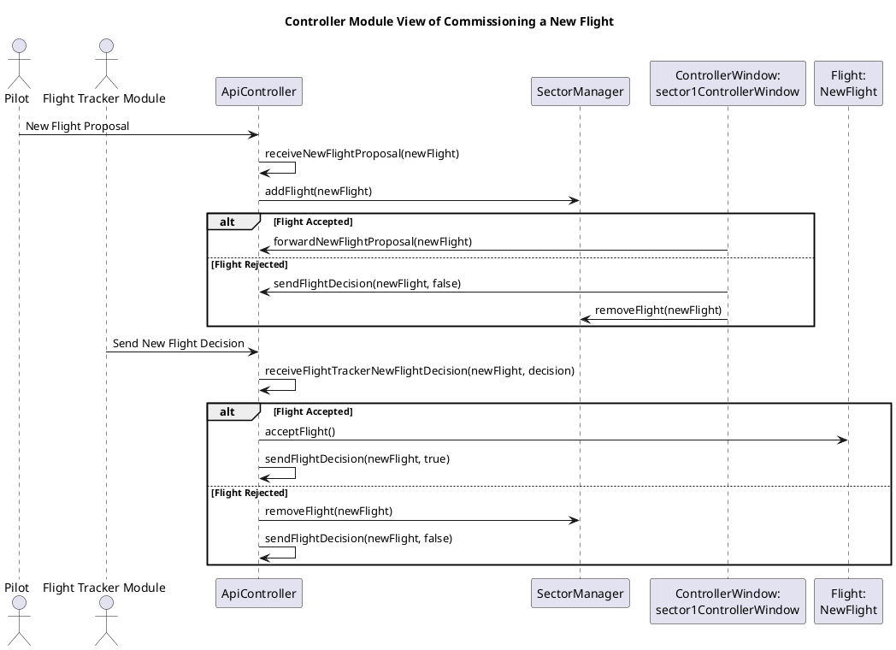

This diagram shows how a flight is first accepted by a human flight controller and then sent to the Flight Tracker module for automated processing of the flight plan, before the accept/reject decision is communicated back to the pilots.

### Entitlement Service Integration
The entitlement service is used to support login/logout and create user functionality for the Controller module UI. The entitlement service is also used to verify proper access levels for all Controller module API calls.

### Object Persistence
Object persistence is handled through the Hibernate framework, with API primary keys documented in the class dictionary.

### Testing Strategy
The module level testing for the Controller module is described below:

* New Flight Test:
    * A flight is proposed that is rejected by the controller
    * A flight is proposed that is accepted by the controller and rejected by the Flight Tracker module (simulated by the testing framework)
    * A flight is proposed that is accepted by both the controller and Flight Tracker module
* Flight Update Test:
    * A mandatory flight update is proposed by the Flight Tracker module
    * An optional flight update is proposed by the Flight Tracker module and accepted by the flight controller
    * An optional flight update is proposed by the Flight Tracker module and rejected by the flight controller
* Sector Reassignment Test:
    * Flight updates are send by the Flight Tracker module
    * A flight is "dragged and dropped" by a flight controller to another sector
    * Two sectors are merged by an administrator
    * A sector is split by an administrator

### Risks
Many of the risks that would typically be considered in an air traffic control system have been segregated out of this module by leaving it separate from the Flight Tracker module. This leaves much of the flight validation and conflict detection in its own module. A risk in this module is that it is responsible for communicating with pilots, and any outage of this communication could have significant consequences. For this reason, redundant instances of this module are commissioned in Kubernetes, which mitigates the risk of a communications failure.

Another risk is the security risk of unauthorized users interacting with the module. For this reason, all meaningful UI and API interactions with this module are access controlled through the Entitlement Service.

### UI Wireframes
The Base Controller UI, which contains the main window is displayed below. This window, like all others, has a night and day mode and is responsible for displaying system information and Create User (only when an Admin is signed in) and Logout options (when applicable). When a user clicks on Create User, a dialog box will appear.

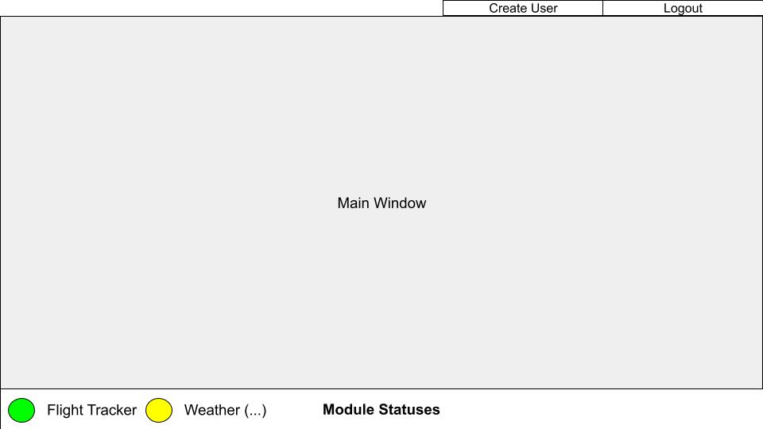

The create user dialog box is shown below:

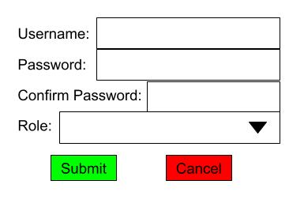

The Controller window is the window that flight controllers interact with the control flights. It is shown below. Of note, this interface supports the drag and drop transfer of aircraft between sectors. Also of note is that messages are color coded between read and unread and warnings are color coded by severity.

The map allows flight controllers to amend the flight plan by clicking on an aircraft and dragging and dropping waypoints.

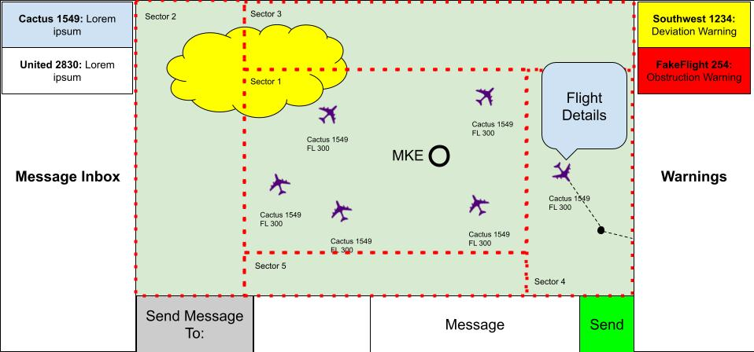

The Administrator window is displayed to administrators and supervisors. It is shown below. Note that on the configuration panel on the right, supervisor users will only have read-only access to this table.

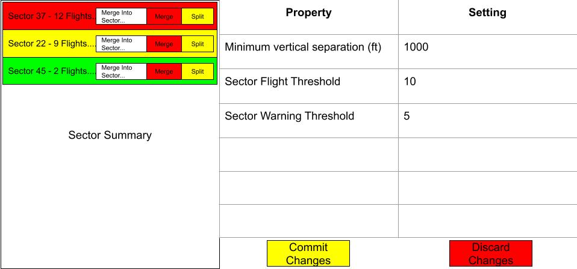

The default window, which is displayed to users who are not logged in, is displayed below:

## Flight Tracker Module
The Flight Tracker module is responsible for ingesting real-time surveillance data and using to predict and analyze flights. This information is used to optimize flight plans, predict future issues and report and resolve current incidents.

### Module Functional Requirements Summary
The Flight Tracker module implements the following requirements:
* Real-Time Aircraft Data Ingestion: The Flight Tracker module shall use real-time surveillance data to track flights in the NGATC.
* Real-Time Aircraft Position Update: The Flight Tracker module shall update the real-time position of all tracked aircraft and send this information to any relevant modules at a rate of at least once per second.
* Unified Aircraft Track: The Flight Tracker module shall synthesize surveillance inputs for a single aircraft into a single, unified aircraft track.
* Flight Plan Ingestion: The Flight Tracker module shall ingest flight plans through a well-defined API and accept or reject them.
* Flight Plan Association: The Flight Tracker module shall associate aircraft flight plans with aircraft tracks.
* Flight Plan Amendments: The Flight Tracker module shall support flight plan amendments from external sources (e.g. Controller module or pilots), or amendments generated within the module.
* Pilot Flight Plan Amendment Acceptance: The Flight Tracker module shall validate all flight plan adjustments before they are accepted.
* Aircraft Trajectory Prediction: The Flight Tracker module shall predict aircraft trajectories based on the aircraft's speed, altitude and route.
* Flight Plan Deviation Notifications: The Flight Tracker module shall notify the Controller module of deviations between an aircraft's flight plan and its actual behavior beyond acceptable limits.
* High Priority Ports: The Flight Tracker module shall use the high priority ports exposed by the Controller module for urgent communication.
* Loss of Separation Detection: The Flight Tracker module shall detect any loss of separation conflicts between aircraft or between an aircraft and a static hazard.
* Loss of Separation Alert to Aircraft: Upon detection of loss of separation, the Flight Tracker module shall communicate a resolution plan for use by the involved aircraft.
* Restricted Airspace Alerts: The Flight Tracker module shall detect and communicate when a flight violates restricted airspace.
* Real-Time Weather Ingestion: The Flight Tracker module shall ingest real-time weather and turbulence data.
* Weather Impacts on Trajectories: The Flight Tracker module shall compensate for the impact of weather on trajectories.
* AI Assisted Conflict Prediction: The Flight Tracker module shall provide AI assisted conflict prediction for at least 3-5 minutes into the future.
* AI Assisted Conflict Alert: When a potential future conflict is identified by the AI assisted conflict prediction, an alert will be given to the controller.
* AI Generated Route Optimization Suggestions: The Flight Tracker module shall provide AI generated route optimization suggestions that controllers can either accept or reject.
* AI Detected Abnormal Aircraft Behavior: The Flight Tracker module shall provide alerts for AI detected abnormal aircraft behavior, such as altitude deviations.
* Event Logging: The Flight Tracker module shall report all warnings to the System Monitor module for logging.

### Module Non-Functional Requirements Summary
* Surveillance Latency: The Flight Tracker module shall process surveillance updates with a latency of less than 500 ms.
* Aircraft Volume: The Flight Tracker shall support at least 5000 simultaneous aircraft tracks.
* 5 Nines of Availability: The Flight Tracker module shall be available 99.999% of the time.
* Redundance Services: The Flight Tracker module shall provide for automatic switchover in the event of a failure.
* Track Data Preservation: When the Flight Tracker module switches to another instance of a module due to a failure, this switchover shall preserve all track data.
* Horizontal Scalability: The Flight Tracker module deployment shall scale horizontally to support increases in aircraft volume.
* Communication Encryption: Communication between the Flight Tracker module and other modules shall use TLS encryption.
* Role-Based Authentication: The Flight Tracker module shall require authentication before trusting any external data.
* Flight Data Modification: The Flight Tracker module shall protect against the unauthorized modification of flight data.
* New Data Sources: The Flight Tracker module shall support the "plug and play" addition of new data sources.
* Module Testability: The Flight Tracker module shall be created such that it can be tested independently using mock data.
* Automated Test Coverage: At least 80% automated test coverage of the Flight Tracker module core logic shall be achieved.

### Flight Tracker Module Classes
The classes that make up the Flight Tracker module are shown below and described in greater detail in the class dictionary.

```plantuml
@startuml
title Flight Tracker Module Class Diagram
scale max 800 width

class Flight {
    - long id
    - String callSign
    - java.time.Instant departureTime
    - java.time.Instant eta
    - String flightStatus
    - int passengerCount
    - double fuelAmountPounds
    - double availableFlightTimeSeconds
    - double remainingFlightTimeSeconds
    - FlightPlan flightPlan
    - FlightPlan proposedUpdateToFlightPlan
    - FlightDynamics requestedFlightDynamics
    - FlightDynamics actualFlightDynamics
    - Aircraft aircraft
    - ArrayList<FlightLogEntry> flightLogEntries
    - Manifest manifest
    - boolean isFlightAccepted
    + void acceptFlightPlanUpdate()
    + void acceptFlight()
    + void addFlightLogEntry(FlightLogEntry entry)
    + void proposeNewFlightPlan(FlightPlan proposedFlightPlan)
    + void updateFlight(FlightDynamics newDynamics)
}

Flight "1" --> "1" FlightPlan

Flight  "1" --> "2" FlightDynamics

Flight  "1" --> "1" Aircraft

Flight "1" *-- "*" FlightLogEntry

Flight  "1" --> "1" Manifest

class FlightPlan {
    - long id
    - java.time.Instant departureTime
    - java.time.Instant eta
    - ArrayList<Waypoint> waypoints
}

FlightPlan "1" *-- "*" Waypoint

class FlightDynamics {
    - double attitude
    - double heading
    - double speedKnots
    - Location location
    - Trajectory trajectory
    - Waypoint targetWaypoint
}

FlightDynamics  "1" --> "1" Location
FlightDynamics  "1" --> "1" Trajectory
FlightDynamics "1" --> "1" Waypoint

class Location {
    - double latitude
    - double longitude
    - double altitudeFeet
}

class Benchmark {
    - java.time.Instant time
    - Location location
}

Benchmark "1" --> "1" Location

class Trajectory {
    - LinkedList<Benchmark> benchmarks
}

Trajectory "1" *-- "*" Benchmark

class Aircraft {
    - long id
    - String callSign
    - String readiness
    - AircraftModel model
    - FlightLog flightLog
}

Aircraft "1" --> "1" AircraftModel
Aircraft "1" --> "1" FlightLog

class AircraftModel {
    - long id
    - String manufacturer
    - String type
    - double ceilingFeet
    - double stallSpeedKnots
    - double cruisingSpeedKnots
    - double maxSpeedKnots
    - int passengerCapacity
    - double fuelCapacityPounds
    - double rangeMiles
}

class FlightLog {
    - long id
    - java.time.Instant startDate
    - LinkedList<FlightLogEntry> flightLogEntries
}

FlightLog "1" *-- "*" FlightLogEntry

class FlightLogEntry {
    - long id
    - String flightRecord
}

class Manifest {
    - ArrayList<CrewMember> crewMembers
    - ArrayList<Passenger> passengers
}

Manifest "1" *-- "*" CrewMember
Manifest "1" *-- "*" Passenger

class Passenger {
    - long id
    - String name
    - java.time.Instant dateOfBirth
}

class CrewMember {
    - long id
    - String name
    - java.time.Instant dateOfBirth
    - String role
}

class Waypoint {
    - long id
    - String name
    - Location location
}

Waypoint "1" <-- Location

class Landmark {
    - double elevationFeet
}

Waypoint <|-- Landmark

class Airport {
    - String code
}

Landmark <|-- Airport

class FlightWarning {
    - long id
    - java.time.Instant time
    - Severity severity
    - ArrayList<Flight> flightsInDanger
}

class MidAirCollisionWarning {
    - double timeBeforeCollisionSeconds
    - double distanceToCollisionMiles
    - String counterMeasureInstructions
    + void createCounterMeasureInstructions()
}

FlightWarning <|-- MidAirCollisionWarning
FlightWarning "1" o-- "*" Flight
FlightWarning "1" --> "1" Severity


class ObstructionWarning {
    - double timeBeforeCollisionSeconds
    - double distanceToCollisionMiles
    - String counterMeasureInstructions
    + void createCounterMeasureInstructions()
}

FlightWarning <|-- ObstructionWarning

class DeviationWarning {
    - String message
}

FlightWarning <|-- DeviationWarning

class Area {
    - long id
    - String type
    - double radiusMiles
    - String name
    - String description
    - ArrayList<Location> boundaries
}

Area "1" *-- "*" Location

class Terrain {
    - double elevationFeet
}

Area <|-- Terrain

class Building {
    - double elevationFeet
}

Area <|-- Building

class Airspace {
    - double upperLimitFeet
    - double lowerLimitFeet
}

Area <|-- Airspace

class RestrictedAirspace {

}

Airspace <|-- RestrictedAirspace

class SevereWeather {
    - java.time.Instant expirationTime
    - String warningDescription
}

Airspace <|-- SevereWeather

enum Severity {
    CRITICAL
    WARNING
    INFO
}

class FlightManager << (S,#FF7700) Singleton >> {
    - ConcurrentHashMap<String, ConcurrentHashMap<long, Flight>> flightMap
    - ConcurrentHashMap<String, ConcurrentHashMap<long, Area>> areaMap
    - ConcurrentHashMap<String, ConcurrentHashMap<long, Waypoint>> waypointMap
    + void addFlight(Flight flight)
    + void removeFlight(Flight flight)
    + void updateFlight(FlightDynamics flightDynamics)
    + void addArea(Area area)
    + void removeArea(Area area)
    + void updateArea(Area area)
    + void addWaypoint(Waypoint waypoint)
    + void removeWaypoint(Waypoint waypoint)
    + void updateWaypoint(Waypoint waypoint)
    + void analyzeFlights()
    + FlightWarning analyzeFlight(Flight flight)
    + FlightWarning analyzeFlightPlanProposal(Flight flight)
    + String getLocationHashKey(Location location)
    + List<String> getNeighborHashKeys(Location location)
    + List<Flight> getCloseFlights(Flight flight)
    + List<Area> getCloseAreas(Flight flight)
    + List<Waypoint> getCloseWaypoints(Flight flight)
    + List<Flight> getAllFlights()
}

FlightManager "1" *-- "*" Flight
FlightManager "1" *-- "*" Area
FlightManager "1" *-- "*" Waypoint

abstract class AiAgent {
    - String prompt
    + void start()
    + void stop()
}

AiAgent ..> FlightManager

class AiConflictDetectionAgent {

}

AiAgent <|.. AiConflictDetectionAgent

class AiRouteOptimizationAgent {

}

AiAgent <|.. AiRouteOptimizationAgent

class AiAbnormalBehaviorDetectionAgent {

}

AiAgent <|.. AiAbnormalBehaviorDetectionAgent

class ApiController << (S,#FF7700) Singleton >> {
    + void receiveNewFlightProposal(Flight newFlight)
    + void sendFlightDecision(Flight newFlight, boolean isAccepted)
    + void receiveFlightPlanUpdate(Flight flight)
    + void sendFlightPlanUpdate(Flight flight, boolean isMandatory)
    + void sendFlightWarning(FlightWarning warning)
    + void receiveSurveillanceInput(FlightDynamics dynamics)
    + void updateWaypoint(Waypoint waypoint)
    + void removeWaypoint(Waypoint waypoint)
    + void updateArea(Area area)
    + void removeArea(Area area)
    + void reportLogEvent(LogEvent event)
    + void reportStatus()
}

ApiController ..> Flight
ApiController ..> FlightPlan
ApiController ..> FlightWarning
ApiController ..> Waypoint
ApiController ..> Area
ApiController ..> LogEvent

class LogEvent {
    - Severity severity
    - String source
    - String info
    - int id
    - java.time.Instant timestamp
    + LogEvent(Severity severity, String source, String info, Instance timestamp)
}

LogEvent --> Severity


@enduml
```

#### Class Dictionary
##### Flight
The Flight class is the top level class that encapsulates all information relating to an individual flight.

###### Methods
| Method Name | Method Signature | Description |
|--|--|--|
| acceptFlightPlanUpdate | void acceptFlightPlanUpdate() | Accepts a proposed edit to the Flight's FlightPlan and replaces the flightPlan with the proposedUpdateToFlightPlan and communicates the updated plan to the pilot. |
| acceptFlight | void acceptFlight() | Signals that a new flight has been accepted into the NGATC and communicates the acceptance to the pilot. |
| addFlightLogEntry | void addFlightLogEntry(FlightLogEntry entry) | Adds an entry in the flight's log. |
| proposeNewFlightPlan | void proposeNewFlightPlan(FlightPlan proposedFlightPlan) | Adds a new flight plan proposal to the flight. |
| updateFlight | void updateFlight(FlightDynamics newDynamics) | Updates a Flight with updated FlightDynamics. |

###### Properties
| Property Name | Type | Description |
|--|--|--|
| id | long | A globally unique ID used as the primary key in the database. |
| departureTime | java.time.Instant | The time the flight has departed or is planning to depart. |
| eta | java.time.Instant | The time the flight is expecting to land. |
| flightStatus | String | The current status (e.g. "Not Departed", "In Progress", "Landed") of the flight. |
| passengerCount | int | The number of passengers the flight is carrying. |
| fuelAmountPounds | double | The current amount of fuel in pounds. |
| availableFlightTimeSeconds | double | The amount of time the aircraft can fly given the current fuel, altitude and speed. |
| remainingFlightTimeSeconds | double | The amount of time remaining in the current flight plan. |
| isFlightAccepted | boolean | Whether the flight has been accepted by air traffic control. |

###### Associations
| Association Name | Type | Description |
|--|--|--|
| flightPlan | FlightPlan | The currently active flight plan. |
| proposedUpdateToFlightPlan | FlightPlan | A proposed updated flight plan to be evaluated. |
| requestedFlightDynamics | FlightDynamics | The flight dynamics the aircraft is requested to observe. |
| actualFlightDynamics | FlightDynamics | The actual flight dynamics of the aircraft. |
| aircraft | Aircraft | Information about the aircraft flying the flight. |
| flightLogEntries | ArrayList<FlightLogEntry> | The log entries from the flight. |
| manifest | Manifest | The flight manifest. |

##### FlightPlan
The route, departure time and ETA of a flight.

###### Properties
| Property Name | Type | Description |
|--|--|--|
| id | long | A unique identifier of the flight plan, used as the primary key in the database. |
| departureTime | java.time.Instant | The time the flight is planned to depart. |
| eta | java.time.Instant | The time the flight is planned to land. |

###### Associations
| Association Name | Type | Description |
|--|--|--|
| waypoints | ArrayList<Waypoint> | A list of waypoints the flight is planned to follow. |

##### FlightDynamics
Information giving the current attitude, heading and speed of the aircraft.

###### Properties
| Property Name | Type | Description |
|--|--|--|
| attitude | double | The attitude of the aircraft in degrees. 0 degrees is horizontal and positive degrees are climbing. |
| heading | double | The heading relative to magnetic north, with 0 degrees corresponding to north. |
| speedKnots | double | The speed of the aircraft in knots. |

###### Associations
| Association Name | Type | Description |
|--|--|--|
| location | Location | The current location of the aircraft. |
| trajectory | Trajectory | The current trajectory of the aircraft. |
| targetWaypoint | Waypoint | The waypoint the aircraft is flying toward. |

##### Location
A GPS coordinate with an altitude.

###### Properties
| Property Name | Type | Description |
|--|--|--|
| latitude | double | The GPS latitude with north as positive. |
| longitude | double | The GPS longitude with east as positive. |
| altitudeFeet | double | The altitude in feet above sea level. |

##### Benchmark
A Location augmented with a time, used to create Trajectories.

###### Properties
| Property Name | Type | Description |
|--|--|--|
| time | java.time.Instant | The time the location will be reached. |

###### Associations
| Association Name | Type | Description |
|--|--|--|
| location | Location | The location that will be reached. |

##### Trajectory
A list of time/location benchmarks describing a flight's trajectory.

###### Associations
| Association Name | Type | Description |
|--|--|--|
| benchmarks | LinkedList<Benchmark> | A list of benchmarks for the trajectory. |

##### Aircraft
The Aircraft class represents information about a particular aircraft making a flight.

###### Properties
| Property Name | Type | Description |
|--|--|--|
| id | long | A globally unique ID for the aircraft, used as the primary key in the database. |
| readiness | String | A String representing the readiness of the aircraft. |

###### Associations
| Association Name | Type | Description |
|--|--|--|
| model | AircraftModel | The model of the aircraft (e.g. Boeing 737-700) |
| flightLog | FlightLog | A log of flights made by the aircraft. |

##### AircraftModel
The AircraftModel class represents a specific model of Aircraft (e.g. Boeing 737-700).

###### Properties
| Property Name | Type | Description |
|--|--|--|
| id | long | A globally unique ID of the aircraft model |
| manufacturer | String | The manufacturer of the aircraft model (e.g. AirBus) |
| type | String | The type of aircraft (e.g. Dual Engine, Single Aisle) |
| ceilingFeet | double | The height altitude above sea level the aircraft model can fly at. |
| stallSpeedKnots | double | The minimum speed the aircraft can fly without stalling. |
| cruisingSpeedKnots | double | The optimal speed for the aircraft to cruise at. |
| maxSpeedKnots | double | The maximum speed the aircraft is capable of flying at. |
| passengerCapacity | int | The maximum number of passengers the aircraft can carry. |
| fuelCapacityPounds | double | The fuel capacity of the aircraft. |
| rangeMiles | double | The maximum number of miles the aircraft can fly. |

##### FlightLog
A list of flight log entries.

###### Properties
| Property Name | Type | Description |
|--|--|--|
| id | long | A globally unique ID of the flight log, used as the primary key in the database. |
| startDate | java.time.Instant | The time the flight log was created. |

###### Associations
| Association Name | Type | Description |
|--|--|--|
| flightLogEntries | LinkedList<FlightLogEntry> | A list of entries into the flight log. |

##### FlightLogEntry
An individual entry into the flight log.

###### Properties
| Property Name | Type | Description |
|--|--|--|
| id | long | A globally unique ID of the entry, used as the primary key in the database. |
| flightRecord | String | The message to record. |

##### Waypoint
Describes a location augmented with a name.

###### Properties
| Property Name | Type | Description |
|--|--|--|
| id | long | A globally unique ID of the waypoint, used as the primary key in the database. |
| name | String | The name of the waypoint. |

###### Associations
| Association Name | Type | Description |
|--|--|--|
| location | Location | The location of the waypoint. |

##### FlightWarning
A class used to describe types of warnings that could occur during a flight.

###### Properties
| Property Name | Type | Description |
|--|--|--|
| id | long | A globally unique ID, used as the primary key in the database. |
| time | java.time.Instant | The time the warning occurred. |

###### Associations
| Association Name | Type | Description |
|--|--|--|
| severity | Severity | The severity of the warning. |
| flightsInDanger | ArrayList<Flight> | A list of the flights in danger with regards to the warning. |

##### MidAirCollisionWarning
A type of FlightWarning of an aircraft colliding with another aircraft in midair.

###### Methods
| Method Name | Method Signature | Description |
|--|--|--|
| createCounterMeasureInstructions | void createCounterMeasureInstructions() | Creates instructions to resolve the potential mid-air collision. |

###### Properties
| Property Name | Type | Description |
|--|--|--|
| timeBeforeCollisionSeconds | double | The number of seconds before collision. |
| distanceToCollisionMiles | double | The number of miles until the projected collision. |
| counterMeasureInstructions | String | The instructions provided to pilots to avoid the collision. |

##### ObstructionWarning
A type of FlightWarning of an aircraft colliding with a static hazard.

###### Methods
| Method Name | Method Signature | Description |
|--|--|--|
| createCounterMeasureInstructions | void createCounterMeasureInstructions() | Creates instructions to resolve the potential collision. |

###### Properties
| Property Name | Type | Description |
|--|--|--|
| timeBeforeCollisionSeconds | double | The number of seconds before collision. |
| distanceToCollisionMiles | double | The number of miles until the projected collision. |
| counterMeasureInstructions | String | The instructions provided to pilots to avoid the collision. |

##### DeviationWarning
A type of FlightWarning indicating that a flight has made a significant deviation from its flight plan.

###### Properties
| Property Name | Type | Description |
|--|--|--|
| message | String | A message explaining the deviation. |

##### Area
Represents an area in the NGATC system.

###### Properties
| Property Name | Type | Description |
|--|--|--|
| id | long | A globally unique ID, used as the primary key in the database. |
| type | String | A String indicating the type of area. |
| radiusMiles | double | The radius of the area in miles. |
| name | String | The name of the area. |
| description | String | A description of the area. |

###### Associations
| Association Name | Type | Description |
|--|--|--|
| boundaries | ArrayList<Location> | An ordered list of the boundaries of the area. |

##### Airspace
A type of area describing a volume of airspace.

###### Properties
| Property Name | Type | Description |
|--|--|--|
| upperLimitFeet | double | The upper limit of airspace altitude. |
| lowerLimitFeet | double | The lower limit of the airspace altitude. |

##### RestrictedAirspace
A type of Airspace that is restricted for civil aviation.

##### SevereWeather
A type of Airspace experiencing hazardous weather conditions for flight.

###### Properties
| Property Name | Type | Description |
|--|--|--|
| expirationTime | java.time.Instant | The time the weather will expire. |
| warningDescription | String | A description of the severe weather. |

##### FlightManager
The FlightManager is the main class responsible for predicting Flight trajectories and using these predictions to detect imminent collisions. This class performs its own analysis and is also used a a resource by the AI agents to perform their analysis.

###### Methods
| Method Name | Method Signature | Description |
|--|--|--|
| addFlight | void addFlight(Flight flight) | Adds a Flight to the FlightManager and classifies it in the flightMap. |
| removeFlight | void removeFlight(Flight flight) | Removes a Flight from the flightMap. |
| updateFlight | void updateFlight(FlightDynamics flightDynamics) | Updates the closest Flight with FlightDynamics from surveillance inputs. |
| addArea | void addArea(Area area) | Adds a new Area to the areaMap. |
| removeArea | void removeArea(Area area) | Removes an Area from the areaMap. |
| updateArea | void updateArea(Area area) | Updates an Area. |
| addWaypoint | void addWaypoint(Waypoint waypoint) | Adds a Waypoint to the waypointMap. |
| removeWaypoint | void removeWaypoint(Waypoint waypoint) | Removes a Waypoint from the waypointMap. |
| updateWaypoint | void updateWaypoint(Waypoint waypoint) | Updates a Waypoint. |
| analyzeFlights | void analyzeFlights() | Analyzes all Flights to update predictions based on weather and surveillance data and to detect imminent collisions. |
| analyzeFlight | FlightWarning analyzeFlight(Flight flight) | Analyzes an individual flight and returns a FlightWarning if an issue is detected or null if no issue is detected. |
| analyzeFlightPlanProposal | FlightWarning analyzeFlightPlanProposal(Flight flight) | Analyzes a Flight with a proposed new FlightPlan to determine if this proposal will result in any conflicts. Returns a FlightWarning if an issue is detected or null if no issue is detected. |
| getLocationHashKey | String getLocationHashKey(Location location) | Returns a hash key to use with the maps in this class. The key if XX_YY where XX is GPS longitude, and YY is GPS latitude, both truncated to an integer. |
| getNeighborHashKeys | List<String> getNeighborHashKeys(Location location) | Gets the hash keys of the neighboring regions around a location. This is used for analyzing the area around a flight. |
| getCloseFlights | List<Flight> getCloseFlights(Flight flight) | Gets all the flights within the current flight's region (as defined by the location hash key) and its neighbors. This is provided primarily as a resource to the AI agents. |
| getCloseAreas | List<Area> getCloseAreas(Flight flight) | Gets all the Areas within the current flight's region (as defined by the location hash key) and its neighbors. This is provided primarily as a resource to the AI agents. |
| getCloseWaypoints | List<Waypoint> getCloseWaypoints(Flight flight) | Gets all the Waypoints within the current flight's region (as defined by the location hash key) and its neighbors. This is provided primarily as a resource to the AI agents. |
| getAllFlights | List<Flight> getAllFlights() | Returns a list of all tracked Flights. This is provided primarily as a resources to the AI agents. |

###### Associations
| Association Name | Type | Description |
|--|--|--|
| flightMap | ConcurrentHashMap<String, ConcurrentHashMap<long, Flight>> | A hashmap grouping Flights by their GPS coordinates. This allows for O(1) access to a list of all nearby Flights. |
| areaMap | ConcurrentHashMap<String, ConcurrentHashMap<long, Area>> | A hashmap grouping Areas by their GPS coordinates. This allows for O(1) access to a list of all nearby Areas. |
| waypointMap | ConcurrentHashMap<String, ConcurrentHashMap<long, Waypoint>> | A hashmap grouping Waypoints by their GPS coordinates. This allows for O(1) access to a list of all nearby Waypoints. |

##### AiAgent (abstract class)
The AiAgent abstract class is used to model an AI automation agent and provide functionality shared by all agents. Specific agents are implemented to achieve well defined purposes.

###### Methods
| Method Name | Method Signature | Description |
|--|--|--|
| start | void start() | Starts the AI agent and continues its execution in a thread. |
| stop | void stop() | Stops the execution of the AI agent thread. |

###### Properties
| Property Name | Type | Description |
|--|--|--|
| prompt | String | The prompt given to the AI agent describing the details of its persona. |

##### AiConflictDetectionAgent
The AiConflictDetectionAgent is a specific type of agent. The goal of this agent is to predict conflicts (mid-air collisions and obstruction collisions) on a 3-5 minute time horizon. The agent is empowered to create a FlightWarning and propose a new FlightPlan, but cannot directly change any flight data.

##### AiRouteOptimizationAgent
The AiRouteOptimizationAgent is a specific type of agent. The goal of this agent is to optimize routes by avoiding bad weather, finding more direct paths, or other means. The agent is empowered to propose new FlightPlans, but cannot directly change any flight data.

##### AiAbnormalBehaviorDetectionAgent
The AiAbnormalBehaviorDetectionAgent is a specific type of agent. The goal of this agent is to detect any flights which have deviated in a meaningful from the FlightPlan. The agent is empowered to create a FlightWarning, but cannot directly change any flight data.

##### ApiController
The ApiController class is a singleton class used to send and receive messages through the module's REST API.

###### Methods
| Method Name | Method Signature | Description |
|--|--|--|
| receiveNewFlightProposal | void receiveNewFlightProposal(Flight newFlight) | Receives a proposal for a new flight that the Flight Tracker module will analyze and accept or reject. |
| sendFlightDecision | void sendFlightDecision(Flight newFlight, boolean isAccepted) | Sends the accept/reject decision for a new flight to the Controller module. |
| receiveFlightPlanUpdate | void receiveFlightPlanUpdate(Flight flight) | Receives an updated flight plan. |
| sendFlightPlanUpdate | void sendFlightPlanUpdate(Flight flight, boolean isMandatory) | Sends an update to a flight plan to the Controller module. |
| sendFlightWarning | void sendFlightWarning(FlightWarning warning) | Sends a warning to the Controller module. |
| receiveSurveillanceInput | void receiveSurveillanceInput(FlightDynamics dynamics) | Receives surveillance input and applies the input to the appropriate flight. |
| updateWaypoint | void updateWaypoint(Waypoint waypoint) | Updates a Waypoint with information from the Static Map module. |
| removeWaypoint | void removeWaypoint(Waypoint waypoint) | Removes a Waypoint. |
| updateArea | void updateArea(Area area) | Updates an Area with information from the Static Map module. |
| removeArea | void removeArea(Area area) | Removes an Area |
| reportLogEvent | void reportLogEvent(LogEvent event) | Reports an event, such as a FlightWarning or failure to the System Monitor module. |
| reportStatus | void reportStatus() | Report's the module's status to the System Monitor module every second. |