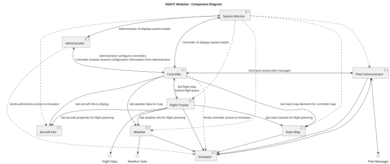
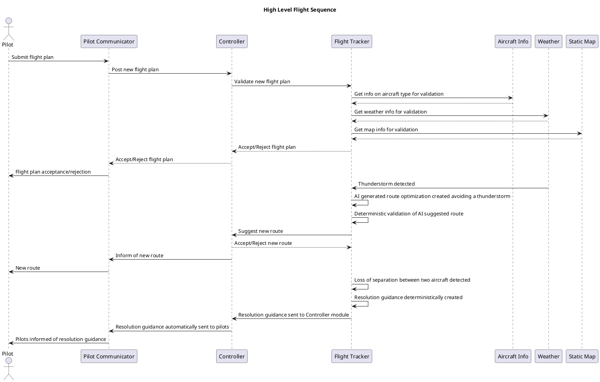
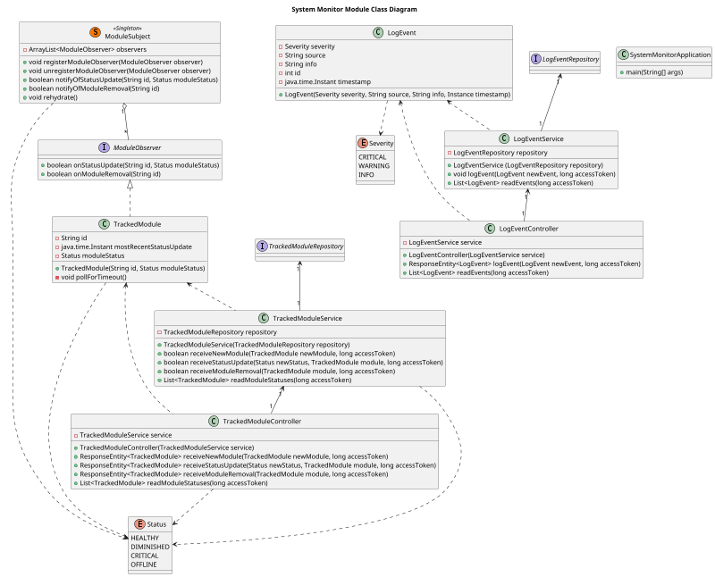
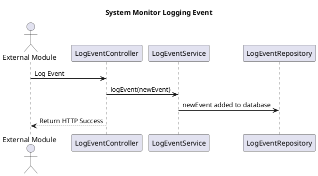
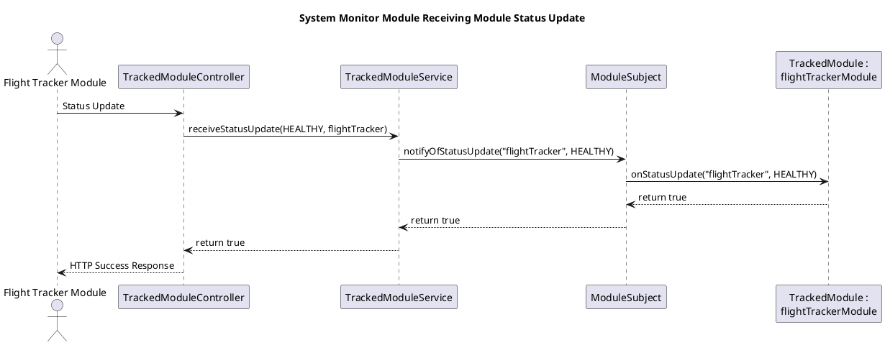

# Next Generation Air Traffic Controller - Software Design
__Date:__ 12/3/2025
__Author:__ Erik Orlowski
__Reviewers:__ Jefferson Dang, Kyriaki Avgerinou

## Introduction
The document captures the requirements, design and test plan for the Next Generation Air Traffic Control (NGATC) system. The NGATC is composed of several modules, this document will discuss the architectural design of how these modules work together, as well as each of these modules individually.

## Overview
The NGATC is a scalable, high availability and safety critical system that will manage air traffic throughout the United States. The system supports the ability to:
* Track aircraft position in US airspace
* Use flight plan data and current aircraft data to predict aircraft flight paths
* Use flight path predictions to predict and prevent any aircraft collisions
* Monitor and reject flight plans with invalid routes (e.g. through restricted airspace or into obstacles)
* Display information about flights to Air Traffic Controllers
* Support communication between the NGATC and pilots
* Allow administrators to configure the NGATC system as needed
* Monitor and log events throughout the system

Each of the modules in the NGATC will communicate with each other through the REST API protocol. The NGATC will be created as a Kubernetes cluster, enabling redundancy of the modules making up the system as well as allowing the system to be easily scaled and reconfigured.

The system will be tested at a functional level (verifying and validating the system as a whole), a module level (verifying individual modules) and at a unit level (unit testing of individual methods).

This document includes a discussion of the NGATC system as a whole, as well as each of the modules that make it up. This document also discusses the functional and non-functional requirements of the system and modules, as well as a high level test plan.

## System Level Requirements
The following section discusses the system level requirements of the NGATC. More granular requirements are discusses in the module level requirements below.

### Functional Requirements

#### Aircraft Tracking and Surveillance
| Requirement: Real-Time Aircraft Data Ingestion |
|--|
| The NGATC shall ingest real-time position data from surveillance sources including radar, ADS-B, satellite and potential future sources through a well-defined API. |

| Requirement: Real-Time Aircraft Position Update |
|--|
| The NGATC shall update the real-time position of all tracked aircraft at a rate of at least once per second. |

| Requirement: Unified Aircraft Track |
|--|
| The NGATC shall synthesize surveillance inputs for a single aircraft into a single, unified aircraft track. |

| Requirement: Aircraft Data Display |
|--|
| The NGATC shall display the position, pitch, altitude, speed and heading of each tracked aircraft to controllers. |

#### Flight Data Management
| Requirement: Flight Plan Ingestion |
|--|
| The NGATC shall ingest aircraft flight plans through a well defined API. |

| Requirement: Flight Plan Association |
|--|
| The NGATC shall associate aircraft flight plans with aircraft tracks. |

| Requirement: Flight Plan Ammendments |
|--|
| The NGATC shall support the ability for pilots and controllers to make ammendments to flight plans. |

| Requirement: Pilot Flight Plan Ammendment Acceptance |
|--|
| When the NGATC receives a proposed flight plan ammendment from a pilot, the NGATC shall have the ability to accept or reject this proposal. |

| Requirement: Aircraft Trajectory Prediction |
|--|
| The NGATC shall predict aircraft trajectories based on the aircraft's speed, altitude and route. |

| Requirement: Flight Plan Deviation Notifications |
|--|
| The NGATC shall notify controllers of deviations between an aircraft's flight plan and its actual behavior beyond acceptable limits. |

#### Communication Services
| Requirement: Secure Pilot Messaging Interface |
|--|
| The NGATC shall provide a secure messaging interface between controllers and pilots. |

| Requirement: Communication Log Audits and Playback |
|--|
| The NGATC shall persistently store communication logs to enable audits and playback. |

| Requirement: Controller to Controller Messaging |
|--|
| The NGATC shall support the ability for any two controllers to message each other. |

| Requirement: Controller Status Indicators |
|--|
| The NGATC will make available to controllers, supervisors and administrators, status indicators showing which controller is responsible for which sector of airspace. |

| Requirement: High Priority Ports |
|--|
| Each module of the NGATC shall provide high priority communication ports to be only to be used to ensure real-time communication in emergency situations. |

#### Conflict Detection and Safety Alerts
| Requirement: Loss of Separation Detection |
|--|
| The NGATC shall detect any loss of separation conflict with other aircraft or with static hazards with a [Probaility of Failure on Demand](https://www.exida.com/blog/back-to-basics-16-pfdavg) of less than 0.001. |

| Requirement: Loss of Separation Alert to Aircraft |
|--|
| Upon detection of loss of separation, the NGATC shall provide an alert to the involved aircraft including [the position, altitude, heading, and vertical and horizontal speeds] of both aircraft, and avoidance guidance (both aircrafts' avoidance guidance are sent to both aircraft) within 100 ms. |
| Rationale: In loss of separation incidents, it is unacceptable to rely solely on the reaction time of a human operator. Therefore, it is preferable to trust the initial task of alerting the involved aircraft to automated systems. |

| Requirement: Loss of Separation Alert Integrity |
|--|
| To allow aircraft to verify the integrity of loss of separation alerts, the communication from the NGATC shall include a 32 bit CRC for every 4096 bits of data sent and a timestamp (in milliseconds past the Unix Epoch) of when the message was initiated, with an accompanying 32 bit CRC. This communication shall be sent 3 times to increase the chances of all involved aircraft receiving a valid communication. |

| Requirement: Loss of Separation Alert to Controller |
|--|
| When a loss of separation event occurs, the NGATC shall notify the relevant controller(s) with the same information and guidance provided to the involved aircraft. |

| Requirement: Restricted Airspace Alerts |
|--|
| The NGATC shall alert controllers when an aircraft violates restricted airspace. |

#### Weather and External Data Integration
| Requirement: Real-Time Weather Ingestion |
|--|
| The NGATC shall ingest real-time weather and turbulence data. |

| Requirement: Weather Impacts on Tracjectories |
|--|
| The NGATC shall compensate for the impact of weather on flight trajectories. |

| Requirement: UI Weather Overlays |
|--|
| The NGATC shall include a weather overlay on controller displays. |

#### Sector Management
| Requirement: Dynamic Sector Boundaries |
|--|
| The NGATC shall administrators merging and splitting sectors based on workload. |

| Requirement: Aircraft Sector Reassignment |
|--|
| The NGATC shall automatically reassign aircraft when sector boundaries change. |

| Requirement: Sector Workload Threshold Alerts |
|--|
| When a sector exceeds workload thresholds, the NGATC shall alert administrators and supervisors. |

#### Airspace Automation and AI Assistance
| Requirement: AI Assisted Conflict Prediction |
|--|
| The NGATC shall provide AI assisted conflict prediction for at least 3-5 minutes into the future. |

| Requirement: AI Assisted Conflict Alert |
|--|
| When a potential future conflict is identified by the AI assisted conflict prediction, an alert will be given to the controller. |

| Requirement: AI Generated Route Optimization Suggestions |
|--|
| The NGATC shall provide AI generated route optimization suggestions that controllers can either accept or reject. |

| Requirement: AI Detected Abnormal Aircraft Behavior |
|--|
| The NGATC shall provide alerts to the controller for AI detected abnormal aircraft behavior, such as altitude deviations. |

#### Controller User Interface
| Requirement: Real-Time Aircraft Map |
|--|
| The NGATC shall display aircraft on a real-time map with configurable zoom levels. |

| Requirement: Color Coded Alerts |
|--|
| The NGATC shall display color coded visual alerts to controllers. Red alerts indicate an immediate safety concern, yellow alerts indicate a potential future safety concern and white alerts are informational. |

| Requirement: Aircraft Details Window |
|--|
| The NGATC shall provide controllers an aircraft details window, display the aircraft's altitude, route, communication status and ETA. |

| Requirement: Drag and Drop Sector Reassignment |
|--|
| The NGATC shall support the ability for controllers to drag and drop aircraft to reassign their sector. |

#### System Monitoring and Logging
| Requirement: Event Logging |
|--|
| The NGATC shall log all system events, alerts and messaging for auditing. |

| Requirement: Module Health Monitoring |
|--|
| The NGATC shall provide health monitoring for each module, visible to administrators. |

| Requirement: Service Unavailable Alert |
|--|
| The NGATC shall provide an alert to administrators, supervisors and controllers when any module becomes unavailable. |

#### Adminstrative Functions
| Requirement: System Configurability |
|--|
| The NGATC shall allow for the configuration of what inputs to accept as surveillance inputs, the severity of alerts and aircraft separation thresholds. |

| Requirement: Role Based Access |
|--|
| The NGATC shall support role based actions based on the controller, supervisor and administrator roles. |

| Requirement: Simulation Mode |
|--|
| The NGATC shall support a simulation mode for training. |

### Non-Functional Requirements

#### Performance
| Requirement: Surveillance Latency |
|--|
| The NGATC shall process surveillance updates with a latency of less than 500 ms. |

| Requirement: Aircraft Volume |
|--|
| The NGATC shall support at least 5000 simultaneous aircraft tracks. |

| Requirement: Controller UI Refresh Rate |
|--|
| The NGATC controller user interface shall update aircraft positions at least once per second. |

#### Availability and Reliability
| Requirement: 5 Nines of Availability |
|--|
| The NGATC shall be available 99.999% of the time. |

| Requirement: Redundance Services |
|--|
| The NGATC shall provide redundancy with automatic within 250 ms for all modules whose absence could adversely affect aircraft safety. |
| Comment: This system does not necessarily require a "bumpless" switchover, so long as all data used by modules is not more than 2 seconds old (measured from when the NGATC ingested the data) and the module uses the most current available data within 1 second of the switchover event. |

| Requirement: Track Data Preservation |
|--|
| When the NGATC switches to another instance of a module due to a failure, this switchover shall preserve all track data. |

#### Scalability
| Requirement: Horizontal Scalability |
|--|
| The NGATC deployment shall scale horizontally to support increases in aircraft volume. |

| Requirement: Module Scaling |
|--|
| NGATC modules shall have the ability to scale independently based on loading. |

| Requirement: Data Pipeline Support |
|--|
| NGATC data pipelines shall support ingest rates of up to 100,000 messages per second. |

#### Security
| Requirement: Communication Encryption |
|--|
| All communication between modules shall use TLS encryption. |

| Requirement: Role-Based Authentication |
|--|
| The NGATC shall enforce role based authentication. |

| Requirement: Security Logging |
|--|
| The NGATC shall log all security-relevant events, including logins, changes and overrides. |

| Requirement: Flight Data Modification |
|--|
| The NGATC shall protect against the unauthorized modification of flight data. |

#### Maintainability
| Requirement: Microservice Use |
|--|
| NGATC modules shall be implemented as microservices using well-defined APIs. |

| Requirement: Module Failure Isolation |
|--|
| The NGATC shall isolate failures to individual modules to prevent cascading effects. |

| Requirement: Naming and Documentation |
|--|
| Code and service interactions shall follow clear naming conventions and documentation standards. |

#### Usability
| Requirement: Controller Alert Reaction Time |
|--|
| Controllers shall be able to identify conflicts within 2 seconds of an alert being generated. |

| Requirement: Color Coded Alerts |
|--|
| The NGATC UI shall distinguish between alert severity levels using different colors and shapes. |

| Requirement: Night and Day Mode |
|--|
| The NGATC UI shall support both night and day display modes. |

#### Interoperability
| Requirement: Surveillance Data Input Format |
|--|
| The NGATC shall use JSON as the supported input format for surveillance data. |

| Requirement: External REST API |
|--|
| The NGATC shall provide a REST API for integrating with external systems. |

| Requirement: New Data Sources |
|--|
| The NGATC shall support the "plug and play" addition of new data sources. |

#### Testability
| Requirement: Module Testability |
|--|
| Each module shall be independently testable using mock data. |

| Requirement: Simulation Testing |
|--|
| The NGATC shall provide simulation tools that can be used to test conflict detection logic at a system level. |

| Requirement: Automated Test Coverage |
|--|
| At least 80% automated test coverage of the NGATC core logic shall be achieved. |

## Module Summary
The modules that make up the NGATC are shown in the component diagram below and are explained in more detail following the diagram.

### System Monitor
The System Monitor is responsible for monitoring the health of all modules in the NGATC system. The system monitor consumes the health of each module in the NGATC and produces an interface for modules (the Administrator and Controller, although there is nothing to preclude other modules from consuming this interface) to gain information about the NGATC system health.

### Administrator
The Adminstrator module is responsible for managing the NGATC at a "macro" level. It exposes a GUI to system administrators, allowing them to assign supervisors and controllers. Additionally, it allows administrators to configure airspace sectors and view workload information for these sectors.

### Controller
The Controller module is the primary interface that flight controllers will directly interact with. This module exposes a GUI to flight controllers that shows aircraft light data, weather, map information and aircraft type information. The Controller module consumes this information from the Flight Tracker, Static Map, Aircraft Info and Weather subsystems. This module allows bidirectional communication between pilots and controllers, as well as between multiple controllers. It also provides alert information to controllers, as well as AI generated suggestions.

### Pilot Communicator
The Pilot Communicator module is responsible for handling encrypted communications between pilots and flight controllers. This module is also responsible for logging and playback of these communications.

### Flight Tracker
The Flight Tracker module is a safety critical module responsible for consuming all data related to aircraft flights and providing this information to the Controller module. In addition to consuming data, the Flight Tracker module has the responsibility to detect aircraft conflicts and any other unsafe conditions, and to respond appropriately. The module also uses an AI agent to make adjustments to flight plans, using safety critical code to detect for any hazards.

As the safety critical module of the NGATC, the Flight Tracker module shall be developed in compliance with [Systematic Capability 3](https://www.exida.com/blog/Back-to-Basics-14-Systematic-Capability) as defined in [IEC 61508-3](https://www.exida.com/Blog/back-to-basics-06-iec-61508).

### Aircraft Info
The Aircraft Info module is responsible for managing information related to aircraft types, such as their maximum and minimum speeds, ceilings and fuel capacity. This information is consumed by the Flight Tracker module. This information is also exposed in a GUI and can be configured through this GUI by administrators.

### Weather
The Weather module is responsible for ingesting weather reports and providing this information to the Flight Tracker.

### Static Map
The Static Map module is responsible for managing the airspace map, including static hazards (e.g. mountains and tall buildings), restricted airspace and landmarks (e.g. airports). This information is consumed by the Flight Tracker module. This information is also exposed in a GUI and can be configured through this GUI by administrators.

### Simulator
The Simulator module is responsible for providing mock data to the modules of the NGATC, as well as consuming information from the NGATC to inform this mock data. Furthermore, the Simulator module will report to the modules that are consuming it whether the system is in production or simulated mode. An adminstator can interact with the Simulator module through a command line interface to enable and disable simulation mode.

## Module Communications
Modules communicate with each other and with external services through REST APIs. Communication between modules is encrypted using TLS encryption.

## High Level Flight Sequence
The diagram below shows a high level overview of the communication between modules during the course of an example flight.

This diagram depicts how the pilots interact with the Pilot Communicator module, which then relays messages to the Controller module. It also depicts how the Flight Tracker module validates a flight plan, using data from other, lower level modules. The interactions in the flight plan validation process are meant to be illustritive, with more specific details available in the Flight Tracker module level design. Finally, the diagram depicts the process of receiving, validating and communicating an AI suggested route optimization, in this case, to avoid a thunderstorm. Of note is that once the suggestion is created, it is validated in a deterministic manner (i.e. not through the use of AI) to ensure the new flight plan is safe.

The thunderstorm route adjustment contrasts with the resolution guidance created to handle a loss of separation event. In this case, the resolution guidance is deterministically created, without the use of AI. This guidance is then automatically sent to the pilots. This removes any human reaction time from the flight controller in the implementation of the resolution guidance.

## System Deployment
The NGATC is deployed through Kubernetes, with each module being deployed along with its database. Multiple instances of each module are deployed to allow for redundant switchover and automatic load balancing handled automatically by Kubernetes. To ensure resiliance against any physical events, instances of each module are commissioned at disparate geographic locations.

## Access Control
Access control for the NGATC will utilize the Entitlement Service developed by Housemate Inc. The four roles defined for the NGATC are controllers, supervisors, administrators and internal modules. For all actions in the NGATC that are not "read-only", some level of authenticated access is required, with specifics discussed in the requirements and design details.

## Persistence Strategy
For each module, all information needed to restore to the current running point in the event of failure is stored persistently in a database, accessed using Hibernate. For classes that must be persisted, the module level designs outline what property in the class maps to the primary key that relates the object to the persistent database.

## Use of AI
AI agents are used to accomplish three tasks in the NGATC, all interfacing with the Flight Tracker module:
* To predict future aircraft conflicts (although detecting active loss of separation events is accomplished through deterministic, safety critical code)
* To generate route optimization suggestions (validated by deterministic code)
* To detect and report abnormal aircraft behavior

In no cases will an AI agent have the authority to direct edit a any data in the NGATC without being deterministically validated. Whenever possible, any actions proposed by an AI agent are also validated by a human.

## High Level Testing Strategy
The NGATC is tested at three levels, unit testing, module testing and system testing.

### Unit Testing
Unit testing is performed as needed on modules of the NGATC. For safety critical code, the following guidelines are established:
* [CCN](https://www.geeksforgeeks.org/dsa/cyclomatic-complexity/) <= 3: Unit test not required
* [CCN](https://www.geeksforgeeks.org/dsa/cyclomatic-complexity/) <= 9: Unit test required with reasonable branch coverage
* [CCN](https://www.geeksforgeeks.org/dsa/cyclomatic-complexity/) >= 10: Unit test required with 100% branch coverage required

For non-safety critical code, the following guidelines are established:
* [CCN](https://www.geeksforgeeks.org/dsa/cyclomatic-complexity/) <= 3: Unit test not recommended
* [CCN](https://www.geeksforgeeks.org/dsa/cyclomatic-complexity/) <= 9: Unit test recommended with reasonable branch coverage
* [CCN](https://www.geeksforgeeks.org/dsa/cyclomatic-complexity/) >= 10: Unit test required with reasonable branch coverage

### Module Testing
Module testing validates an individual module's behavior. It is performed by ingesting communication directly into the module, interacting with the module's GUI as appropriate, and observing the communicates output from the module. Details on module testing are discussed in the module design sections.

### System Testing
System testing is used to validate the NGATC's behavior as a "closed box". In system tests, the data for the NGATC to act upon are simulated through the Simulation module and user interactions with system GUIs are simulated using [Functionize](https://www.functionize.com/?_gl=1*12iaepr*_up*MQ..*_ga*MTMyMzYyNjUzMi4xNzY1MzEwMDI0*_ga_77JHMZYNHZ*czE3NjUzMTAwMjMkbzEkZzAkdDE3NjUzMTAwMjMkajYwJGwwJGgyMDExNDMyMDUy).

#### Happy Path Test
* Mock weather, map and aircraft type data are input through the simulator and the Aircraft Info GUI
* Multiple flight plans are submitted that should be accepted
* It is validated that these flight plans are accepted
* The NGATC waits until an AI route optimization is suggested
* It is validated that this suggestion is correctly accepted or rejected
* Is is validated that any updates to a flight plan are communicated properly
* The simulator injects surveillance data that should move an aircraft between sectors
* It is validated that the aircraft correctly changed sectors
* The Administrator module GUI changes a sector boundary
* It is validated the all aircraft are correctly re-assigned and the controller GUIs update as needed

#### Loss of Separation Test
This test validates that the system responds properly to aircraft loss of separation events with other aircraft and static hazards.
* Mock weather, map and aircraft type data are input through the simulator and the Aircraft Info GUI
* Multiple flight plans are submitted that should be accepted
* It is validated that these flight plans are accepted
* The simulator injects flight surveillance data that should indicate a loss of separation between two aircraft
* It is validated that the system responds correctly to this loss of separation
* The simulator injects flight surveillance data that should indicate a loss of separation between an aircraft and a static hazard
* It is validated that the system responds correctly to this loss of separation

#### Invalid Flight Plan Test
* Mock weather, map and aircraft type data are input through the simulator and the Aircraft Info GUI
* Multiple flight plans are submitted that should be rejected
* It is validated that these flight plans are rejected and not added to the NGATC system.

## Risk Summary
The most critical risk for the NGATC is safety and availability. This risk comes in two forms: the risk that the system will cause a pilot to take an unsafe action and the risk that the system will fail to detect of act upon an existing unsafe condition. This risk is mitigated by the Flight Tracker module being treated as a safety critical module, with several design choices in the module reflecting the principal of diverse redundancy, and with the SC3 level of rigor the module is developed to. A significant challenge in developing the safety infrastructure of the NGATC is unlike in machine safety where "the safest machine is one that isn't running", there is no candidate for a "safe state" for the system. This means that the system must keep operating at all times and provide its best possible guidance to pilots.

Furthermore, this risk is mitigated by deploying redundant instances of the modules and corresponding databases making up the system, that automatically fail-over in the event of any failures.

Another class of risk in the NGATC is security. An unauthorized user making changes to this system could have catasrophic consequences. To mitigate this risk, the system is designed with access control using the Housemate Entitlement Service.

## System Monitor Module
The System Monitor module is responsible for monitoring and reporting on the statuses and events of modules in the NGATC system. The module is implented with a MySQL database and uses the Spring Boot framework for the REST API implementation.

### Module Requirement Summary

#### Module Functional Requirements

* Controller Status Indicators: The System Monitor module shall expose an interface for other modules to report their status.
* Module Health Monitoring: The System Monitor module shall make available to other modules the status of all modules for which it has status information.
* Service Unavailable Alert: When the System Monitor module has not received a status update from a module in 2 seconds, it shall report the module as offline.
* High Priority Ports: In the system deployment, the System Monitor module's service shall have high priority ports for other modules to communicate high priority status updates.
* Event Logging: The System Monitor module shall expose an interface for other modules to report system events.
* Event Logging: The System Monitor module shall persistently store all system events provided to the module.
* Event Logging: The System Monitor module shall expose an interface for other modules to access recorded system events. This service shall require an administrator access token.

#### Module Non-Functional Requirements
* The System Monitor module shall respond to all incoming requests within 50 ms.
* The System Monitor module shall reflect all status updates from other modules within 50 ms.
* The System Monitor module shall be deployed in a redundant configuration, such that if an instance of the module fails, a switchover to a working instance of the module is complete within 250 ms.
* The System Monitor module shall have the ability to scale horizontally to accomodate additional module instances.
* The System Monitor module shall be implemented in such a way to allow new module types to be added to the NGATC system.
* The System Monitor module shall use a REST API to communicate with other modules in the NGATC.

### System Monitor Classes
The System Monitor is implemented with the following classes as shown below.

#### Class Dictionary
##### SystemMonitorApplication
The SystemMonitorApplication class is the main class used by the Spring Boot framework to run the REST API and database implementation. No business logic occurs in this class.

###### Methods
| Method Name | Method Signature | Description |
|--|--|--|
| main | main(String[] args) | Starts the SpringbootapiApplication, which runs the REST API and database implementation. |

##### LogEvent
The LogEvent class is used to store information for a specific system event in the NGATC.

###### Methods
| Method Name | Method Signature | Description |
|--|--|--|
| LogEvent | LogEvent(Severity severity, String source, String info, Instance timestamp) | Constructs a new LogEvent object. |

###### Properties
| Property Name | Type | Description |
|--|--|--|
| severity | Severity | The severity of the event. |
| source | String | A String with information about the module creating the event. |
| info | String | A String containing full information about the event. |
| timestamp | java.time.Instant | The time when the event occurred. |
| id | int | A unique ID of the LogEvent to use as the primary key in the database. |

##### LogEventRepository
This interface is used by the Spring Boot framework to store instances of the LogEvent class in the database.

##### LogEventService
The LogEventService is used to handle the business logic of REST API requests involving the LogEvent object.

###### Methods
| Method Name | Method Signature | Description |
|--|--|--|
| LogEventService | LogEventService (LogEventRepository repository) | Creates and logs a new LogEventService instance. |
| logEvent | void logEvent(LogEvent newEvent, long accessToken) | Logs a new LogEvent. |
| readEvents | List<LogEvent> readEvents(long accessToken) | Returns a list of events in the NGATC if the provided access token has the administrator role. |

###### Associations
| Association Name | Type | Description |
|--|--|--|
| repository | LogEventRepository | A reference to a LogEventRepository instance used for this service. |

##### LogEventController
The LogEventController class is used to generate HTTP responses to REST API requests involving the LogEvent class.

###### Methods
| Method Name | Method Signature | Description |
|--|--|--|
| LogEventController | LogEventController(LogEventService service) | Creates and logs a new LogEventController instance. |
| logEvent | ResponseEntity<LogEvent> logEvent(LogEvent newEvent, long accessToken) | Logs a new LogEvent. |
| readEvents | List<LogEvent> readEvents(long accessToken) | Returns a list of events in the NGATC. |

###### Associations
| Association Name | Type | Description |
|--|--|--|
| service | LogEventService  | A reference to a LogEventService instance used for this controller. |

##### ModuleSubject
The ModuleSubject class fills the role of the "subject" in the observer design pattern. This is implemented as a singleton instance, with a list of its registered observers.

###### Methods
| Method Name | Method Signature | Description |
|--|--|--|
| registerModuleObserver | void registerModuleObserver(ModuleObserver observer) | Registers a ModuleObserver to receive updates. |
| unregisterModuleObserver | void unregisterModuleObserver(ModuleObserver observer) | Removes the ModuleObserver from the list of ModuleObservers receiving updates. |
| notifyOfStatusUpdate | boolean notifyOfStatusUpdate(String id, Status moduleStatus) | Notifies all registered observers of a module giving a status update. Returns whether a module was found matching the ID. |
| notifyOfModuleRemoval | boolean notifyOfModuleRemoval(String id) | Notifies all registered observers that a module has been removed and its status should no longer be tracked. Returns whether a module was found matching the ID. |
| rehydrate | void rehydrate() | On powerup, refreshes the list of tracked observers with the module database. |

###### Associations
| Association Name | Type | Description|
|--|--|--|
| observers | ArrayList<ModuleObserver> | An ArrayList of all registers ModuleObservers. |

##### ModuleObserver
The ModuleObserver interface fills the role of the observer in the observer framework. It should be noted that this interface is not currently needed, as there is only one concrete observer. However, the interface is included to provide for potential future expansion.

###### Methods
| Method Name | Method Signature | Description |
|--|--|--|
| onStatusUpdate | boolean onStatusUpdate(String id, Status moduleStatus) | Processes a status update. The concrete implementation of this method will decide whether the ID is relevant and process the update if so. If the concrete implementation of this interface is tracking a timeout for status updates, the timeout time should be updated in this method. Returns whether this observer matches the provided ID. |
| onModuleRemoval | boolean onModuleRemoval(String id) | Processes a module removal. The concrete implementation of this method will decide whether the ID is relevant and remove the module from tracking if so. Returns whether this observer matches the provided ID. |

##### TrackedModule
The TrackedModule class is the concrete observer for the observer design pattern. This represents a module in the NGATC system whose status is being tracked. It inherits from the ModuleObserver interface.

###### Methods
| Method Name | Method Signature | Description |
|--|--|--|
| TrackedModule | TrackedModule(String id, Status moduleStatus) | Constructs a new TrackedModule instance and creates a thread to call the pollForTimeout method every 250 ms to monitor for a timeout of the module. |
| pollForTimeout | void pollForTimeout() | Checks if it has been more than 2 seconds since the last time a status update has been received from the module. If it has, the module status is set to OFFLINE. |

###### Properties
| Property Name | Type | Description |
|--|--|--|
| id | String | A String identifying the module. This is used as the primary key to store the TrackedModule in the database. |
| mostRecentStatusUpdate | java.time.Instant | The most recent time this module's status was updated. |
| moduleStatus | Status | The current status of the module. |

##### TrackedModuleRepository
This interface is used by the Spring Boot framework to store instances of the TrackedModule class in the database.

##### TrackedModuleService
The TrackedModuleService is used to handle the business logic of REST API requests involving the TrackedModule object.

###### Methods
| Method Name | Method Signature | Description |
|--|--|--|
| TrackedModuleService | TrackedModuleService (TrackedModuleRepository repository) | Creates and logs a new TrackedModuleService instance. |
| receiveNewModule | bool receiveNewModule(TrackedModule newModule, long accessToken) | Adds a new module to track the status of. Returns whether this module could be added. |
| receiveStatusUpdate | bool receiveStatusUpdate(Status newStatus, TrackedModule module, long accessToken) | Processes a module status update. Returns whether that module was found. |
| receiveModuleRemoval | bool receiveModuleRemoval(TrackedModule module, long accessToken) | Removes a module from tracking. Returns whether the module was found. |
| readModuleStatuses | List<TrackedModule> readModuleStatuses(long accessToken) | Returns a list of all tracked modules and their statuses. |

###### Associations
| Association Name | Type | Description |
|--|--|--|
| repository | TrackedModuleRepository | A reference to a TrackedModuleRepository instance used for this service. |

##### TrackedModuleController
The TrackedModuleController class is used to generate HTTP responses to REST API requests involving the TrackedModule class.

###### Methods
| Method Name | Method Signature | Description |
|--|--|--|
| TrackedModuleController | TrackedModuleController(TrackedModuleService service) | Creates and logs a new TrackedModuleController instance. |
| receiveNewModule | ResponseEntity<TrackedModule> receiveNewModule(TrackedModule newModule, long accessToken) | Adds a new module to track the status of. Returns an HTTP 501 status if the module could not be added (e.g. dupicate ID). |
| receiveStatusUpdate | ResponseEntity<TrackedModule> receiveStatusUpdate(Status newStatus, TrackedModule module, long accessToken) | Processes a module status update. Returns an HTTP 501 status if the module could not be found. |
| receiveModuleRemoval | ResponseEntity<TrackedModule> receiveModuleRemoval(TrackedModule module, long accessToken) | Removes a module from tracking. Returns an HTTP 501 status if the module could not be found. |
| readModuleStatuses | List<TrackedModule> readModuleStatuses(long accessToken) | Returns a list of all tracked modules and their statuses. |

###### Associations
| Association Name | Type | Description |
|--|--|--|
| service | TrackedModuleService  | A reference to a TrackedModuleService instance used for this controller. |

### Service API
The Service Monitor module implements the following API services:

* Log Event: Log a new system event.
    * Inputs:
        * Event Severity (2=CRITICAL, 1=WARNING, 0=INFO)
        * Event Source (A String containing information about the module originating the event)
        * Event Info (A String with full information about the event)
        * Event Timestamp (Number of milliseconds past the Unix epoch)
        * Access Token
    * Output: HTTP Status
* Read Events: Return all logged system events.
    * Inputs: Access Token
    * Outputs: A list of logged events in the form:
        * Event Severity (2=CRITICAL, 1=WARNING, 0=INFO)
        * Event Source (A String containing information about the module originating the event)
        * Event Info (A String with full information about the event)
        * Event Timestamp (Number of milliseconds past the Unix epoch)
* New Module: Add a new module for status tracking.
    * Inputs:
        * Module ID (String with the module name)
        * Status (3=HEALTHY, 2=DIMINISHED, 1=CRITICAL, 0=OFFLINE)
        * Access Token
    * Output: HTTP Status
* Status Update: Update a tracked module's status.
    * Inputs:
        * Module ID (String with the module name)
        * Status (3=HEALTHY, 2=DIMINISHED, 1=CRITICAL, 0=OFFLINE)
        * Access Token
    * Output: HTTP Status
* Remove Module: Remove the module from tracking.
    * Inputs:
        * Module ID (String with the module name)
        * Access Token
    * Output: HTTP Status
* Read Module Statuses: Returns the status of all tracked modules.
    * Inputs: Access Token
    * Output: A list of tracked modules in the form:
        * Module ID (String with the module name)
        * Status (3=HEALTHY, 2=DIMINISHED, 1=CRITICAL, 0=OFFLINE)

### Event Logging Sequence Diagram

This diagram illustrates the interactions taking place with a new log event being received. The interactions involving the service, controller and repository classes are handled by the Spring Boot framework.

### Module Status Update Sequence Diagram

This diagram illustrates the process of updating the status of a module and returning whether a matching module could be found to update the status of.

### Entitlement Service Integration
The Read Events API service requires the administrator role to be performed. All other services require the Internal Module role.

### Object Persistence
Object persistence is handled using the Spring Boot framework, using a MySQL database. The persisted classes are the TrackedModule and LogEvent classes. The observers list in the ModuleSubject class is rehydrated on power up using custom logic with the module database.

### Testing Strategy
The following module level tests are specified for the System Monitor module:
#### Module Status Test
* Register new modules to the System Monitor module
* Read the module statuses and verify they match their initial statuses
* Send status updates
* Read the module statuses and verify they match their new statuses
* Remove a module
* Read the module statuses and verify the module is removed
* Let a module timeout
* Read the module statuses and verify the module is offline
* Restart the System Monitor module
* Read the module statuses and verify the statuses report their proper values
* Attempt to set a module status with an invalid access token
* Verify the API service is rejected

#### Logging Test
* Log several events
* Verify that the events can be read
* Attempt to read the events with an invalid access token
* Verify the API service is rejected

### Risks
For this module, the primary risk is security. For this reason, it is imerative that API request to this module have access protections. For module statuses, a malicious actor could potentially perform a denial of service attack by spoofing statuses claiming that modules were offline. A malicious actor could also spoof statuses claiming that the modules were healthy, masking actual issues with the modules. For event logging, a malicious actor accessing the NGATC event logs could potentially learn valuable information about the system that could be used for an attack.